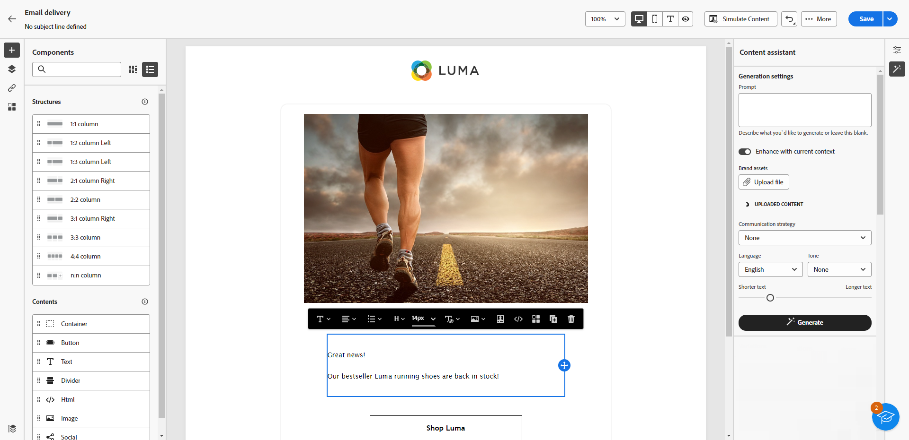

# Generación de texto con el Asistente de IA {#generative-text}

>[!IMPORTANT]
>
>Antes de empezar a usar esta capacidad, lea las [Protecciones y limitaciones](generative-gs.md#generative-guardrails) relacionadas.
> 
>
>Debe aceptar un [acuerdo de usuario](https://www.adobe.com/legal/licenses-terms/adobe-dx-gen-ai-user-guidelines.html){target="_blank"} antes de usar el Asistente de IA en Adobe Campaign Web. Para obtener más información, póngase en contacto con su representante Adobe.

Utilice el Asistente de IA en Adobe Campaign Web para generar texto atractivo que resuene con su audiencia. Tanto si mejora la copia de correo electrónico, crea contenido de página de aterrizaje persuasivo, escribe mensajes de notificación push o redacta texto SMS, el asistente de IA le ayuda a proporcionar una comunicación clara e impactante.

## Para correo electrónico y páginas de destino {#email-web-channels}

El asistente de IA puede generar contenido de texto de alta calidad para sus envíos de correo electrónico y páginas de aterrizaje. Esta capacidad le permite crear mensajes atractivos y en la marca que se conectan con su audiencia en puntos de contacto digitales.

### Acceso y configuración {#access-configure}

Para poder empezar a generar contenido de texto con el asistente de IA, debe configurar la entrega y acceder al editor de contenido. Siga estos pasos para preparar su espacio de trabajo y abrir el panel Asistente de IA.

1. Cree y configure su envío:

   * **Correo electrónico**: Después de crear y configurar tu envío de correo electrónico, haz clic en **[!UICONTROL Editar contenido]**. [Más información](../email/create-email-content.md)
   * **Página de aterrizaje**: Después de crear y configurar la página de aterrizaje, haga clic en **[!UICONTROL Editar contenido]**. [Más información](../landing-pages/create-lp.md)

1. Seleccione un **[!UICONTROL componente Texto]** para segmentar contenido específico y acceda al menú **[!UICONTROL Asistente de IA]**.

   {zoomable="yes"}

### Generar contenido {#generate-content}

Aprenda a crear mensajes claros, ajustar la configuración y generar texto adaptado mediante el asistente de IA, lo que garantiza que los mensajes se ajusten a los objetivos de comunicación y de marca.

1. Seleccione su **[!UICONTROL marca]** para asegurarse de que el contenido generado por IA se ajuste a las especificaciones de su marca. [Más información](brands.md) sobre marcas.

1. Ajuste el contenido describiendo lo que desea generar en el campo **[!UICONTROL Preguntar]**.

   Si necesita ayuda para redactar el mensaje, acceda a la **[!UICONTROL Biblioteca de mensajes]**, que ofrece una amplia gama de ideas para mejorar los envíos. [Más información sobre las prácticas recomendadas para los mensajes](ai-assistant-prompting-guide.md)

   {zoomable="yes"}

1. Adapte el mensaje utilizando la opción **[!UICONTROL Configuración de texto]**:

   * **[!UICONTROL Estrategia de comunicación]**: elige el estilo de comunicación más adecuado para el texto generado.
   * **[!UICONTROL Idiomas]**: elige el idioma del contenido generado.
   * **[!UICONTROL Tono]**: Asegúrese de que el tono del correo electrónico resuene en la audiencia. Tanto si desea sonar informativo, lúdico o persuasivo, AI Assistant adapta el mensaje en consecuencia.
   * **Longitud del texto**: utilice el control deslizante para seleccionar la longitud deseada del texto.

     {zoomable="yes"}

1. En el menú **[!UICONTROL Contenido de referencia]**, haga clic en **[!UICONTROL Cargar archivo]** para agregar cualquier recurso de marca que contenga contenido que pueda proporcionar un asistente de IA de contexto adicional o seleccione uno cargado anteriormente.

   Los archivos cargados anteriormente están disponibles en la lista desplegable **[!UICONTROL Contenido de referencia cargado]**. Simplemente, cambie los recursos que desee incluir en la generación.

1. Una vez que la solicitud esté lista, haga clic en **[!UICONTROL Generar]**.

### Refinamiento y finalización {#refine-finalize}

Aprenda a revisar el texto generado, realizar refinamientos y aplicar personalizaciones para finalizar el contenido, creando mensajes atractivos y refinados listos para su envío.

1. Examine las **[!UICONTROL variaciones]** generadas.

1. Haga clic en el icono de porcentaje para ver su **[!UICONTROL puntuación de alineación de marca]** e identificar cualquier desalineación con su marca.

   Más información sobre [puntuación de alineación de marca](brands-score.md).

   {zoomable="yes"}

1. Haz clic en **[!UICONTROL Vista previa]** para ver una versión en pantalla completa de la variación seleccionada o en **[!UICONTROL Aplicar]** para reemplazar el contenido actual.

1. Vaya a la opción **[!UICONTROL Refinar]** en la ventana de **[!UICONTROL vista previa]** para obtener acceso a características de personalización adicionales:

   * **[!UICONTROL Usar como contenido de referencia]**: la variante elegida sirve como contenido de referencia para generar otros resultados.
   * **[!UICONTROL Elaborar]**: amplía temas específicos y proporciona detalles adicionales para una mejor comprensión y participación.
   * **[!UICONTROL Resumir]**: condense los puntos clave en resúmenes claros y concisos para atraer la atención y alentar a que sigan leyendo.
   * **[!UICONTROL Reformular]**: reformula tu mensaje de diferentes maneras, manteniendo tu escritura fresca y atractiva para diversas audiencias.
   * **[!UICONTROL Use un lenguaje más sencillo]**: Simplifique su idioma para garantizar la claridad y accesibilidad para una audiencia más amplia.
   * **[!UICONTROL Traducir]**: Simplifique su idioma para garantizar la claridad y accesibilidad para una audiencia más amplia.

   También puedes cambiar el **[!UICONTROL tono]** y la **[!UICONTROL estrategia de comunicación]** de tu texto.

   {zoomable="yes"}

1. Abra la pestaña **[!UICONTROL Alineación de marca]** para ver cómo se ajusta su contenido a las [directrices de marca](../content/brands.md).

1. Haz clic en **[!UICONTROL Seleccionar]** cuando encuentres el contenido apropiado.

1. Inserte campos de personalización para personalizar el contenido en función de los datos del perfil. A continuación, haga clic en el botón **[!UICONTROL Simular contenido]** para controlar la renderización y comprobar la configuración de personalización con perfiles de prueba. [Más información](../preview-test/preview-content.md)

1. Revise y active el contenido:
   * **Correo electrónico**: Una vez que haya definido el contenido, la audiencia y la programación, estará listo para preparar su envío de correo electrónico. [Más información](../monitor/prepare-send.md)
   * **Página de aterrizaje**: Una vez que la página de aterrizaje esté lista, puede publicarla para que esté disponible para usarla en un mensaje. [Más información](../landing-pages/create-lp.md)

## Para canales móviles {#mobile-channels}

El asistente de IA puede generar contenido de texto atractivo para sus notificaciones push y mensajes SMS, lo que le ayuda a crear comunicaciones móviles atractivas que se conectan con su audiencia en todos los puntos de contacto móviles.

### Acceso y configuración {#mobile-access-configure}

Antes de empezar a generar texto con el asistente de IA para canales móviles, debe configurar la entrega y acceder al asistente de AI.

1. Cree y configure su envío móvil:
   * **Notificaciones push**: después de crear y configurar la entrega de notificaciones push, haga clic en **[!UICONTROL Editar contenido]**. [Más información](../push/create-push.md)
   * **SMS**: después de crear y configurar tu envío de SMS, haz clic en **[!UICONTROL Editar contenido]**. [Más información](../sms/create-sms.md)

1. Complete **[!UICONTROL detalles básicos]** para su envío. Una vez finalizado, haga clic en **[!UICONTROL Editar contenido]**.

1. Personalice el mensaje según sea necesario:
   * **Notificaciones push**: [Más información](../push/content-push.md)
   * **SMS**: [Más información](../sms/content-sms.md)

1. Acceda al menú **[!UICONTROL Mostrar asistente de IA]**.

   {zoomable="yes"}

### Generar contenido {#mobile-generate-content}

Una vez que haya accedido al asistente de IA, puede configurar los ajustes de generación para crear contenido móvil que coincida con su marca y los objetivos de entrega. Personalice los parámetros de texto, añada recursos de marca y proporcione indicadores para guiar a la IA en la generación de variaciones relevantes.

1. Seleccione su **[!UICONTROL marca]** para asegurarse de que el contenido generado por IA se ajuste a las especificaciones de su marca. [Más información](brands.md) sobre marcas.

1. Ajuste el contenido describiendo lo que desea generar en el campo **[!UICONTROL Preguntar]**.

   Si está buscando ayuda para redactar el mensaje, acceda a la **[!UICONTROL Biblioteca de mensajes]**, que proporciona una amplia gama de ideas para mejorar su envío. [Más información sobre las prácticas recomendadas para los mensajes](ai-assistant-prompting-guide.md)

   {zoomable="yes"}

1. **Para las notificaciones push**, elige el campo de texto que quieras generar: **[!UICONTROL Título]**, **[!UICONTROL Subtítulo]** y/o **[!UICONTROL Mensaje]**.

1. Adapte el mensaje con la opción **[!UICONTROL Configuración de texto]**:

   * **[!UICONTROL Estrategia de comunicación]**: elige el estilo de comunicación más adecuado para el texto generado.
   * **[!UICONTROL Idiomas]**: elige el idioma del contenido generado.
   * **[!UICONTROL Tono]**: el tono debería interesar a su audiencia. Tanto si desea sonar informativo, lúdico o persuasivo, el asistente de IA puede adaptar el mensaje en consecuencia.
   * **[!UICONTROL Longitud]**: seleccione la longitud del contenido mediante el regulador de intervalo.

     {zoomable="yes"}

1. En el menú **[!UICONTROL Contenido de referencia]**, haga clic en **[!UICONTROL Cargar archivo]** para agregar cualquier recurso de marca que contenga contenido que pueda proporcionar un asistente de IA de contexto adicional o seleccione uno cargado anteriormente.

   Los archivos cargados anteriormente están disponibles en la lista desplegable **[!UICONTROL Contenido de referencia cargado]**. Simplemente, cambie los recursos que desee incluir en la generación.

1. Una vez que la solicitud esté lista, haga clic en **[!UICONTROL Generar]**.

### Refinamiento y finalización {#mobile-refine-finalize}

Después de generar variaciones de texto para los mensajes móviles, puede ajustar los resultados para asegurarse de que cumplen con los requisitos exactos. Revise la alineación de la marca, ajuste el tono y el idioma y prepare el contenido para su activación.

1. Después de la generación, examine **[!UICONTROL Variaciones]**.

1. Haga clic en el icono de porcentaje para ver su **[!UICONTROL puntuación de alineación de marca]** e identificar cualquier desalineación con su marca.

   Más información sobre [puntuación de alineación de marca](brands-score.md).

   {zoomable="yes"}

1. Haga clic en **[!UICONTROL Vista previa]** para ver una versión en pantalla completa de la variación seleccionada o haga clic en **[!UICONTROL Aplicar]** para reemplazar el contenido actual.

1. Vaya a la opción **[!UICONTROL Refinar]** en la ventana de **[!UICONTROL vista previa]** para obtener acceso a características de personalización adicionales:

   * **[!UICONTROL Usar como contenido de referencia]**: la variante elegida servirá como contenido de referencia para generar otros resultados.

   * **[!UICONTROL Reformular]**: vuelva a escribir el mensaje conservando su significado. Esta opción le ayuda a generar frases alternativas, mejorar el flujo o ajustar el estilo sin cambiar el mensaje principal.

   * **[!UICONTROL Use un lenguaje más sencillo]**: aproveche el Asistente para IA a fin de simplificar su lenguaje y garantizar la claridad y accesibilidad para una audiencia más amplia.

   * **[!UICONTROL Traducir]**: Simplifique su idioma para garantizar la claridad y accesibilidad para una audiencia más amplia.

   * **[!UICONTROL Cambiar tono]**: Ajuste el tono del mensaje para que coincida mejor con su estilo de comunicación, es decir, para que sea más amable, profesional, urgente o inspirador.

   * **[!UICONTROL Cambiar estrategia de comunicación]**: modifique el enfoque de mensajería en función de sus objetivos, como crear urgencia o enfatizar atractivo interesante.

     {zoomable="yes"}

1. Abra la pestaña **[!UICONTROL Alineación de marca]** para ver cómo se ajusta su contenido a las [directrices de marca](brands.md).

1. Haga clic en **[!UICONTROL Seleccionar]** cuando encuentre el contenido apropiado.

1. Inserte campos de personalización para personalizar el contenido en función de los datos de perfiles. A continuación, haga clic en el botón **[!UICONTROL Simular contenido]** para controlar la renderización y compruebe la configuración de personalización con perfiles de prueba. [Más información](../personalization/personalize.md)

1. Revise y active el contenido:
   * **Notificación push**: cuando haya definido el contenido, la audiencia y la programación, estará listo para preparar la entrega de notificaciones push. [Más información](../push/send-push.md)
   * **SMS**: una vez que tu SMS esté listo, puedes publicarlo para que esté disponible para usarlo en un mensaje. [Más información](../sms/send-sms.md)
