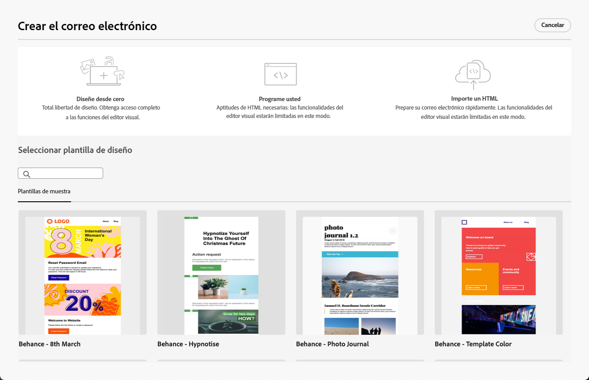

# Introducción al Diseñador de correo electrónico {#get-started-email-designer}

Puede importar contenido existente en [!DNL Journey Optimizer] o aproveche las capacidades de diseño de contenido:

* Uso [!DNL Campaign] funciones de diseño de correo electrónico para crear fácilmente correos electrónicos adaptables. [Más información](create-email-content.md)

* Mejore la experiencia de los clientes creando funciones personalizadas basadas en sus atributos de perfil. [Más información](../personalization/personalize.md)

* Configure campos de contenido condicionados para crear una personalización dinámica basada en el perfil del destinatario. [Más información](../personalization/conditions.md)

## Prácticas recomendadas de diseño de correo electrónico {#best-practices}

Al enviar correos electrónicos, es importante tener en cuenta que los destinatarios pueden reenviarlos, lo que a veces puede causar problemas con el procesamiento del correo electrónico. Esto es especialmente cierto cuando se utilizan clases CSS que es posible que el proveedor de correo electrónico no admita para el reenvío, por ejemplo, si utiliza la clase CSS &quot;is-desktop-hidden&quot; para ocultar una imagen en dispositivos móviles.

Para minimizar estos problemas de procesamiento, recomendamos mantener la estructura de diseño del correo electrónico tan simple como sea posible. Intente utilizar un solo diseño que funcione bien tanto para dispositivos de escritorio como móviles, y evite utilizar clases CSS complejas u otros elementos de diseño que puedan no ser totalmente compatibles con todos los clientes de correo electrónico. Al seguir estas prácticas recomendadas, puede ayudar a garantizar que los correos electrónicos se representen correctamente de forma coherente, independientemente de cómo los destinatarios los vean o reenvíen.

## Comience a crear el contenido {#start-authoring}

En el panel de envío de correo electrónico, vaya a [Editar contenido](edit-content.md) para abrir la página de inicio del Diseñador de correo electrónico. A partir de ahí, elija cómo desea diseñar el correo electrónico entre las siguientes opciones:

* **Diseñe su correo electrónico desde cero** mediante la interfaz del diseñador de correo electrónico. Aprenda a diseñar el contenido de su correo electrónico en [esta sección](create-email-content.md).

* **Codifique o pegue el HTML sin procesar** directamente en el diseñador de correo electrónico. Aprenda a codificar su propio contenido en [esta sección](code-content.md).

* **Importación de contenido de HTML existente** desde un archivo o una carpeta .zip. Obtenga información sobre cómo importar contenido de correo electrónico en [esta sección](existing-content.md).

* **Seleccionar contenido existente** de una lista de plantillas integradas o personalizadas. Aprenda a trabajar con plantillas de correo electrónico [esta sección](email-templates.md).

   

