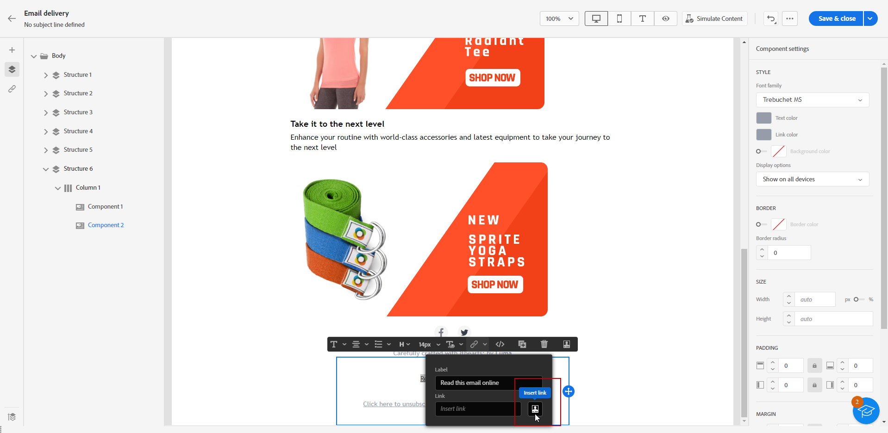
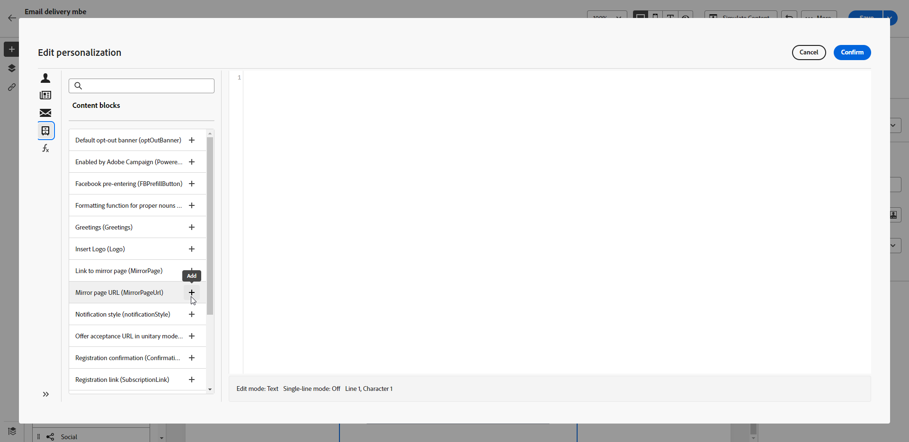

# Añadir un vínculo a la página espejo{#mirror-page}

## Acerca de la página espejo{#about-mirror-page}

La página espejo es una versión en línea de su correo electrónico.

Aunque la mayoría de los clientes de correo electrónico procesan imágenes sin problemas, algunos ajustes preestablecidos pueden evitar mostrar imágenes por motivos de seguridad. Los usuarios pueden navegar a la página espejo de un correo electrónico, por ejemplo, si están experimentando problemas de renderización o imágenes rotas al intentar verlo en su bandeja de entrada. También se recomienda proporcionar una versión en línea por motivos de accesibilidad o para fomentar el uso compartido en redes sociales.

La página espejo generada por Adobe Campaign contiene todos los datos de personalización.

{width="600" align="left"}

## Añadir un vínculo a la página espejo{#link-to-mirror-page}

Se recomienda insertar un vínculo a la página espejo. Este enlace puede ser, por ejemplo, &quot;Ver este correo electrónico en tu navegador&quot; o &quot;Leer esto en línea&quot;. A menudo se encuentra en el encabezado o pie de página del correo electrónico.

En Adobe Campaign, puede insertar un vínculo a la página espejo en el contenido del correo electrónico mediante la variable **bloque personalizado**. El **Vínculo a página espejo** el bloque personalizado inserta el siguiente código en el contenido del correo electrónico: `<%@ include view='MirrorPage' %>`.

Para añadir un vínculo a una página espejo en el correo electrónico:

1. Seleccione un elemento y haga clic en **[!UICONTROL Insertar vínculo]** de la barra de herramientas contextual.

   

1. Seleccione el **[!UICONTROL Insertar vínculo]** para acceder al menú de personalización.

   

1. En el **[!UICONTROL Bloque de contenido]** seleccione **[!UICONTROL URL de página espejo]** y haga clic en **[!UICONTROL Agregar]**.

   

   Para obtener más información sobre la inserción de bloques de contenido personalizado, consulte [esta sección](../personalization/personalize.md#personalize-emails).

La página espejo se crea automáticamente.

>[!IMPORTANT]
>
>Los vínculos de páginas espejo se generan automáticamente y no se pueden editar. Contienen todos los datos personalizados cifrados necesarios para procesar el correo electrónico original. Como resultado, el uso de atributos personalizados con valores grandes puede generar direcciones URL de páginas espejo largas, lo que puede impedir que el vínculo funcione en exploradores web que tengan una longitud máxima de direcciones URL.

Una vez enviado el correo electrónico, cuando los destinatarios hacen clic en el vínculo de la página espejo, el contenido del correo electrónico se muestra en su navegador web predeterminado.

>[!NOTE]
>
>En el correo electrónico de prueba enviado a los perfiles de prueba, el vínculo a la página espejo no está activo. Solo se activa en los mensajes finales.

De forma predeterminada, el período de retención de una página espejo es de 60 días. Después de ese retraso, la página espejo ya no está disponible.

## Generación de páginas espejo{#mirror-page-generation}

De forma predeterminada, Adobe Campaign genera automáticamente la página espejo si el contenido del correo electrónico no está vacío y si contiene un vínculo a la página espejo (también conocido como vínculo espejo).

Puede controlar el modo de generación de la página espejo del correo electrónico. Las opciones están disponibles en las propiedades de envío. [Más información](../advanced-settings/delivery-settings.md#mirror)
