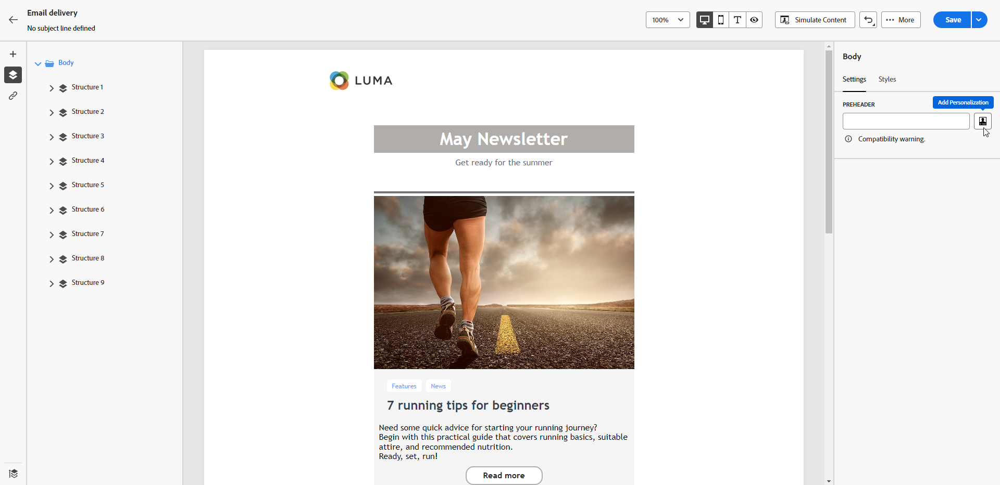

# Añadir un encabezado previo a un correo electrónico {#preheader}

>[!CONTEXTUALHELP]
>id="ac_edition_preheader"
>title="Añadir un preencabezado"
>abstract="Un preencabezado es un breve texto de resumen que sigue a la línea del asunto cuando se visualiza un correo electrónico desde su cliente de correo electrónico. En muchos casos, proporciona un breve resumen del correo electrónico y suele contener una frase."

Un preencabezado es un texto corto que sigue a la línea de asunto cuando se visualiza un correo electrónico desde cualquier cliente de correo electrónico principal.

En muchos casos, proporciona un breve resumen del contenido y, por lo general, tiene una frase.

>[!NOTE]
>
>Los encabezados previos no son compatibles con todos los clientes de correo electrónico. Cuando no se admite, el encabezado previo no se muestra.

Para definir el encabezado previo del correo electrónico, siga los pasos a continuación.

1. Desde el Diseñador de correo electrónico, añada al menos una **[!UICONTROL Estructura]** para empezar a diseñar el correo electrónico.

1. Haga clic en el icono **[!UICONTROL Árbol de navegación]** en el panel izquierdo y seleccione **[!UICONTROL Cuerpo]**.

   

1. Desde la pestaña **[!UICONTROL Configuración]**, añada el preencabezado. Puede personalizarlo aún más haciendo clic en el icono **[!UICONTROL Añadir personalización]**.

   

1. Desde el **[!UICONTROL Editar personalización]** ventana, puede añadir **[!UICONTROL Bloques de contenido]**, **[!UICONTROL Contenido dinámico]** o **[!UICONTROL Campos de personalización]**.

1. Haga clic en **[!UICONTROL Validar]** para comprobar la sintaxis de personalización.

1. Haga clic en **[!UICONTROL Guardar]**.

El encabezado previo ya está configurado para el correo electrónico.
