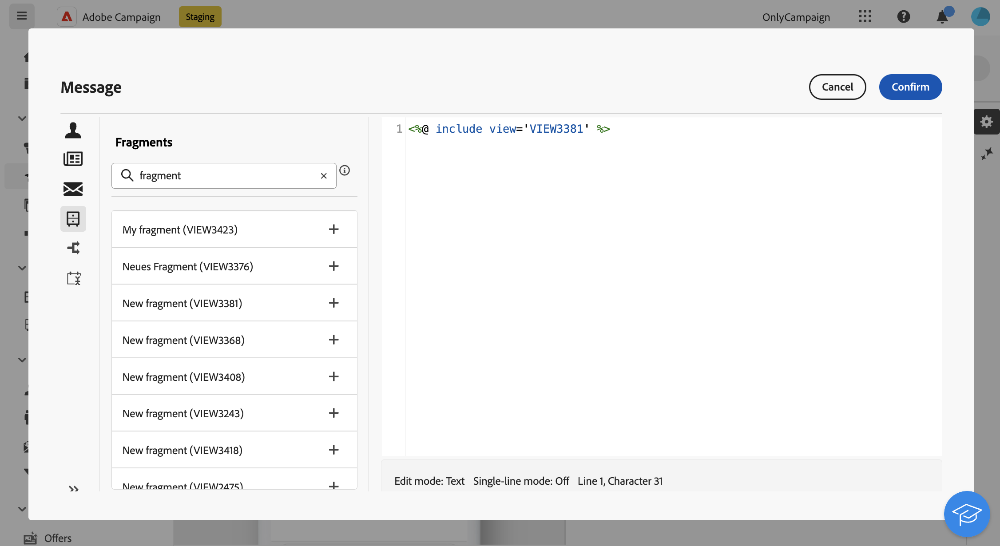

# Añadir fragmentos de expresiones en el editor de expresiones {#expression}

>[!CONTEXTUALHELP]
>id="acw_fragments_list"
>title="Fragmentos"
>abstract="Todos los fragmentos de expresiones creados en la zona protegida actual se muestran en esta lista. Para utilizar un fragmento, haga clic en el botón + para añadir el ID del fragmento al editor."

<!-- pas vu dans l'UI-->

Los fragmentos de expresión se pueden utilizar en cualquier campo que se pueda editar con el editor de expresiones. Para añadir fragmentos de expresión al contenido, siga los pasos a continuación.

1. Abra [Editor de expresiones](../personalization/gs-personalization.md) y seleccione el menú **[!UICONTROL Fragmentos]** en el panel izquierdo.

   La lista muestra todos los fragmentos de expresiones creados en la zona protegida actual.

1. Haga clic en el icono `+` junto a un fragmento de expresión para agregarlo al contenido.

   

1. El ID de fragmento se agrega al editor. Si abre el fragmento de expresión correspondiente y lo edita desde la interfaz, los cambios se sincronizan automáticamente. Se propagan a todos los **[!UICONTROL borradores]** envíos que contienen ese ID de fragmento.