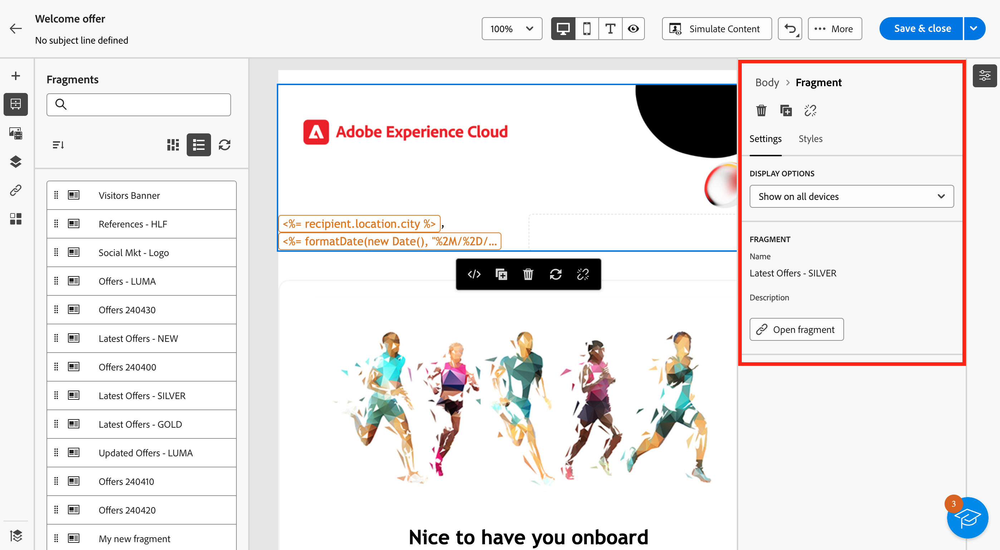

# Añadir fragmentos visuales a los correos electrónicos {#use-visual-fragments}

>[!AVAILABILITY]
>
>Esta capacidad requiere una actualización a Campaign v8.6.4. Obtenga más información en el Notas de la versión de la [consola de cliente de Campaign](https://experienceleague.adobe.com/es/docs/campaign/campaign-v8/releases/release-notes) v8.

En la interfaz web de Campaign, **los fragmentos visuales son bloques visuales predefinidos que se pueden reutilizar en varias [entregas**](../email/get-started-email-designer.md) correo electrónico o en [plantillas](../email/use-email-templates.md) de contenido. Aprenda a crear y administrar fragmentos de contenido en [esta sección](fragments.md).

## Uso de un fragmento visual {#use-fragment}

>[!CONTEXTUALHELP]
>id="acw_fragments_details"
>title="Opciones de fragmentos"
>abstract="Este panel proporciona opciones relacionadas con el fragmento seleccionado. Permite elegir en qué dispositivos desea que se muestre el fragmento y abrir el contenido de este fragmento. Use la pestaña **[!UICONTROL Estilos]** para personalizar aún más el fragmento. También puede romper la herencia con el fragmento visual original."

<!-- pas vu dans l'UI-->

Para insertar un fragmento visual en correo electrónico contenido, seguir estos pasos:

1. Abra cualquier correo electrónico o contenido plantilla con el Diseñador](../email/get-started-email-designer.md) de [correo electrónico.

1. Seleccione el **[!UICONTROL icono Fragmentos]** de la izquierda carril.

   

1. Se muestra el lista de todos los fragmentos visuales creados en el simulador de pruebas actual. Puede hacer lo siguiente:

   * Search para un fragmento específico escribiendo su etiqueta.
   * Ordenar fragmentos en orden ascendente o de bajada.
   * Cambiar la forma en que se muestran los fragmentos (tarjetas o lista vista).

   >[!NOTE]
   >
   >Los fragmentos se ordenan por fecha de creación. Los fragmentos añadidos recientemente aparecen primero en la lista.

   Si se modifican o agregan fragmentos visuales mientras edita el contenido, haga clic en el icono Actualizar **** para actualizar el lista con los cambios más recientes.

1. Arrastre y coloque cualquier fragmento visual del lista en el área donde desea insertarlo. Como cualquier otro componente, puede mover el fragmento en su contenido.

1. Seleccione el fragmento para mostrar sus opciones en el panel derecho.

   

   Desde la **[!UICONTROL Configuración]** pestaña, puede:

   * Seleccione la dispositivos en la que desea que se muestre el fragmento.
   * Haga clic en la **botón contenido** Editar para abrir el contenido de este fragmento. [Más información](../content/fragments.md#edit-fragments)

     Puede personalizar aún más el fragmento mediante el **[!UICONTROL pestaña Estilos]** .

1. Si es necesario, rompa la herencia con el fragmento visual original. [Más información](#break-inheritance)

   También puede eliminar el fragmento de su contenido o duplicado él. Realice estas acciones directamente desde el menú contextual que se muestra en la parte superior del fragmento.

1. añadir todos los fragmentos visuales necesarios y **[!UICONTROL Guardar]** los cambios.

### Fragmento visual en modo de solo lectura {#fragment-readonly}

Los derechos de acceso pueden aplicarse a los fragmentos visuales.

Si no se concede permiso edición para un fragmento visual concreto, el plantilla contenido se muestra en **modo** de solo lectura. En este caso, la **[!UICONTROL botón contenido]** Editar se sustituye por el **[!UICONTROL botón contenido]** Ver, lo que permite vista el fragmento sin realizar cambios.

{zoomable="yes"}

Como se muestra a continuación, todos los iconos de funciones están desactivados, lo que limita la interacción a la visualización solamente.

{zoomable="yes"}

## Romper herencia {#break-inheritance}

Cuando se edita un fragmento visual, los cambios se sincronizan y se propagan automáticamente a todas las correo electrónico entregas y contenido plantillas que contengan ese fragmento.

De forma predeterminada, los fragmentos se sincronizan cuando se añaden a una plantilla de correo electrónico o contenido.

Sin embargo, puede separar la herencia del fragmento original. En este caso, el contenido del fragmento se copia en el diseño actual y los cambios ya no se sincronizan.

Para cancelar la herencia, seguir estos pasos:

1. Seleccione el fragmento visual.

1. Haga clic en el icono de desbloqueo de la barra de herramientas contextual.

   

1. El fragmento se convierte en un elemento independiente que ya no está vinculado al fragmento original. Editar como cualquier otro componente contenido del contenido. [Más información](../email/content-components.md)