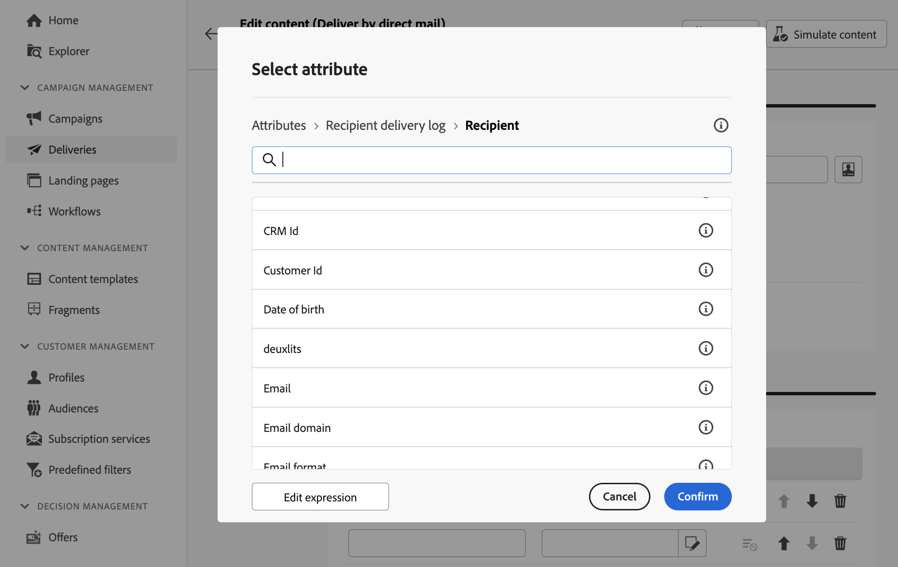

# Diseño del archivo de extracción {#design-direct-mail}

>[!CONTEXTUALHELP]
>id="acw_directmail_content"
>title="Contenido del archivo de extracción"
>abstract="Haga clic en el botón **Editar contenido** para empezar a diseñar el archivo de extracción requerido por su proveedor de correo directo. Esto le permite definir las propiedades del archivo, como su etiqueta y formato, y especificar las columnas que desea incluir en el archivo."

>[!CONTEXTUALHELP]
>id="acw_directmail_properties_file"
>title="Propiedades del archivo"
>abstract="Configure las propiedades del archivo de extracción, como su nombre y formato. Puede personalizar el nombre del archivo usando atributos de la base de datos mediante el editor de expresiones."

>[!CONTEXTUALHELP]
>id="acw_directmail_properties_content"
>title="Contenido"
>abstract="En esta sección, especifique las columnas que desea mostrar en el archivo de extracción. Cuando haya terminado, podrá, puede obtener una vista previa del archivo de extracción mediante el botón **Simular contenido**."

Para diseñar el contenido del archivo de extracción generado por su envío de correo postal, haga clic en el botón **[!UICONTROL Editar contenido]** de su página de envío y, a continuación, configure las propiedades y el contenido del archivo.

## Configuración de las propiedades del archivo de extracción {#properties}

1. En el campo **[!UICONTROL Nombre de archivo]**, especifique el nombre que desee para el archivo de extracción. Puede personalizar el nombre del archivo mediante los atributos de la base de datos. Para ello, haga clic en el icono **[!UICONTROL Abrir cuadro de diálogo de personalización]** para abrir el editor de expresiones. [Obtenga información sobre cómo personalizar el contenido](../personalization/personalize.md)

1. En el campo **[!UICONTROL Formato de archivo]**, elija el formato deseado para el archivo de extracción: **Texto**, **Texto con columnas de ancho fijo**, **CSV (Excel)** o **XML**.

1. Expanda la sección **[!UICONTROL Formato de extracción]** para acceder a opciones específicas relacionadas con el formato del archivo de extracción. Los valores disponibles dependen del formato seleccionado.

   +++ Opciones de formato de extracción disponibles

   * **[!UICONTROL Usar primera línea como encabezado de columna]** (formato de texto/CSV (Excel)): Active esta opción para usar la primera columna como encabezado.
   * **[!UICONTROL Separador de columnas]** (formato de texto): especifique el carácter que se utilizará como separador de columnas en el archivo de extracción.
   * **[!UICONTROL Delimitador de cadenas]** (formato de texto): especifique cómo delimitar cadenas en el archivo de extracción.
   * **[!UICONTROL Fin de línea]** (formato de texto): especifique cómo delimitar el final de líneas en el archivo de extracción.
   * **[!UICONTROL Codificación]**: elija la codificación del archivo de extracción.
   * **[!UICONTROL Separadores y formato de fecha]**: especifique el formato de las fechas en el archivo de extracción.
   * **[!UICONTROL Formato de número]**: especifique el formato de los números en el archivo de extracción.
   * **[!UICONTROL Exportar etiquetas en lugar de valores internos de enumeraciones]**: Active esta opción si exporta valores de enumeración y desea recuperar etiquetas de columna, que son más fáciles de entender, en lugar de identificadores internos.

   +++

1. Active la opción **[!UICONTROL Cantidad solicitada]** para restringir el número de destinatarios de su envío.

   {zoomable="yes"}

## Configuración de las columnas del archivo de extracción {#content}

En la sección **[!UICONTROL Contenido]**, especifique las columnas que se mostrarán en el archivo de extracción. Para ello, siga estos pasos:

1. Haga clic en el botón **[!UICONTROL Agregar atributo]** para crear una columna nueva.
1. Seleccione el atributo que desea mostrar en la columna y, a continuación, confirme la selección. Tenga en cuenta que puede usar el editor de expresiones para seleccionar el atributo al hacer clic en el botón **[!UICONTROL Editar expresión]**. [Aprenda a seleccionar atributos y agregarlos a favoritos](../get-started/attributes.md)

   

1. Una vez añadida la columna, se puede cambiar su etiqueta y modificar el atributo asociado mediante el icono de edición.
1. Repita estos pasos para agregar tantas columnas como sea necesario para el archivo de extracción.
1. Para ordenar el archivo de extracción con una de las columnas, haga clic en el icono de la columna **[!UICONTROL Sorting]** y seleccione el método de ordenación que desee.
1. Para cambiar la posición de una columna, utilice las flechas arriba y abajo.

Ahora puede obtener una vista previa del archivo de extracción y realizar la entrega para generar el archivo de extracción. [Aprenda a probar y enviar mensajes de correo postal](send-direct-mail.md)