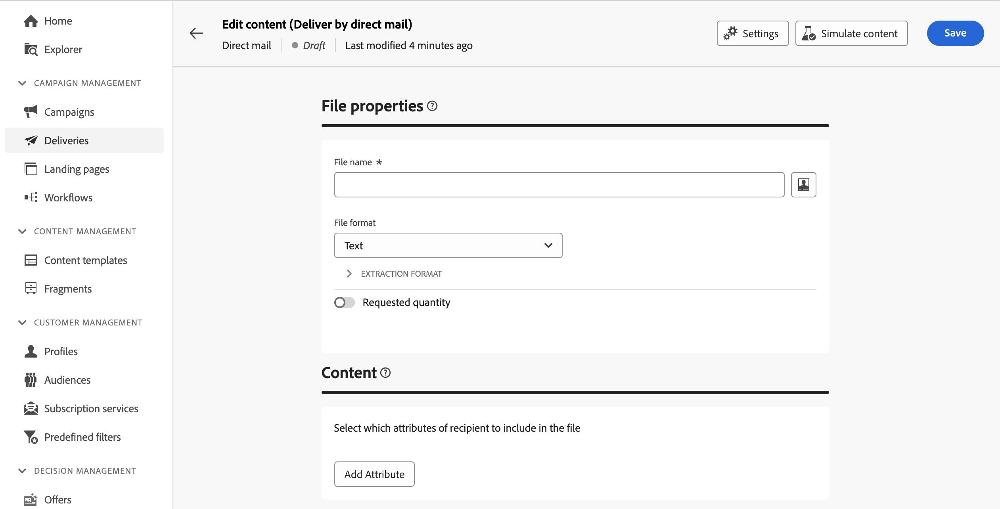

# Crear un envío de correo directo {#create-direct-mail}

Puede crear una entrega de correo postal independiente o crear una entrega de correo directo en el contexto de un flujo de trabajo de la campaña. Los pasos siguientes detallan el procedimiento para un envío de correo postal independiente (único). Si está trabajando en el contexto de un flujo de trabajo de campaña, los pasos de creación se detallan en [esta sección](../workflows/activities/channels.md#create-a-delivery-in-a-campaign-workflow).

Para crear un nuevo envío de correo postal independiente, siga estos pasos:

1. Vaya a la **[!UICONTROL Envíos]** en el carril izquierdo y haga clic en el botón  **[!UICONTROL Creación de envíos]** botón.

1. En el **[!UICONTROL Canal]** , elija **[!UICONTROL Correo directo]** como canal y seleccione una plantilla. [Más información sobre las plantillas](../msg/delivery-template.md)

1. Haga clic en el botón **[!UICONTROL Crear envío]** para confirmar.

   {zoomable="yes"}

1. Introduzca una **[!UICONTROL Etiqueta]** para la entrega y acceda al **[!UICONTROL Opciones adicionales]** menú desplegable. Si la entrega se basa en un esquema ampliado, especifique **Opciones personalizadas** Los campos de están disponibles.

   {zoomable="yes"}

   +++Configure la siguiente configuración según sus necesidades.
   * **[!UICONTROL Nombre interno]**: asignar un identificador único al envío.
   * **[!UICONTROL Carpeta]**: almacene el envío en una carpeta específica.
   * **[!UICONTROL Código de envío]**: organice los envíos con su propia convención de nomenclatura.
   * **[!UICONTROL Descripción]**: especifique una descripción para el envío.
   * **[!UICONTROL Naturaleza]**: especifique la naturaleza de la entrega con fines de clasificación.
+++

1. Haga clic en **[!UICONTROL Seleccionar audiencia]** para dirigirse a una audiencia existente o crear la suya propia.

   * [Obtenga información sobre cómo seleccionar una audiencia existente](../audience/add-audience.md)
   * [Obtenga información sobre cómo crear una audiencia nueva](../audience/one-time-audience.md)

   {zoomable="yes"}

   >[!NOTE]
   >
   >Los destinatarios del correo postal deben contener al menos sus nombres y direcciones postales. Se considera que una dirección está completa si el nombre, el campo de código postal y el campo de municipio o ciudad no están vacíos. Los destinatarios con direcciones incompletas se excluirán de los envíos de correo directo.

1. Encienda el **[!UICONTROL Habilitar grupo de control]** opción para establecer un grupo de control para medir el impacto del envío. Los mensajes no se envían a ese grupo de control, por lo que puede comparar el comportamiento de la población que recibió el mensaje con el comportamiento de los contactos que no lo recibieron. [Aprenda a trabajar con grupos de control](../audience/control-group.md)

1. Clic **[!UICONTROL Editar contenido]** para definir la información (columnas) que se van a exportar al archivo de extracción. [Más información](content-direct-mail.md)

   {zoomable="yes"}

1. Para programar su envío a una fecha y hora específicas, active la opción **[!UICONTROL Habilitar programación]**. Después de iniciar la entrega, el archivo de extracción se generará automáticamente en la fecha y hora exactas que haya definido. [Obtenga información sobre cómo programar entregas](../msg/gs-messages.md#gs-schedule).

   >[!NOTE]
   >
   >Cuando se realiza una entrega en el contexto de un flujo de trabajo, se debe utilizar el **Planificador** actividad. Obtenga más información en [esta página](../workflows/activities/scheduler.md).

1. Clic **[!UICONTROL Configuración]** para acceder a las opciones avanzadas relacionadas con la plantilla de envíos. [Más información](../advanced-settings/delivery-settings.md)

   {zoomable="yes"}

1. Una vez que la entrega de correo postal esté lista, haga clic en **[!UICONTROL Revisar y enviar]** para validar y realizar la entrega y generar el archivo de extracción. [Obtenga información sobre cómo obtener una vista previa y enviar una entrega de correo directo](send-direct-mail.md)
