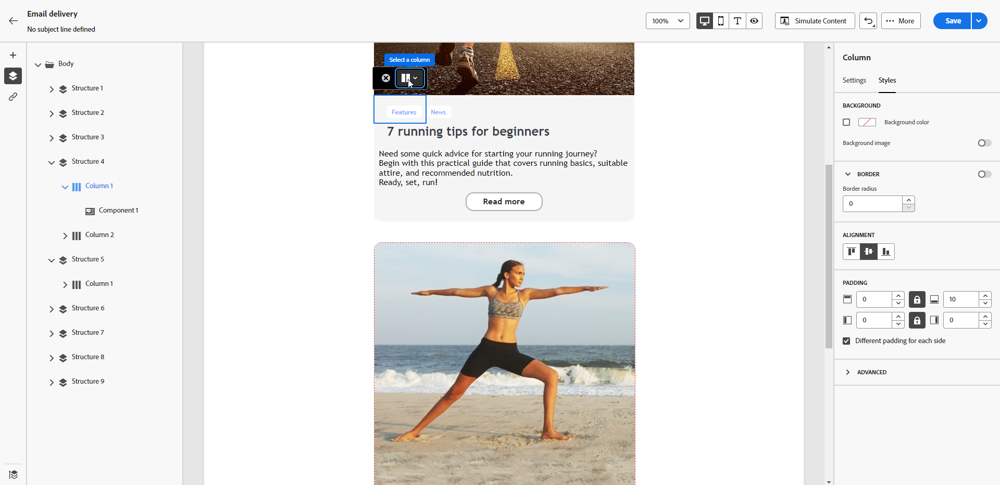
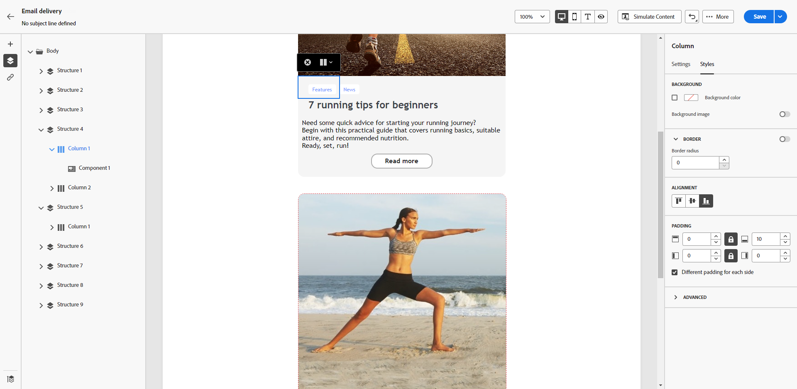
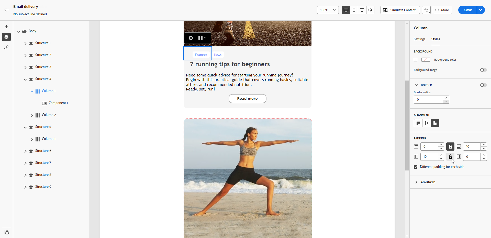

# Ajustar alineación vertical y relleno {#alignment-and-padding}

En este ejemplo, ajuste el relleno y la alineación vertical dentro de un componente de estructura compuesto por tres columnas.

1. Seleccione el componente de estructura directamente en el correo electrónico o utilice el **[!UICONTROL árbol de navegación]** disponible en el panel izquierdo.

   {zoomable="yes"}

1. En la barra de herramientas contextual, haga clic en **[!UICONTROL Seleccionar una columna]** y elija la columna que desee editar. También puede seleccionarla en el árbol de estructura de la izquierda.

   {zoomable="yes"}

1. Los parámetros editables de la columna seleccionada se muestran en la ficha **[!UICONTROL Estilos]**. Ajuste la **[!UICONTROL Alineación]** usando la sección específica.

   {zoomable="yes"}

   Por ejemplo, seleccione **[!UICONTROL Inferior]**. El componente de contenido se desplaza a la parte inferior de la columna.

1. En **[!UICONTROL Relleno]**, defina el relleno superior dentro de la columna y establezca el margen izquierdo y derecho para esa columna.

   >[!NOTE]
   >
   >Haga clic en el icono de bloqueo para interrumpir la sincronización entre el relleno superior e inferior o izquierdo y derecho.

   {zoomable="yes"}

1. Ajuste la alineación y el relleno de las demás columnas del mismo modo.

1. Guarde los cambios.