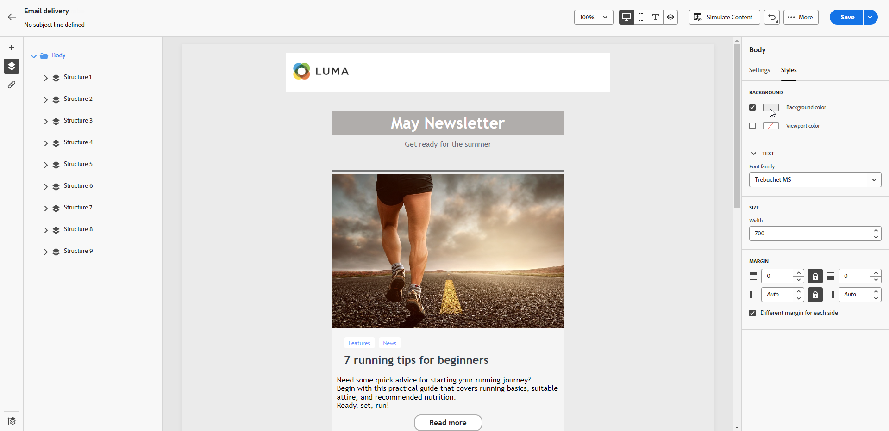

# Personalice el fondo del correo electrónico {#backgrounds}

>[!CONTEXTUALHELP]
>id="ac_edition_backgroundimage"
>title="Configuración de fondo"
>abstract="Puede personalizar el color o la imagen de fondo del contenido. Tenga en cuenta que la imagen de fondo no es compatible con todos los clientes de correo electrónico."

En cuanto a la configuración de fondos con el Diseñador de correo electrónico, Adobe recomienda lo siguiente:

1. Aplique un color de fondo al cuerpo del correo electrónico si lo requiere el diseño.
1. Normalmente, se deben definir los colores de fondo al nivel de columna.
1. Intente no utilizar colores de fondo en componentes de imagen o texto, ya que son difíciles de administrar.

A continuación se muestran los ajustes de fondo disponibles que puede utilizar.

* Configure un **[!UICONTROL Color de fondo]** para todo el correo electrónico. Asegúrese de seleccionar la configuración de cuerpo en el árbol de navegación accesible desde el panel izquierdo.

  {zoomable="yes"}

* Establezca el mismo color de fondo para todos los componentes de estructura seleccionando **[!UICONTROL Color de fondo de la ventanilla]**. Esta opción le permite seleccionar una configuración diferente del color de fondo.

  {zoomable="yes"}

* Defina un color de fondo diferente para cada componente de estructura. Seleccione una estructura en el árbol de navegación del panel izquierdo para aplicar un color de fondo específico solo a esa estructura.

  {zoomable="yes"}

  >[!NOTE]
  >
  >Asegúrese de no establecer un color de fondo de ventanilla, ya que podría ocultar los colores de fondo de la estructura.

* Configure una **[!UICONTROL Imagen de fondo]** para el contenido de un componente de estructura.

  {zoomable="yes"}

  >[!NOTE]
  >
  >Algunos programas de correo electrónico no admiten imágenes de fondo. Cuando no se admite, se utiliza el color de fondo de la fila. Asegúrese de seleccionar un color de fondo alternativo adecuado en caso de que la imagen no se pueda mostrar.

* Establezca un color de fondo en el nivel de columna.

  {zoomable="yes"}

  >[!NOTE]
  >
  >Este es el caso de uso más común. Adobe recomienda configurar los colores de fondo en el nivel de columna, ya que esto permite una mayor flexibilidad al editar todo el contenido del correo electrónico.

  También puede establecer una imagen de fondo en el nivel de columna, pero esto no se suele utilizar.
