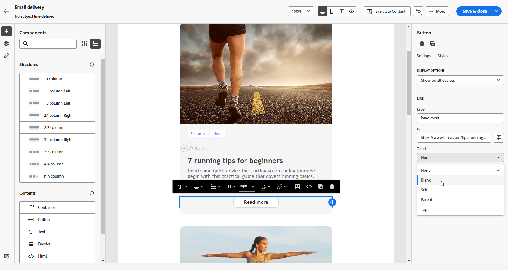
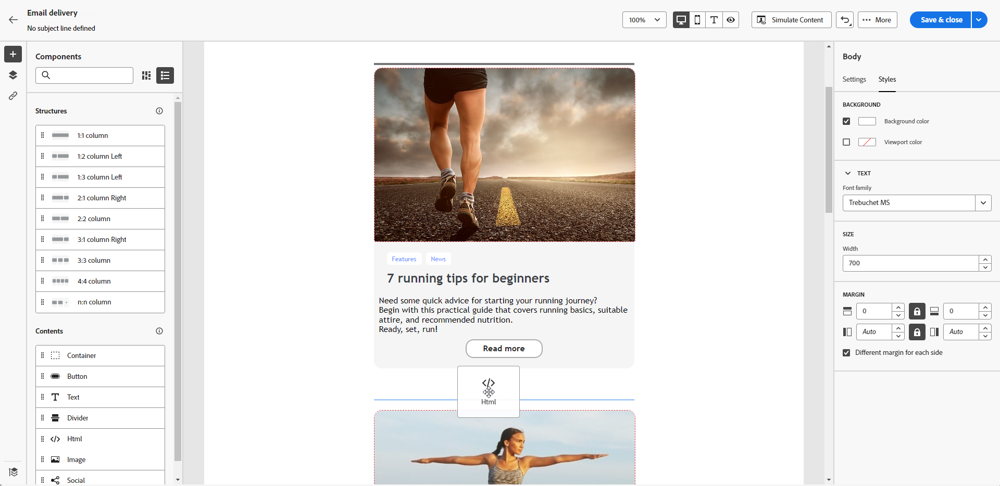
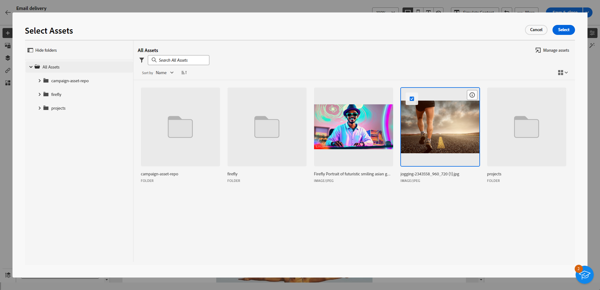
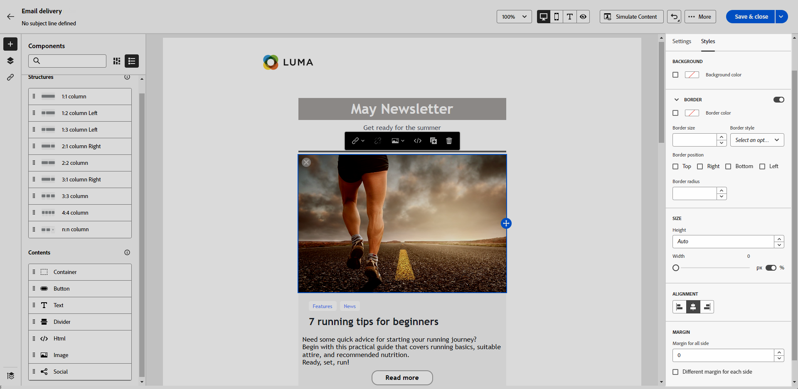

# Usar componentes de contenido {#content-components}

>[!CONTEXTUALHELP]
>id="ac_content_components_email"
>title="Acerca del contenido"
>abstract="Los componentes de contenido son marcadores de posición de contenido vacíos que se pueden utilizar para crear el diseño de un correo electrónico."

>[!CONTEXTUALHELP]
>id="ac_content_components_landing_page"
>title="Acerca del contenido"
>abstract="Los componentes de contenido son marcadores de posición de contenido vacíos que se pueden utilizar para crear el diseño de una página de aterrizaje."

>[!CONTEXTUALHELP]
>id="ac_content_components_fragment"
>title="Acerca del contenido"
>abstract="Los componentes de contenido son marcadores de posición de contenido vacíos que se pueden utilizar para crear el diseño de un fragmento de contenido."

>[!CONTEXTUALHELP]
>id="ac_content_components_template"
>title="Acerca del contenido"
>abstract="Los componentes de contenido son marcadores de posición de contenido vacíos que se pueden utilizar para crear el diseño de una plantilla."

Al crear su contenido correo electrónico, **[!UICONTROL los componentes de contenido]** le permiten personalizar su correo electrónico con componentes sin procesar y vacíos que puede usar una vez colocados en una correo electrónico.

Puede agregar tantos **[!UICONTROL contenidos]** como sea necesario dentro de una **[!UICONTROL estructura]**, que define el diseño de su correo electrónico.

## añadir componentes de contenido {#add-content-components}

Para añadir componentes de contenido al correo electrónico y ajustarlos a sus necesidades, siga los pasos a continuación.

1. En el Designer de correo electrónico, usa un [contenido existente](existing-content.md) o arrastra y suelta una **[!UICONTROL Estructura]** en el contenido vacío para definir el diseño del correo electrónico. [Descubra cómo](create-email-content.md)

1. Arrastre y suelte el **[!UICONTROL Contenido]** de su elección dentro de las estructuras relevantes.

   {zoomable="yes"}

   >[!NOTE]
   >
   >Puede añadir varios componentes en una sola estructura y en cada columna de una estructura.

1. Ajuste las opciones de cada componente con la ficha **[!UICONTROL Configuración]** contextual. Por ejemplo, elija si desea mostrarlo solo en escritorio dispositivos móvil, o en ambos. También puede administrar opciones vincular desde este pestaña. [Más información sobre la gestión de vínculos](message-tracking.md)

1. Ajuste los atributos de estilo de cada componente mediante el **[!UICONTROL pestaña de estilo]** . Por ejemplo, cambie el estilo del texto, el relleno o el margen de cada componente. [Obtenga más información sobre la alineación y el relleno](alignment-and-padding.md)

   {zoomable="yes"}

1. En el menú avanzado de su **[!UICONTROL Contenido]** en el panel derecho, elimine o duplique cualquier componente de contenido según sea necesario.

## Contenedor {#container}

Puede añadir un contenedor simple dentro del cual añadir otro componente de contenido. Esto le permite aplicar un estilo específico al contenedor, que es diferente del componente utilizado en el interior.

Por ejemplo, agregue el componente **[!UICONTROL Contenedor]** y el componente [Botón](#button) dentro de ese contenedor. Utilice un fondo específico para el contenedor y otro para el botón.

{zoomable="yes"}

## Botón {#buttons}

Utilice el componente **[!UICONTROL Botón]** para insertar uno o varios botones en el correo electrónico y redirigir el público de correo electrónico a otra página.

1. En la lista **[!UICONTROL Contenidos]**, arrastre y suelte el componente **[!UICONTROL Botón]** en un componente de **[!UICONTROL Estructura]**.

   {zoomable="yes"}

1. Haga clic en el botón recién agregado para personalizar el texto y acceder a las pestañas **[!UICONTROL Configuración]** y **[!UICONTROL Estilos]** .

   {zoomable="yes"}

1. En la ficha **[!UICONTROL Configuración]**, en el campo **[!UICONTROL URL]**, agregue la URL a la que redirigir al hacer clic en el botón.

1. Elija cómo se muestra el contenido mediante la lista desplegable **[!UICONTROL Target]**:

   * **[!UICONTROL Ninguna]**: abre el vínculo en el mismo marco en el que se hizo clic (predeterminado).
   * **[!UICONTROL En blanco]**: abre el vínculo en una nueva ventana o pestaña.
   * **[!UICONTROL Propio]**: abre el vínculo en el mismo marco en el que se hizo clic.
   * **[!UICONTROL Principal]**: abre el vínculo en el marco principal.
   * **[!UICONTROL Superior]**: abre el vínculo en todo el cuerpo de la ventana.

   {zoomable="yes"}

1. Personalice aún más el botón cambiando atributos de estilo como **[!UICONTROL Borde]**, **[!UICONTROL Tamaño]**, **[!UICONTROL Margen]** y otros de la pestaña **[!UICONTROL Estilos]**.

## Texto {#text}

Use el componente **[!UICONTROL Texto]** para insertar texto en el correo electrónico y ajustar el estilo (borde, tamaño, relleno, etc.) con las fichas **[!UICONTROL Configuración]** y **[!UICONTROL Estilos]**.

1. En el menú **[!UICONTROL Contenido]**, arrastre y suelte **[!UICONTROL Texto]** en un componente **[!UICONTROL Estructura]**.

   {zoomable="yes"}

1. Haga clic en el componente que acaba de agregar para personalizar el texto y acceder a las pestañas **[!UICONTROL Configuración]** y **[!UICONTROL Estilos]**.

1. Cambie el texto con las siguientes opciones disponibles en la barra de herramientas contextual:

   {zoomable="yes"}

   * **[!UICONTROL Cambiar estilo de texto]**: aplique negrita, cursiva, subrayado o tachado al texto.
   * **Cambiar alineación**: elija entre alineación a la izquierda, a la derecha, al centro o justificada para el texto.
   * **[!UICONTROL Crear lista]**: agregue listas de viñetas o números al texto.
   * **[!UICONTROL Definir encabezado]**: añadir hasta seis niveles de encabezado al texto.
   * **Tamaño de fuente**: seleccionar el tamaño de fuente del texto en píxeles.
   * **[!UICONTROL Editar imagen]**: añadir una imagen o un recurso al componente de texto.
   * **[!UICONTROL Mostrar el código fuente]**: mostrar el código fuente del texto. No se puede modificar.
   * **[!UICONTROL Duplicar]**: añadir una copia del componente de texto.
   * **[!UICONTROL Eliminar]**: eliminar el componente de texto seleccionado del correo electrónico.
   * **[!UICONTROL Añadir personalización]**: añadir campos de personalización para personalizar el contenido de los datos de perfiles.
   * **[!UICONTROL Habilitar contenido condicional]**: agregue contenido condicional para adaptar el contenido del componente a los perfiles de destino.

1. Ajuste otros atributos de estilo, como el color del texto, la familia de fuente, el borde, el relleno, el margen y otros de la **[!UICONTROL pestaña Estilos]** .

   {zoomable="yes"}

## Divisor {#divider}

Utilice el componente **[!UICONTROL Divisor]** para insertar una línea divisoria y organizar el diseño y el contenido del correo electrónico.

Puede ajustar los atributos de estilo, como el color de la línea, el estilo y la altura, desde el **[!UICONTROL pestaña Estilos]** .

{zoomable="yes"}

## HTML {#HTML}

Utilice el **[!UICONTROL componente HTML]** para copiar y pegar partes de su HTML existente. Esto permite crear gratuito componentes HTML modulares para reutilizar contenido externas.

1. En **[!UICONTROL Componentes]**, arrastre y suelte el componente **[!UICONTROL HTML]** en un componente de **[!UICONTROL Estructura]**.

   {zoomable="yes"}

1. Haga clic en el componente recién agregado y, a continuación, seleccione **[!UICONTROL Mostrar el código fuente]** de la barra de herramientas contextual para añadir el HTML.

   {zoomable="yes"}

>[!NOTE]
>
>Para que el contenido externo sea compatible con Email Designer, Adobe recomienda [crear un mensaje desde cero](create-email-content.md) y copiar el contenido del correo electrónico existente en los componentes.

## Imagen {#image}

>[!IMPORTANT]
>
>El acceso al menú de Assets está limitado a los usuarios con una licencia activa de Adobe Experience Manager as a Cloud Service. Si no dispone de esta licencia, el menú Assets no estará disponible.

Utilice el componente Imagen ]**para insertar un archivo de imagen desde el**[!UICONTROL  ordenador en el correo electrónico.

1. En el menú Contenido ]**, arrastre y suelte**[!UICONTROL  Imagen **** en un **[!UICONTROL componente Estructura]**.

   {zoomable="yes"}

1. Haga clic en **[!UICONTROL Examinar]** para elegir un archivo de imagen de sus recursos. También puedes elegir **[!UICONTROL Importar tus medios]**.

   Para obtener más información sobre cómo cargar y agregar recursos en Adobe Experience Manager, consulte [Documentación de Adobe Experience Manager as a Cloud Service](https://experienceleague.adobe.com/docs/experience-manager-cloud-service/content/assets/manage/add-assets.html).

   {zoomable="yes"}

1. Navegue por sus carpetas para localizar el recurso específico que necesita o use la barra de búsqueda para encontrarlo de manera eficiente.

   Una vez que haya encontrado el recurso que está buscando, haga clic en **[!UICONTROL Seleccionar]**.

   {zoomable="yes"}

1. Haga clic en el componente recién agregado y configure las propiedades de imagen con el **[!UICONTROL pestaña Configuración]** :

   * **[!UICONTROL Imagen título]** le permite definir un título para la imagen.
   * **[!UICONTROL Texto alternativo]** permite definir el pie de ilustración vinculado a la imagen. Esto corresponde al atributo HTML alt.

   {zoomable="yes"}

1. añadir una vincular para redirección su audiencia a otra contenido. [Más información](message-tracking.md)

1. Ajuste otros atributos de estilo, como margen, borde y otros, mediante el **[!UICONTROL pestaña Estilos]** .

## Social {#social}

Utilice el componente **[!UICONTROL Social]** para insertar vínculos a páginas de redes sociales en el contenido del correo electrónico.

1. Desde el menú **[!UICONTROL Componentes]**, arrastre y suelte el componente **[!UICONTROL Social]** en un componente de **[!UICONTROL Estructura]**.

1. Haga clic en el componente recién añadido.

1. En el campo **[!UICONTROL Social]** de la pestaña **[!UICONTROL Configuración]**, elija los medios sociales que desea agregar o quitar.

   {zoomable="yes"}

1. Elija el tamaño de los iconos en el campo **[!UICONTROL Tamaño de las imágenes]**.

1. Haga clic en cada uno de sus iconos de redes sociales para configurar la **[!UICONTROL URL]** a la que se redirige su público.

   {zoomable="yes"}

1. Cambie los iconos de cada uno de sus medios sociales si es necesario en el **[!UICONTROL campo Origen]** .

1. Ajuste otros atributos de estilo como estilo, margen borde y otros de la **[!UICONTROL pestaña Estilos]** .