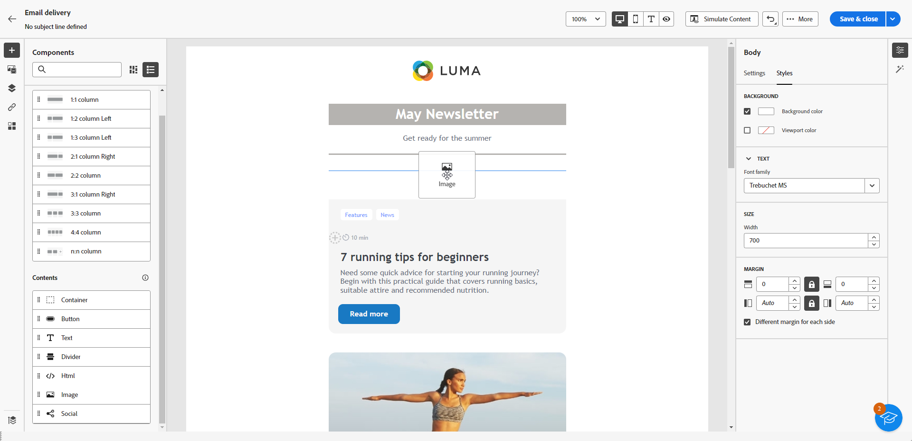

# Usar componentes de contenido {#content-components}

>[!CONTEXTUALHELP]
>id="ac_content_components_email"
>title="Acerca del contenido"
>abstract="Los componentes de contenido son marcadores de posición de contenido vacíos que se pueden utilizar para crear el diseño de un correo electrónico."

>[!CONTEXTUALHELP]
>id="ac_content_components_landing_page"
>title="Acerca del contenido"
>abstract="Los componentes de contenido son marcadores de posición de contenido vacíos que se pueden utilizar para crear el diseño de una página de aterrizaje."

>[!CONTEXTUALHELP]
>id="ac_content_components_fragment"
>title="Acerca del contenido"
>abstract="Los componentes de contenido son marcadores de posición de contenido vacíos que se pueden utilizar para crear el diseño de un fragmento de contenido."

>[!CONTEXTUALHELP]
>id="ac_content_components_template"
>title="Acerca del contenido"
>abstract="Los componentes de contenido son marcadores de posición de contenido vacíos que se pueden utilizar para crear el diseño de una plantilla."

Al crear el contenido del correo electrónico, los componentes **[!UICONTROL Contenido]** le permiten personalizar el correo electrónico con componentes sin procesar y vacíos que puede utilizar una vez colocados en un correo electrónico.

Puede agregar tantos **[!UICONTROL Contenidos]** como sea necesario dentro de una **[!UICONTROL Estructura]**, que define el diseño del correo electrónico.

## Añadir componentes de contenido {#add-content-components}

Para añadir componentes de contenido al correo electrónico y ajustarlos a sus necesidades, siga los pasos a continuación.

1. En el Designer de correo electrónico, usa un [contenido existente](existing-content.md) o arrastra y suelta una **[!UICONTROL Estructura]** en el contenido vacío para definir el diseño del correo electrónico. [Descubra cómo](create-email-content.md)

1. Arrastre y suelte el **[!UICONTROL Contenido]** de su elección dentro de las estructuras relevantes.

   {zoomable="yes"}

   >[!NOTE]
   >
   >Puede añadir varios componentes en una sola estructura y en cada columna de una estructura.

1. Ajuste las opciones de cada componente con la ficha **[!UICONTROL Configuración]** contextual. Por ejemplo, elija mostrarlo solo en equipos de escritorio o dispositivos móviles, o en ambos. También puede administrar las opciones de vínculo desde esta pestaña. [Más información acerca de la administración de vínculos](message-tracking.md)

1. Ajuste los atributos de estilo de cada componente mediante la ficha **[!UICONTROL Style]**. Por ejemplo, cambie el estilo del texto, el relleno o el margen de cada componente. [Obtenga más información sobre la alineación y el relleno](alignment-and-padding.md)

   {zoomable="yes"}

1. En el menú avanzado de su **[!UICONTROL Contenido]** en el panel derecho, elimine o duplique cualquier componente de contenido según sea necesario.

## Contenedor {#container}

Puede añadir un contenedor simple dentro del cual añadir otro componente de contenido. Esto le permite aplicar un estilo específico al contenedor, que es diferente al componente utilizado dentro de.

Por ejemplo, agregue el componente **[!UICONTROL Contenedor]** y el componente [Botón](#button) dentro de ese contenedor. Utilice un fondo específico para el contenedor y otro para el botón.

{zoomable="yes"}

## Botón {#buttons}

Utilice el componente **[!UICONTROL Botón]** para insertar uno o varios botones en el correo electrónico y redirigir el público de correo electrónico a otra página.

1. En la lista **[!UICONTROL Contenidos]**, arrastre y suelte el componente **[!UICONTROL Botón]** en un componente de **[!UICONTROL Estructura]**.

   {zoomable="yes"}

1. Haga clic en el botón que acaba de agregar para personalizar el texto y acceder a las fichas **[!UICONTROL Configuración]** y **[!UICONTROL Estilos]**.

   {zoomable="yes"}

1. En la ficha **[!UICONTROL Configuración]**, en el campo **[!UICONTROL URL]**, agregue la URL a la que redirigir al hacer clic en el botón.

1. Elija cómo se muestra el contenido mediante la lista desplegable **[!UICONTROL Target]**:

   * **[!UICONTROL Ninguna]**: abre el vínculo en el mismo marco en el que se hizo clic (predeterminado).
   * **[!UICONTROL En blanco]**: abre el vínculo en una nueva ventana o pestaña.
   * **[!UICONTROL Propio]**: abre el vínculo en el mismo marco en el que se hizo clic.
   * **[!UICONTROL Principal]**: abre el vínculo en el marco principal.
   * **[!UICONTROL Superior]**: abre el vínculo en todo el cuerpo de la ventana.

   {zoomable="yes"}

1. Personalice aún más el botón cambiando atributos de estilo como **[!UICONTROL Borde]**, **[!UICONTROL Tamaño]**, **[!UICONTROL Margen]** y otros de la pestaña **[!UICONTROL Estilos]**.

## Texto {#text}

Use el componente **[!UICONTROL Texto]** para insertar texto en el correo electrónico y ajustar el estilo (borde, tamaño, relleno, etc.) con las fichas **[!UICONTROL Configuración]** y **[!UICONTROL Estilos]**.

1. En el menú **[!UICONTROL Contenido]**, arrastre y suelte **[!UICONTROL Texto]** en un componente **[!UICONTROL Estructura]**.

   {zoomable="yes"}

1. Haga clic en el componente que acaba de agregar para personalizar el texto y acceder a las pestañas **[!UICONTROL Configuración]** y **[!UICONTROL Estilos]**.

1. Cambie el texto con las siguientes opciones disponibles en la barra de herramientas contextual:

   {zoomable="yes"}

   * **[!UICONTROL Cambiar estilo de texto]**: aplique negrita, cursiva, subrayado o tachado al texto.
   * **Cambiar alineación**: elija entre alineación a la izquierda, a la derecha, al centro o justificada para el texto.
   * **[!UICONTROL Crear lista]**: agregue listas de viñetas o números al texto.
   * **[!UICONTROL Definir encabezado]**: añadir hasta seis niveles de encabezado al texto.
   * **Tamaño de fuente**: seleccionar el tamaño de fuente del texto en píxeles.
   * **[!UICONTROL Editar imagen]**: añadir una imagen o un recurso al componente de texto.
   * **[!UICONTROL Mostrar el código fuente]**: mostrar el código fuente del texto. No se puede modificar.
   * **[!UICONTROL Duplicar]**: añadir una copia del componente de texto.
   * **[!UICONTROL Eliminar]**: eliminar el componente de texto seleccionado del correo electrónico.
   * **[!UICONTROL Añadir personalización]**: añadir campos de personalización para personalizar el contenido de los datos de perfiles.
   * **[!UICONTROL Habilitar contenido condicional]**: agregue contenido condicional para adaptar el contenido del componente a los perfiles de destino.

1. Ajuste otros atributos de estilo, como el color del texto, la familia de fuentes, el borde, el relleno, el margen y otros, en la ficha **[!UICONTROL Estilos]**.

   {zoomable="yes"}

## Divisor {#divider}

Utilice el componente **[!UICONTROL Divisor]** para insertar una línea divisoria y organizar el diseño y el contenido del correo electrónico.

Puede ajustar atributos de estilo como el color, el estilo y la altura de la línea desde la ficha **[!UICONTROL Estilos]**.

{zoomable="yes"}

## HTML {#HTML}

Use el componente **[!UICONTROL HTML]** para copiar y pegar partes de su HTML existente. Esto le permite crear componentes modulares de HTML gratuitos para reutilizar contenido externo.

1. En **[!UICONTROL Componentes]**, arrastre y suelte el componente **[!UICONTROL HTML]** en un componente de **[!UICONTROL Estructura]**.

   {zoomable="yes"}

1. Haga clic en el componente recién agregado y, a continuación, seleccione **[!UICONTROL Mostrar el código fuente]** de la barra de herramientas contextual para añadir el HTML.

   {zoomable="yes"}

>[!NOTE]
>
>Para que el contenido externo sea compatible con Email Designer, Adobe recomienda [crear un mensaje desde cero](create-email-content.md) y copiar el contenido del correo electrónico existente en los componentes.

## Imagen {#image}

>[!IMPORTANT]
>
>El acceso al menú de Assets está limitado a los usuarios con una licencia activa de Adobe Experience Manager as a Cloud Service. Si no dispone de esta licencia, el menú Assets no estará disponible.

Use el componente **[!UICONTROL Image]** para insertar un archivo de imagen del equipo en el correo electrónico.

1. En el menú **[!UICONTROL Contenido]**, arrastre y suelte **[!UICONTROL Imagen]** en un componente **[!UICONTROL Estructura]**.

   {zoomable="yes"}

1. Haga clic en **[!UICONTROL Examinar]** para elegir un archivo de imagen de sus recursos. También puedes elegir **[!UICONTROL Importar tus medios]**.

   Para obtener más información sobre cómo cargar y agregar recursos en Adobe Experience Manager, consulte [Documentación de Adobe Experience Manager as a Cloud Service](https://experienceleague.adobe.com/docs/experience-manager-cloud-service/content/assets/manage/add-assets.html?lang=es).

   {zoomable="yes"}

1. Desplácese por las carpetas para localizar el recurso específico que necesita o utilice la barra de búsqueda para encontrarlo de forma eficaz.

   Cuando encuentre el recurso que busca, haga clic en **[!UICONTROL Seleccionar]**.

   {zoomable="yes"}

1. Haga clic en el componente que acaba de agregar y configure las propiedades de la imagen con la pestaña **[!UICONTROL Configuración]**:

   * **[!UICONTROL Título de imagen]** le permite definir un título para su imagen.
   * **[!UICONTROL Texto alternativo]** permite definir el pie de ilustración vinculado a la imagen. Esto corresponde al atributo HTML alt.

   {zoomable="yes"}

1. Añada un vínculo para redirigir a la audiencia a otro contenido. [Más información](message-tracking.md)

1. Ajuste otros atributos de estilo como margen, borde y otros mediante la ficha **[!UICONTROL Estilos]**.

## Social {#social}

Utilice el componente **[!UICONTROL Social]** para insertar vínculos a páginas de redes sociales en el contenido del correo electrónico.

1. Desde el menú **[!UICONTROL Componentes]**, arrastre y suelte el componente **[!UICONTROL Social]** en un componente de **[!UICONTROL Estructura]**.

1. Haga clic en el componente recién añadido.

1. En el campo **[!UICONTROL Social]** de la pestaña **[!UICONTROL Configuración]**, elija los medios sociales que desea agregar o quitar.

   {zoomable="yes"}

1. Elija el tamaño de los iconos en el campo **[!UICONTROL Tamaño de las imágenes]**.

1. Haga clic en cada uno de sus iconos de redes sociales para configurar la **[!UICONTROL URL]** a la que se redirige su público.

   {zoomable="yes"}

1. Cambie los iconos de cada uno de los medios sociales si es necesario en el campo **[!UICONTROL Source]**.

1. Ajuste otros atributos de estilo como estilo, margen, borde y otros en la ficha **[!UICONTROL Estilos]**.