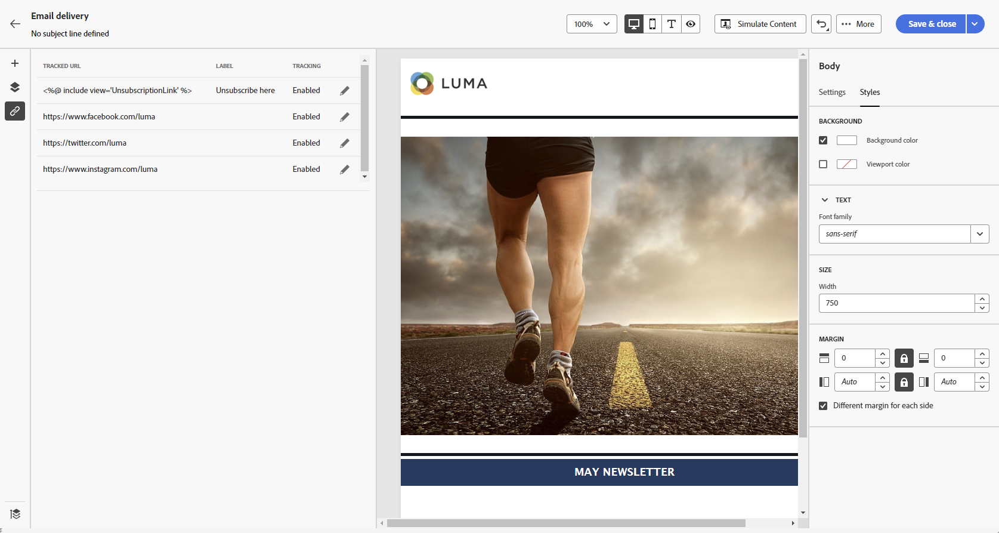

# Inicie el contenido del correo electrónico desde cero {#create-email-content}

>[!CONTEXTUALHELP]
>id="ac_structure_components_email"
>title="Añadir estructuras"
>abstract="Los componentes de estructura definen el diseño del correo electrónico. Arrastre y suelte un componente **Estructura** en el lienzo para empezar a diseñar el contenido del correo electrónico."

>[!CONTEXTUALHELP]
>id="ac_structure_components_landing_page"
>title="Añadir estructuras"
>abstract="Los componentes de estructura definen el diseño de la página de aterrizaje. Arrastre y suelte un componente **Estructura** en el lienzo para empezar a diseñar el contenido del correo electrónico."

>[!CONTEXTUALHELP]
>id="ac_structure_components_fragment"
>title="Añadir estructuras"
>abstract="Las estructuras definen el diseño del fragmento de contenido. Arrastre y suelte un componente **Estructura** en el lienzo para empezar a diseñar el contenido del correo electrónico."

>[!CONTEXTUALHELP]
>id="ac_structure_components_template"
>title="Añadir estructuras"
>abstract="Las estructuras definen el diseño de la plantilla. Arrastre y suelte el componente **Estructura** en el lienzo para empezar a diseñar el contenido del correo electrónico."

>[!CONTEXTUALHELP]
>id="ac_edition_columns_email"
>title="Definición de columnas de correo electrónico"
>abstract="El diseñador de correo electrónico permite definir fácilmente el diseño del correo electrónico mediante la definición de la estructura de columnas."

>[!CONTEXTUALHELP]
>id="ac_edition_columns_landing_page"
>title="Definición de columnas de página de aterrizaje"
>abstract="El diseñador de correo electrónico permite definir fácilmente el diseño de la página de aterrizaje mediante la definición de la estructura de columnas."

>[!CONTEXTUALHELP]
>id="ac_edition_columns_fragment"
>title="Definición de columnas de fragmento de contenido"
>abstract="El diseñador de correo electrónico permite definir fácilmente el diseño del fragmento de contenido mediante la definición de la estructura de columnas."

>[!CONTEXTUALHELP]
>id="ac_edition_columns_template"
>title="Definición de columnas de plantilla"
>abstract="El diseñador de correo electrónico permite definir fácilmente el diseño de la plantilla mediante la definición de la estructura de columnas."

El Diseñador de correo electrónico le permite definir fácilmente la estructura del correo electrónico. Al agregar y mover elementos estructurales con simples acciones de arrastrar y soltar, diseña el cuerpo de su correo electrónico en segundos.

➡️ [Descubra esta funcionalidad en vídeo](#video)

Para inicio la creación de su contenido correo electrónico, seguir los pasos que se describen a continuación.

1. En la [página de inicio Diseñador](get-started-email-designer.md#start-authoring) de correo electrónico, seleccione la **[!UICONTROL opción Diseño desde cero]** .

   {zoomable="yes"}

1. Inicio diseñar su contenido correo electrónico arrastrando y soltando **[!UICONTROL estructuras]** en el lienzo para definir el diseño de su correo electrónico.

   >[!NOTE]
   >
   >El apilado de columnas no es compatible con todos los programas de correo electrónico. Cuando no se admite, las columnas no se apilan.

1. añadir tantas **[!UICONTROL estructuras]** como sea necesario y edite su configuración en el panel dedicado de la derecha.

   {zoomable="yes"}

1. Seleccione el componente **[!UICONTROL columna n:n]** para definir el número de columnas que elija (entre 3 y 10). Defina el ancho de cada columna moviendo las flechas en la parte inferior de cada columna.

   >[!NOTE]
   >
   >Cada tamaño de columna no puede ser inferior al 10 % de la anchura total del componente de la estructura. No se puede quitar una columna que no esté vacía.

1. En la **[!UICONTROL sección Componentes]** , arrastre y coloque tantos elementos como sea necesario en una o más estructuras. [Más información sobre los componentes de contenido](content-components.md)

1. Personalice cada componente mediante las **[!UICONTROL fichas Configuración]** o **[!UICONTROL Estilo]** de la derecha. Por ejemplo, cambie el estilo del texto, el relleno o el margen de cada componente. [Obtenga más información sobre la alineación y el relleno](alignment-and-padding.md)

   {zoomable="yes"}

1. Inserte campos de personalización para personalizar los contenido de correo electrónico basándose en perfil datos. [Más información sobre la personalización de contenido](../personalization/personalize.md)

1. añadir vínculos a su contenido.

   Haga clic en el **[!UICONTROL pestaña Vínculos]** del panel izquierdo para mostrar todas las direcciones URL de la contenido que se rastrearán. Modifique su **[!UICONTROL tipo]** o **[!UICONTROL Etiquetar]** de seguimiento y agregue **[!UICONTROL categorías]** si es necesario.

[Más información sobre enlaces y mensajes seguimiento](message-tracking.md)

   {zoomable="yes"}

1. Si es necesario, personalice aún más su correo electrónico haciendo clic en **[!UICONTROL el editor]** Cambiar a código en el menú avanzado. Esto permite editar el código fuente de la correo electrónico, por ejemplo, para agregar etiquetas HTML seguimiento o personalizadas. [Obtenga más información sobre el editor de código](code-content.md)

   >[!CAUTION]
   >
   >No puede volver al diseñador visual para este correo electrónico después de cambiar al editor de código.

1. Una vez que el contenido esté listo, haga clic en **[!UICONTROL Simular contenido]** para comprobar el procesamiento del correo electrónico. Seleccione la escritorio o la vista móvil. [Obtenga más información sobre la vista previa del correo electrónico](../preview-test/preview-test.md)

   {zoomable="yes"}

1. Cuando el correo electrónico esté listo, haga clic en **[!UICONTROL Guardar]**.

## Vídeos explicativos {#video}

Obtén información sobre cómo navegar por el Diseñador de correo electrónico. Aprenda a estructurar y diseñar un correo electrónico desde cero, personalizar y prueba su correo electrónico.

>[!VIDEO](https://video.tv.adobe.com/v/3453568/?quality=12&captions=spa)