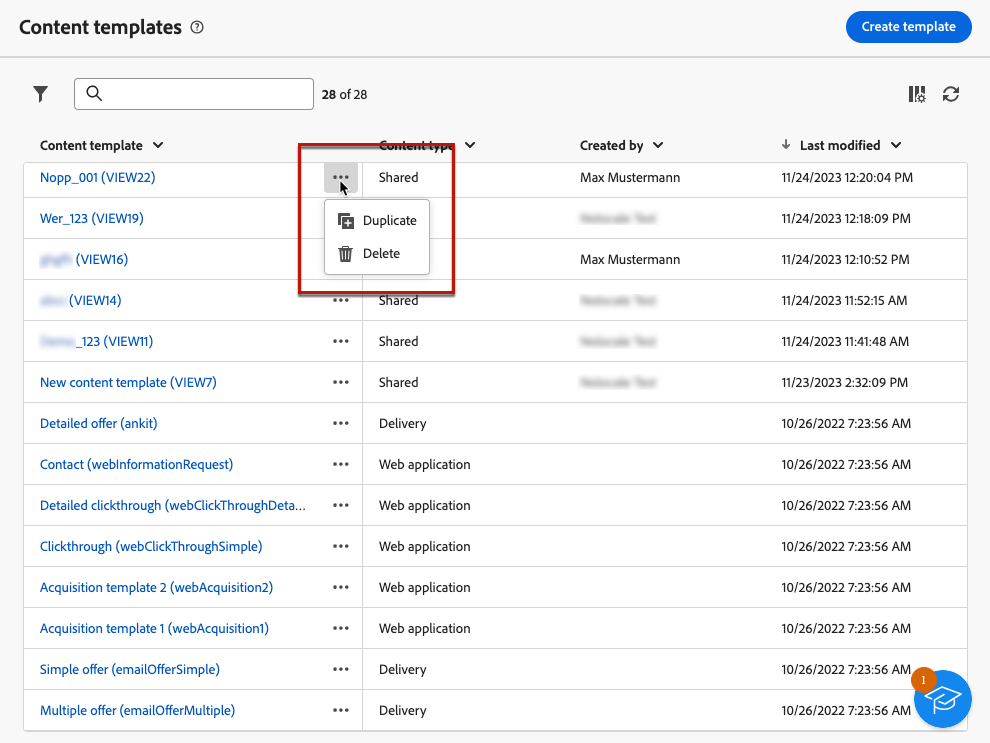

# Trabajo con plantillas de contenido {#content-templates}

>[!CONTEXTUALHELP]
>id="acw_contenttemplate_menu"
>title="Plantillas de contenido"
>abstract="Para lograr un proceso de diseño acelerado y mejorado, puede crear plantillas de envío independientes con el fin de reutilizar fácilmente el contenido personalizado en Adobe Campaign. Estas plantillas de contenido se pueden diseñar desde cero, en función de las plantillas integradas o personalizadas, crear a partir de un contenido existente o importar al editor de plantillas de contenido."

Para un proceso de diseño acelerado y mejorado, puede crear plantillas independientes para reutilizar fácilmente el contenido personalizado en [!DNL Adobe Campaign]. Estas plantillas de contenido se pueden diseñar desde cero, en función de las plantillas integradas o personalizadas, crear a partir de un contenido existente o importar al editor de plantillas de contenido.

Esta funcionalidad permite a los usuarios orientados a contenido trabajar en plantillas independientes para que los usuarios de marketing puedan reutilizarlas y adaptarlas dentro de sus propias campañas de correo electrónico.

>[!NOTE]
>
>Solo actualmente **email** se admiten las plantillas de contenido.

## Plantillas de contenido de acceso {#access-templates}

>[!CONTEXTUALHELP]
>id="acw_contenttemplate_edition"
>title="Edite el contenido de la plantilla"
>abstract="Haga clic en el botón **Editar contenido** para actualizar el contenido con el Diseñador de correo electrónico."

Para acceder a la lista de plantillas de contenido, vaya a **[!UICONTROL Gestión de contenido]** > **[!UICONTROL Plantillas de contenido]** desde el carril izquierdo.

{zoomable="yes"}

Este panel muestra todas las plantillas de contenido disponibles en forma de lista. Puede filtrar por un [carpeta](../get-started/permissions.md#folders) mediante la lista desplegable o agregue reglas utilizando [modelador de consultas](../query/query-modeler-overview.md).

{zoomable="yes"}

Desde la lista, puede editar, duplicar o eliminar plantillas de contenido existentes. Utilice el botón de la sección superior para crear una plantilla de contenido.

## Crear plantillas de contenido {#create-content-templates}

>[!CONTEXTUALHELP]
>id="acw_contenttemplate_design"
>title="Diseño de plantilla de contenido"
>abstract="Diseñe la plantilla de contenido del correo electrónico."

>[!CONTEXTUALHELP]
>id="acw_contenttemplate_selection"
>title="Selección de plantilla de contenido"
>abstract="Seleccione la plantilla de contenido de correo electrónico."

Las plantillas de contenido se pueden crear mediante [guardar un correo electrónico existente como plantilla](#save-as-template), o desde la lista de plantillas de correo electrónico, a través de **Crear plantilla de contenido** botón, [como se detalla a continuación](#create-template-from-scratch).

Una vez guardada, ahora puede utilizar esta plantilla al crear cualquier [email](../email/create-email.md) dentro [!DNL Adobe Campaign]. [Descubra cómo](use-email-templates.md)

>[!NOTE]
>
>* Los cambios realizados en las plantillas de contenido no se propagan a los correos electrónicos.
>
>* Del mismo modo, cuando las plantillas se utilizan en un mensaje de correo electrónico, las ediciones que realice en el contenido del correo electrónico no afectarán a la plantilla de contenido utilizada anteriormente.

### Creación de una nueva plantilla de contenido {#create-template-from-scratch}

>[!CONTEXTUALHELP]
>id="acw_contenttemplate_properties"
>title="Defina las propiedades de la plantilla"
>abstract="Defina las propiedades de la plantilla de contenido de correo electrónico para recuperarlas fácilmente cuando sea necesario."

Para crear una nueva plantilla de contenido desde el panel de plantillas de contenido, siga estos pasos:

1. Navegue hasta la lista de plantillas de contenido desde **[!UICONTROL Gestión de contenido]** > **[!UICONTROL Plantillas de contenido]** carril izquierdo.

1. Seleccionar **[!UICONTROL Crear plantilla]**.

   {zoomable="yes"}

1. Introduzca la etiqueta de plantilla y las propiedades. Puede seleccionar la carpeta en la que desea almacenar la plantilla. De forma predeterminada, las plantillas de contenido se almacenan en una carpeta específica de la jerarquía de Adobe Campaign: **[!UICONTROL Explorer]** > **[!UICONTROL Recursos]** > **[!UICONTROL Plantillas]** > **[!UICONTROL Plantillas de contenido]**. Más información sobre las carpetas en [esta página](../get-started/permissions.md#folders)

   {zoomable="yes"}

1. Clic **[!UICONTROL Crear]** y elija cómo desea diseñar la plantilla entre las distintas opciones:

   * [Diseño del contenido desde cero](create-email-content.md) mediante la interfaz del Diseñador de correo electrónico.

   * [Codifique o copie y pegue el HTML sin procesar](code-content.md) directamente en el Diseñador de correo electrónico.

   * [Importación de contenido de HTML existente](existing-content.md) desde un archivo o una carpeta .zip.

   * Utilice contenido existente de una lista de plantillas integradas o personalizadas. Los pasos para utilizar una plantilla de contenido en un correo electrónico se describen en [esta sección](use-email-templates.md).

   {zoomable="yes"}

1. Se muestra el Diseñador de correo electrónico. Edite el contenido según sea necesario, del mismo modo que lo haría para cualquier correo electrónico, según la opción seleccionada. Aprenda a utilizar el Diseñador de correo electrónico en [esta sección](get-started-email-designer.md).

   <!--You can test your content if needed. [Learn how](#test-template)-->

1. Una vez preparada la plantilla, haga clic en **[!UICONTROL Guardar]**.

   Si es necesario, haga clic en la flecha situada junto al nombre de la plantilla para volver al **[!UICONTROL Detalles]** y editar la plantilla.

   {zoomable="yes"}

La plantilla está disponible en el **[!UICONTROL Plantillas de contenido]** lista. [Más información](#access-templates)

Ahora puede utilizar esta plantilla para crear un nuevo contenido: está disponible en el **[!UICONTROL Plantillas guardadas]** del Diseñador de correo electrónico. [Descubra cómo](use-email-templates.md)

### Guardar contenido de correo electrónico como plantilla {#save-as-template}

Una vez que [diseño de un correo electrónico](create-email-content.md), puede guardar este contenido como una plantilla para su reutilización futura. Las plantillas guardadas están disponibles para todos los usuarios de su entorno de Adobe Campaign.

Para guardar un contenido de correo electrónico como plantilla, siga los pasos a continuación:

1. En el diseñador de correo electrónico, haga clic en **[!UICONTROL Más]** en la parte superior derecha de la pantalla.

1. Seleccionar **[!UICONTROL Guardar como plantilla de contenido]** en el menú desplegable.

   {zoomable="yes"}

1. Introduzca un nombre para esta plantilla y guárdela.

   {zoomable="yes"}

La plantilla se guarda y se muestra en la **[!UICONTROL Plantillas de contenido]** lista. Se convierte en una plantilla de contenido independiente a la que se puede acceder, editar y eliminar como cualquier otro elemento de la lista. [Más información](#access-manage-templates)

Ahora puede utilizar esta plantilla para crear un nuevo contenido: está disponible en el **[!UICONTROL Plantillas guardadas]** del Diseñador de correo electrónico. [Descubra cómo](use-email-templates.md)

{zoomable="yes"}

>[!NOTE]
>
>Los cambios realizados en esa nueva plantilla no se propagan al correo electrónico del que procede. Del mismo modo, cuando el contenido original se edita dentro de ese correo electrónico, la nueva plantilla no se modifica.

<!--

Test your content template {#test-template}

You can test the rendering of any email content template, whether created from scratch or from an email. To do so, follow the steps below.

1. Access the content template list.

1. Click **[!UICONTROL Edit content]** from the **[!UICONTROL Template properties]**.

1. Click **[!UICONTROL Simulate Content]** and select a test profile to check your email rendering. You can choose the desktop or mobile view.

1. You can send a proof to test your content and have it approved by some internal users before using it. To do so, click the **[!UICONTROL Send proof]** button and follow the steps described in .

-->

## Modificación de una plantilla de contenido {#modify-delete}

Para actualizar una plantilla de contenido existente, siga estos pasos:

1. En la lista de plantillas de contenido, haga clic en la etiqueta de la plantilla para modificarla y editarla.

1. Haga clic en **[!UICONTROL Editar contenido]** para actualizar el contenido con el [Diseñador de correo electrónico](get-started-email-designer.md).

{zoomable="yes"}

>[!NOTE]
>
>Los cambios realizados en las plantillas de contenido no se propagan a los correos electrónicos que utilizan esta plantilla de contenido.

## Eliminación de una plantilla de contenido {#content-delete}

Existen dos formas de eliminar una plantilla de contenido:

* en la lista de plantillas de contenido, haga clic en el botón de puntos suspensivos y seleccione **Eliminar**

  

* en la propia plantilla de contenido, haga clic en **Más** y luego seleccione **Eliminar**

>[!NOTE]
>
>La eliminación de una plantilla de contenido no afecta a los envíos creados con esta plantilla.

## Duplicación de una plantilla de contenido {#content-duplicate}

Existen dos formas de duplicar una plantilla de contenido:

* en la lista de plantillas de contenido, haga clic en el botón de puntos suspensivos y seleccione **Duplicar**

* en la propia plantilla de contenido, haga clic en **Más** y luego seleccione **Duplicar**

En ambos casos, confirme la duplicación para crear la nueva plantilla de contenido. La etiqueta de la nueva plantilla de contenido es **Copia de`<label of the initial campaign`**. Vaya a la configuración de la plantilla para actualizar esta etiqueta.

