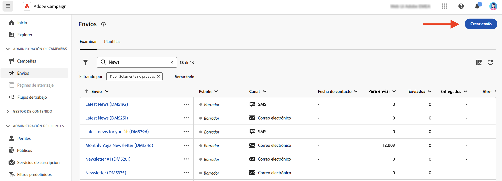
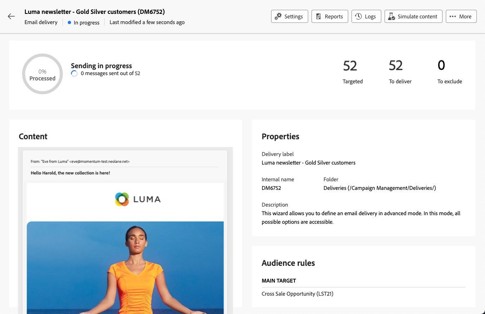

# Creación de su primer correo electrónico {#first-email}

>[!CONTEXTUALHELP]
>id="acw_homepage_learning_card3"
>title="Empezar con correos electrónicos"
>abstract="Puede crear un envío de correo electrónico independiente o crear un correo electrónico en el contexto de un flujo de trabajo de campaña. Obtenga información sobre cómo crear el envío, seleccionar el público y diseñar el contenido del correo electrónico."

<!--TO REMOVE BELOW-->
>[!CONTEXTUALHELP]
>id="acw_homepage_card3"
>title="Empezar con correos electrónicos"
>abstract="Puede crear un envío de correo electrónico independiente o crear un correo electrónico en el contexto de un flujo de trabajo de campaña. Obtenga información sobre cómo crear el envío, seleccionar el público y diseñar el contenido del correo electrónico."

<!--TO REMOVE ABOVE-->

Aprenda a crear su primer correo electrónico de destino. En este caso de uso, se programa el envío de un correo electrónico a los miembros socios plata y oro en una fecha específica.

Basado en un [plantilla de diseño](../email/create-email-templates.md), el correo electrónico también incluye contenido personalizado basado en atributos de perfil del cliente.

## Creación del envío de correo electrónico {#create-email}

>[!CONTEXTUALHELP]
>id="acw_deliveries_email_template_selection"
>title="Selección de una plantilla de correo electrónico"
>abstract="Una plantilla de correo electrónico es una configuración de envío específica que contiene configuraciones predefinidas, como reglas de tipología, parámetros de personalización o enrutamiento. Las plantillas se definen en la consola del cliente de Campaign."

>[!CONTEXTUALHELP]
>id="acw_deliveries_email_properties"
>title="Definición de las propiedades del correo electrónico"
>abstract="Las propiedades son los parámetros de envío comunes que le ayudan a nombrar y clasificar el envío. La configuración adicional es opcional. Si el envío se basa en un esquema ampliado definido en la consola de la versión 8 de Adobe Campaign, algunas **Opciones personalizadas** están disponibles."

Puede crear un envío de correo electrónico independiente o crear un correo electrónico en el contexto de un flujo de trabajo de campaña. Los pasos siguientes detallan el procedimiento para un envío de correo electrónico independiente (único). Obtenga más información acerca de los pasos de creación de entregas en Adobe Campaign en [esta página](../msg/gs-deliveries.md).

Para crear un nuevo envío de correo electrónico independiente, siga los pasos a continuación.

1. Vaya a la **[!UICONTROL Envíos]** en el carril izquierdo y haga clic en el botón  **[!UICONTROL Creación de envíos]** botón.

   

1. Seleccionar **[!UICONTROL Correo electrónico]** como canal y seleccione una plantilla de envíos de correo electrónico de la lista.

   >[!NOTE]
   >
   >Las plantillas son ajustes de envío preconfigurados que se guardan para utilizarlos en el futuro. [Más información](../msg/delivery-template.md)

   {zoomable=&quot;yes&quot;}

1. Haga clic en el botón **[!UICONTROL Crear envío]** para confirmar.
1. Introduzca una etiqueta para el envío y configure las opciones adicionales según sus necesidades:

   * **[!UICONTROL Nombre interno]**: asigne un identificador único a la entrega.
   * **[!UICONTROL Carpeta]**: almacene la entrega en una carpeta específica.
   * **[!UICONTROL Código de envío]**: utilice este campo para organizar los envíos en función de su propia convención de nombres.
   * **[!UICONTROL Descripción]**: especifique una descripción para la entrega.
   * **[!UICONTROL Naturaleza]**: especifique la naturaleza del correo electrónico con fines de clasificación.<!--The content of the list is defined in the delivery template selected when creating the email.-->

   >[!NOTE]
   >
   >Si ha ampliado el esquema con campos personalizados específicos, puede acceder a ellos en la sección **[!UICONTROL Opciones personalizadas]**.

   {zoomable=&quot;yes&quot;}

1. Además, se puede acceder a la configuración avanzada, como reglas de tipología y asignaciones de destino, a través del **[!UICONTROL Configuración]** situado en la parte superior derecha de la pantalla. Estos ajustes están preconfigurados en la plantilla seleccionada, pero se pueden editar según sea necesario para este correo electrónico específico. [Más información](../advanced-settings/delivery-settings.md)

## Definición del público {#define-audience}

>[!CONTEXTUALHELP]
>id="acw_deliveries_email_audience"
>title="Seleccione un público para el envío"
>abstract="Seleccione el mejor público para el mensaje de marketing. Puede elegir un público existente (ya definido en una instancia de la versión 8 de Campaign o Adobe Experience Platform), crear un nuevo público con el modelador de consultas o cargar un archivo que contenga el público. Los grupos de control no están habilitados para la opción **Seleccionar del archivo** y viceversa."
>additional-url="https://experienceleague.adobe.com/docs/campaign-web/v8/audiences/target-audiences/add-audience.html?lang=es" text="Selección de los públicos principales"
>additional-url="https://experienceleague.adobe.com/docs/campaign-web/v8/audiences/target-audiences/control-group.html?lang=es" text="Establecer un grupo de control"

En este caso de uso, envía el correo electrónico a una audiencia existente.

Encontrará instrucciones adicionales sobre cómo trabajar con públicos en [esta sección](../audience/about-recipients.md).

1. Para seleccionar el público del correo electrónico, haga clic en el botón **[!UICONTROL Seleccionar público]** y elija un público existente en la lista.

   En este ejemplo, queremos utilizar un público existente dirigido a clientes que pertenezcan a los niveles de puntos de lealtad de oro y plata.

   {zoomable=&quot;yes&quot;}

   >[!NOTE]
   >
   >Las audiencias disponibles en la lista proceden de la instancia de Campaign v8 o de Adobe Experience Platform si se ha configurado la integración destino/origen en la instancia. Esta integración le permite enviar segmentos de Experience Platform a Adobe Campaign y enviar registros de envío y seguimiento de Campaign a Adobe Experience Platform. Descubra cómo trabajar con Campaign y Adobe Experience Platform en [Documentación de Campaign v8 (consola de cliente)](https://experienceleague.adobe.com/docs/campaign/campaign-v8/connect/ac-aep/ac-aep.html){target="_blank"}.

1. Una vez seleccionado el público, puede refinar aún más el objetivo mediante la aplicación de reglas adicionales.

   {zoomable=&quot;yes&quot;}

1. También puede establecer un grupo de control para analizar el comportamiento de los destinatarios de correo electrónico en comparación con los que no son los destinatarios. [Aprenda a trabajar con grupos de control](../audience/control-group.md)

## Definición del contenido del correo electrónico {#create-content}

Para empezar a crear el contenido del correo electrónico, siga los pasos a continuación. En este caso de uso, se utiliza un correo electrónico predefinido [plantilla de envíos](../msg/delivery-template.md) para diseñar el correo electrónico.<!--TBC delivery template or email content template?-->

<!--Detailed instructions on how to configure the email content are available in [this section](../email/edit-content.md).-->

1. En el panel de envío de correo electrónico, haga clic en **[!UICONTROL Editar contenido]** botón.

   {zoomable=&quot;yes&quot;}

   Esto le lleva a una interfaz dedicada en la que puede configurar el contenido del correo electrónico y acceder al Diseñador de correo electrónico. [Más información](edit-content.md)

   {zoomable=&quot;yes&quot;}

1. Escriba la línea de asunto del correo electrónico y personalícela con el Editor de expresiones. [Obtenga información sobre cómo personalizar el contenido](../personalization/personalize.md)

   {zoomable=&quot;yes&quot;}

1. Para diseñar el contenido del correo electrónico, haga clic en el botón **[!UICONTROL Editar cuerpo del correo electrónico]**.

   Elija el método que desee utilizar para crear el contenido del correo electrónico. En este ejemplo, utilice un [plantilla de contenido predefinida](create-email-templates.md).

   {zoomable=&quot;yes&quot;}

1. Una vez seleccionada la plantilla, se muestra en el [Diseñador de correo electrónico](create-email-content.md), donde puede realizar las ediciones necesarias y agregar personalización.

   Por ejemplo, para personalizar el título del correo electrónico, seleccione el bloque de componentes y haga clic en **[!UICONTROL Añadir personalización]**.

   {zoomable=&quot;yes&quot;}

1. Una vez que esté satisfecho con el contenido, guárdelo y cierre el diseño. Haga clic en **[!UICONTROL Guardar]** para volver a la pantalla de creación del correo electrónico.

   {zoomable=&quot;yes&quot;}

## Programación del envío {#schedule}

Cuando se realiza una entrega en el contexto de un flujo de trabajo, se debe utilizar el **Planificador** actividad. Obtenga más información en [esta página](../workflows/activities/scheduler.md). Los pasos siguientes solo se aplican a envíos independientes.

1. Vaya a la **[!UICONTROL Programación]** de las propiedades de entrega.

1. Utilice el **[!UICONTROL Habilitar programación]** para activarlo.

1. Establezca la fecha y la hora deseadas para el envío.

   {zoomable=&quot;yes&quot;}

Una vez realizada la entrega, el envío real comienza en la fecha de contacto definida.

Obtenga más información sobre la programación de entregas en [esta sección](../msg/gs-deliveries.md#schedule-the-delivery-sending).

## Vista previa y prueba del correo electrónico {#preview-test}

Antes de enviar el correo electrónico, puede obtener una vista previa y probarlo para asegurarse de que cumpla con sus expectativas.

En este caso de uso, se obtiene una vista previa del correo electrónico y se envían versiones de prueba a direcciones de correo electrónico específicas para suplantar algunos de los perfiles de destino.

Encontrará información adicional sobre cómo previsualizar y probar correos electrónicos en [esta sección](../preview-test/preview-test.md).

1. Para revisar su correo electrónico, haga clic en **[!UICONTROL Revisar y enviar]**. Se muestra una vista previa del correo electrónico, junto con todas las propiedades, público y programación configuradas. Puede editar cualquiera de estos elementos haciendo clic en el botón modificar.

1. Para obtener una vista previa del correo electrónico y enviar versiones de prueba, haga clic en **[!UICONTROL Simular contenido]** botón.

   {zoomable=&quot;yes&quot;}

1. En el lado izquierdo, seleccione los perfiles que desee utilizar para previsualizar el correo electrónico.

   El panel derecho muestra una vista previa del correo electrónico en función del perfil seleccionado. Si ha añadido varios perfiles, puede alternarlos para previsualizar el correo electrónico correspondiente.

   {zoomable=&quot;yes&quot;}

   <!--Additionally, the **[!UICONTROL Render email]** button allows you to preview the email using mutiple devices or mail providers. Learn on how to preview email rendering
    -->

1. Para enviar versiones de prueba de su correo electrónico, haga clic en el botón **[!UICONTROL Prueba]**, y a continuación, seleccione el modo que desee utilizar.

   En este ejemplo, utilice el modo **[!UICONTROL Sustituir desde el destinatario principal]**, que envía versiones de prueba a direcciones de correo electrónico específicas al suplantar algunos de los perfiles a los que se dirige el correo electrónico.

   {zoomable=&quot;yes&quot;}

1. Haga clic en **[!UICONTROL Añadir dirección]** y especifique las direcciones de correo electrónico que recibirán las versiones de prueba.

   Para cada dirección de correo electrónico, seleccione el perfil que desea suplantar. También puede permitir que Adobe Campaign seleccione un perfil aleatorio de destinatario.

   {zoomable=&quot;yes&quot;}

1. Haga clic en **[!UICONTROL Enviar correo electrónico de prueba]** y confirme el envío.

   Las versiones de prueba se envían a las direcciones de correo electrónico especificadas mediante el perfil seleccionado con el prefijo **[Prueba x]**.

   {zoomable=&quot;yes&quot;}

   Puede comprobar el estado del envío y acceder a los correos electrónicos de prueba enviados en cualquier momento haciendo clic en el botón **[!UICONTROL Ver registro de correos electrónicos de prueba]** en la pantalla Simular contenido.

## Envío y supervisión del correo electrónico {#prepare-send}

Después de revisar y probar el correo electrónico, puede prepararlo y enviarlo.

1. Para prepararlo, haga clic en **[!UICONTROL Preparación]**. [Aprenda a preparar un correo electrónico](../monitor/prepare-send.md)

   {zoomable=&quot;yes&quot;}

1. Una vez que el correo electrónico esté listo para enviarse, haga clic en el botón **[!UICONTROL Enviar]** (o **[!UICONTROL Enviar como está programado]** si ha programado su envío) y confirme el envío.

1. Durante el proceso de envío, puede realizar un seguimiento del progreso y ver las estadísticas en tiempo real directamente en esta pantalla.

   {zoomable=&quot;yes&quot;}

   <!--
    {zoomable="yes"}-->

   También puede acceder a la información detallada sobre la entrega haciendo clic en el botón **[!UICONTROL Registros]**. [Obtenga información sobre cómo monitorizar los registros de envío](../monitor/delivery-logs.md)

1. Una vez enviado el correo electrónico, puede acceder a los informes específicos para un análisis más detallado haciendo clic en el botón **[!UICONTROL Informes]**.

{zoomable=&quot;yes&quot;}
