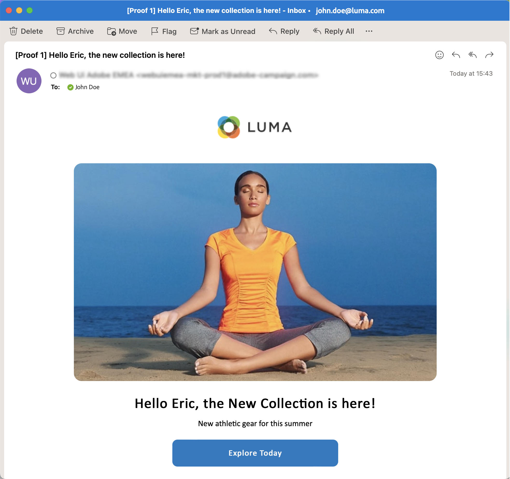

# Envíe su primer correo electrónico {#first-email}

Obtenga información sobre cómo crear su primer correo electrónico de destino. En este caso de uso, se programa el envío de un correo electrónico a los miembros socio Silver y Gold en una fecha específica.

En función de una plantilla de diseño predefinida, el correo electrónico también incluye contenido personalizado basado en atributos de perfil del cliente.

## Creación del correo electrónico {#create-email}

>[!CONTEXTUALHELP]
>id="acw_deliveries_email_template_selection"
>title="Seleccionar una plantilla de correo electrónico"
>abstract="Una plantilla de correo electrónico es una configuración de envío específica que contiene configuraciones predefinidas, como reglas de tipología, parámetros de personalización o enrutamiento. Las plantillas se definen en la consola del cliente de Campaign."

>[!CONTEXTUALHELP]
>id="acw_deliveries_email_properties"
>title="Propiedades de correo electrónico"
>abstract="Las propiedades son los parámetros de envío comunes que le ayudan a nombrar y clasificar su envío. Si la entrega se basa en un esquema ampliado definido en la consola de Adobe Campaign v8, algunas configuraciones específicas **Opciones personalizadas** Los campos de están disponibles."

1. Para crear un nuevo envío, vaya a **[!UICONTROL Envíos]** en el carril izquierdo y haga clic en el botón  **[!UICONTROL Creación de envíos]** botón.

1. Seleccionar **[!UICONTROL Correo electrónico]** como el canal y seleccione una plantilla.

   >[!NOTE]
   >
   >Las plantillas son ajustes de entrega preconfigurados guardados para su uso futuro. Pueden crearlos los usuarios administradores en la consola de Adobe Campaign. [Aprenda a trabajar con plantillas de envíos](https://experienceleague.adobe.com/docs/campaign/campaign-v8/campaigns/send/create-templates.html){target="_blank"}.

   

1. Haga clic en **[!UICONTROL Creación de envíos]** para confirmar.
1. Introduzca una etiqueta para la entrega y configure opciones adicionales según sus necesidades:

   * **[!UICONTROL Nombre interno]**: asigne un identificador único al envío,
   * **[!UICONTROL Carpeta]**: almacene la entrega en una carpeta específica,
   * **[!UICONTROL Código de envío]**: utilice este campo para organizar los envíos en función de su propia convención de nombres.
   * **[!UICONTROL Descripción]**: especifique una descripción para la entrega,
   * **[!UICONTROL Naturaleza]**: especifique la naturaleza del correo electrónico con fines de clasificación.<!--The content of the list is defined in the delivery template selected when creating the email.-->

   >[!NOTE]
   >
   >Si ha ampliado el esquema con campos personalizados específicos, puede acceder a ellos en la **[!UICONTROL Opciones personalizadas]** sección.

   

   Además, se puede acceder a la configuración avanzada, como las reglas de tipología y las asignaciones de destino, haciendo clic en el botón situado junto al nombre de la entrega. Estos ajustes están preconfigurados en la plantilla seleccionada, pero se pueden editar según sea necesario para este correo electrónico específico.

## Creación del contenido del correo electrónico {#create-content}

>[!CONTEXTUALHELP]
>id="acw_homepage_card3"
>title="Aprenda a diseñar el contenido de su correo electrónico"
>abstract="Aprenda a utilizar el Diseñador de correo electrónico."

Encontrará instrucciones detalladas sobre cómo configurar el contenido del correo electrónico en [esta sección](../content/edit-content.md).

En este caso de uso, se utiliza una plantilla predefinida para diseñar el correo electrónico.

1. Para empezar a crear el contenido del correo electrónico, abra su envío por correo electrónico y haga clic en **[!UICONTROL Editar contenido]** botón.

   Esto le lleva a una interfaz dedicada en la que puede configurar el contenido del correo electrónico y diseñarlo con el Diseñador de correo electrónico.

   

1. Introduzca la línea de asunto del correo electrónico y personalícelo con el Editor de expresiones. [Aprenda a personalizar el contenido](../personalization/personalize.md)

   

1. Para diseñar el contenido del correo electrónico, haga clic en **[!UICONTROL Editar cuerpo del correo electrónico]** botón.

   Elija el método que desea utilizar para crear el contenido del correo electrónico. En este ejemplo, utilice una plantilla de diseño predefinida.

   

<!--1. Select the HTML or ZIP file to import then click **[!UICONTROL Next]**.

    If your folder contains assets, choose the instance and folder where they should be stored then click **[!UICONTROL Import]**. (+ link to doc on assets?)

    -->

1. Una vez seleccionada la plantilla, se muestra en el Diseñador de correo electrónico, donde puede realizar los cambios necesarios y agregar personalización.

   Por ejemplo, para añadir personalización al título del correo electrónico, seleccione el bloque de componentes y haga clic en **[!UICONTROL Añadir personalización]**.

   

1. Una vez que esté satisfecho con el contenido, guarde y cierre el diseño. Clic **[!UICONTROL Guardar]** para volver a la pantalla de creación de correo electrónico.

   

## Definición de la audiencia {#define-audience}

>[!CONTEXTUALHELP]
>id="acw_deliveries_email_audience"
>title="Definición de la audiencia"
>abstract="Seleccione la mejor audiencia para su mensaje de marketing. Puede elegir una audiencia existente ya definida en una instancia de Campaign v8 o de Adobe Experience Platform, o puede crear una nueva audiencia con el generador de reglas."

En este caso de uso, envía el correo electrónico a una audiencia existente. Encontrará instrucciones adicionales sobre cómo trabajar con audiencias en [esta sección](../audience/about-audiences.md).

1. Para seleccionar la audiencia del correo electrónico, haga clic en **[!UICONTROL Seleccionar audiencia]** y elija una audiencia existente en la lista.

   En este ejemplo, queremos utilizar una audiencia existente dirigida a clientes que pertenecen a los niveles de puntos de lealtad plata y oro.

   

   >[!NOTE]
   >
   >Las audiencias disponibles en la lista proceden de la instancia de Campaign v8 o de Adobe Experience Platform si se ha configurado la integración destino/fuentes en la instancia.
   >
   >La integración Destino / Fuentes permite enviar segmentos del Experience Platform a Adobe Campaign y enviar registros de envío y seguimiento de Campaign a Adobe Experience Platform. [Descubra cómo trabajar con Campaign y Adobe Experience Platform](https://experienceleague.adobe.com/docs/campaign/campaign-v8/connect/ac-aep.html){target="_blank"}.

1. Una vez seleccionada la audiencia, se puede refinar aún más el objetivo aplicando reglas adicionales.

   También puede establecer un grupo de control para analizar el comportamiento de los destinatarios del correo electrónico en comparación con los destinatarios no seleccionados. [Aprenda a trabajar con grupos de control](../audience/control-group.md)

   

## Programe el envío {#schedule}

>[!CONTEXTUALHELP]
>id="acw_deliveries_email_schedule"
>title="Programe el envío"
>abstract="Defina la fecha y la hora exacta para su envío. Al elegir el momento más adecuado para su mensaje de marketing, puede maximizar las tasas de apertura."

Para programar el envío del correo electrónico, abra su envío de correo electrónico y vaya a **Programación** sección. Utilice el **[!UICONTROL Habilitar programación]** para activarlo y establecer la fecha y la hora deseadas para el envío. Una vez que realice la entrega, el envío real comenzará en la fecha de contacto definida.

De forma predeterminada, la variable **[!UICONTROL Habilitar confirmación antes de enviar]** La opción está activada. Esta opción requiere que confirme el envío antes de que el correo electrónico se envíe en la fecha y la hora programadas. Si necesita enviar el correo electrónico automáticamente en la fecha y la hora programadas, puede desactivar esta opción.

## Previsualización y prueba del correo electrónico {#preview-test}

Antes de enviar el correo electrónico, puede previsualizarlo y probarlo para asegurarse de que cumple sus expectativas.

En este caso de uso, se obtiene una vista previa del correo electrónico y se envían versiones de prueba a direcciones de correo electrónico específicas, al tiempo que se suplantan algunos de los perfiles de destino.

Encontrará información adicional sobre cómo previsualizar y probar correos electrónicos en [esta sección](../preview-test/preview-test.md).

1. Para revisar el correo electrónico, haga clic en **[!UICONTROL Revisar y enviar]**. Esto muestra una previsualización del correo electrónico, junto con todas las propiedades, la audiencia y la programación configuradas. Puede editar cualquiera de estos elementos haciendo clic en el botón Modificar.

1. Para obtener una vista previa del correo electrónico y enviar versiones de prueba, haga clic en **[!UICONTROL Simular contenido]** botón.

   

1. En el lado izquierdo, seleccione los perfiles que desee utilizar para previsualizar el correo electrónico.

   El panel derecho muestra una vista previa del correo electrónico en función del perfil seleccionado. Si ha añadido varios perfiles, puede cambiar entre ellos para previsualizar el correo electrónico correspondiente.

   

   <!-- !NOTE
    >
    >Additionally, the **[!UICONTROL Render email]** button allows you to preview the email using mutiple devices or mail providers. Learn on how to preview email rendering-->

1. Para enviar versiones de prueba del correo electrónico, haga clic en **[!UICONTROL Prueba]** a continuación, seleccione el modo que desee utilizar.

   En este ejemplo, utilice la variable **[!UICONTROL Sustituir del destinatario principal]** , que envía versiones de prueba a direcciones de correo electrónico específicas mientras suplanta algunos de los perfiles a los que se dirige el correo electrónico.

   

1. Clic **[!UICONTROL Añadir dirección]** y especifique las direcciones de correo electrónico que reciben las versiones de prueba.

   Para cada dirección de correo electrónico, seleccione el perfil que desea suplantar. También puede permitir que Adobe Campaign seleccione un perfil aleatorio del destinatario.

   

1. Clic **[!UICONTROL Enviar correo electrónico de prueba]** y confirme el envío.

   Las versiones de prueba se envían a las direcciones de correo electrónico especificadas utilizando el perfil seleccionado con la variable **[Prueba x]** prefijo.

   

   Puede comprobar el estado del envío y acceder a los correos electrónicos de prueba enviados en cualquier momento haciendo clic en el **[!UICONTROL Ver registro de correo electrónico de prueba]** en la pantalla simular contenido.

## Envío y monitorización del correo electrónico {#prepare-send}

Después de revisar y probar el correo electrónico, puede iniciar su preparación y enviarlo.

1. Para iniciar la preparación del correo electrónico, haga clic en **[!UICONTROL Preparar]**. [Obtenga información sobre cómo preparar un correo electrónico](../monitor/prepare-send.md)

   

1. Una vez que el correo electrónico esté listo para enviarse, haga clic en **[!UICONTROL Enviar]** botón (o **[!UICONTROL Enviar como está programado]** si ha programado su envío) y confirme el envío.

1. Durante el proceso de envío, puede realizar un seguimiento del progreso y ver las estadísticas en tiempo real directamente en esta pantalla.

   

   También puede acceder a información detallada sobre el envío haciendo clic en el **[!UICONTROL Registros]** botón. [Obtenga información sobre cómo monitorizar los registros de envío](../monitor/delivery-logs.md)

1. Una vez enviado el correo electrónico, puede acceder a los informes dedicados para un análisis más detallado haciendo clic en **[!UICONTROL Informes]** botón.

