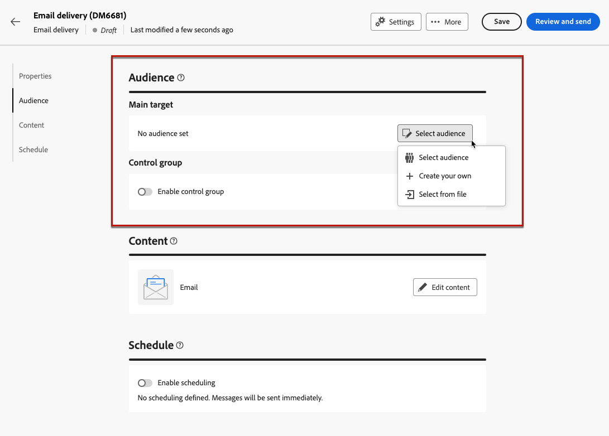
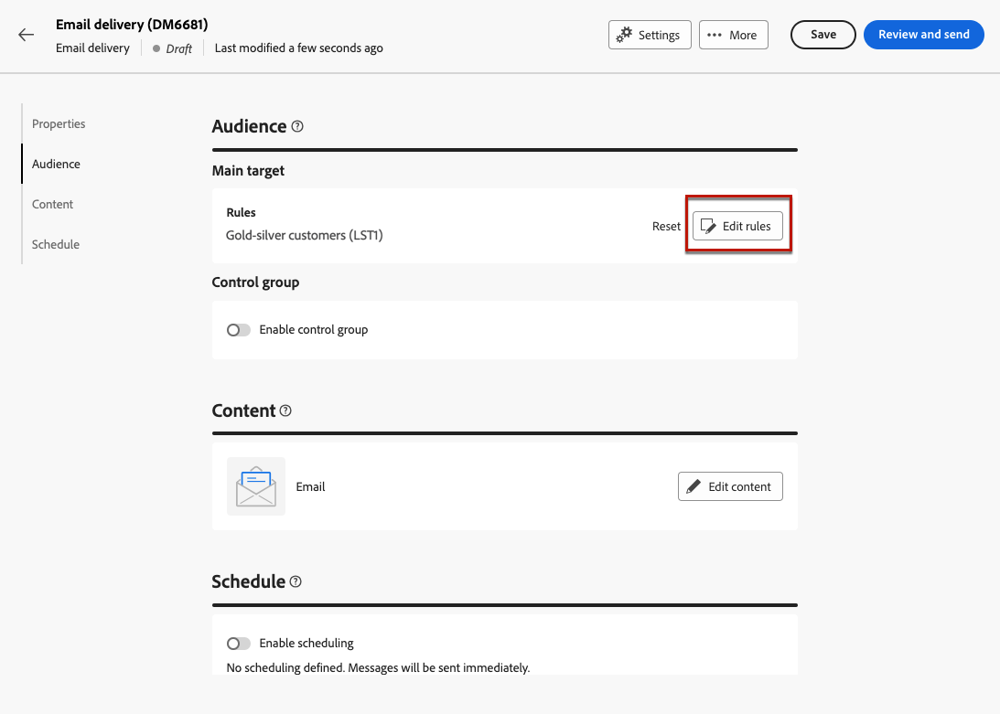

# Enviar su primer correo electrónico {#first-email}

Este caso de uso detalla cómo crear su primer correo electrónico. Vamos a programar el envío de un correo electrónico en una fecha específica a los clientes fieles de plata y oro. Este correo electrónico se diseñará con una plantilla predefinida e incluirá la personalización mediante los atributos del perfil.

## Creación del correo electrónico {#create-email}

>[!CONTEXTUALHELP]
>id="acw_deliveries_email_template_selection"
>title="Seleccionar una plantilla de correo electrónico"
>abstract="Se define una plantilla en la consola Adobe Campaign v8. Esta es una configuración de envío específica que contiene parámetros predefinidos como reglas de tipología, parámetros de personalización o de enrutamiento."

>[!CONTEXTUALHELP]
>id="acw_deliveries_email_properties"
>title="Propiedades de correo electrónico"
>abstract="Las propiedades son los parámetros de envío comunes que le ayudan a nombrar y clasificar la entrega. Si la entrega se basa en un esquema ampliado definido en la consola Adobe Campaign v8, algunas **Opciones personalizadas** están disponibles."

1. Cree un nuevo envío desde la **[!UICONTROL Entregas]** para abrir el Navegador.

1. Seleccione el **[!UICONTROL Correo electrónico]** canal y la plantilla que se va a utilizar y, a continuación, haga clic en **[!UICONTROL Creación de envíos]**.

   >[!NOTE]
   >
   >Una plantilla es una configuración de envío específica que se ha guardado como plantilla para su reutilización. Los usuarios administradores configuran las plantillas de envío en la consola de Adobe Campaign. [Aprenda a trabajar con plantillas de envíos](https://experienceleague.adobe.com/docs/campaign/campaign-v8/campaigns/send/create-templates.html){target="_blank"}.

   

1. Proporcione una etiqueta para el correo electrónico y configure opciones adicionales según sus necesidades:

   * **[!UICONTROL Nombre interno]**: asignar un identificador único al envío,
   * **[!UICONTROL Carpeta]**: almacene la entrega en una carpeta específica,
   * **[!UICONTROL Código de entrega]**: utilice este campo para organizar los envíos en función de su propia convención de nombres,
   * **[!UICONTROL Descripción]**: especifique una descripción para la entrega,
   * **[!UICONTROL Naturaleza]**: especifique la naturaleza del correo electrónico con fines de clasificación.<!--The content of the list is defined in the delivery template selected when creating the email.-->
   >[!NOTE]
   >
   >Si ha ampliado el esquema con campos personalizados específicos, puede acceder a ellos desde el **[!UICONTROL Opciones personalizadas]** para obtener más información.

   

   Además, la configuración avanzada (regla de tipología, asignaciones de destino, etc.) están disponibles en el botón situado junto al nombre de la entrega. Se predefinen en la plantilla seleccionada al crear el correo electrónico. Puede editarlas si es necesario.

## Creación del contenido del correo electrónico {#create-content}

>[!CONTEXTUALHELP]
>id="acw_homepage_card3"
>title="Aprenda a diseñar el contenido del correo electrónico mediante el Diseñador de correo electrónico."
>abstract="Aprenda a diseñar su contenido"

En este caso de uso, se diseña el correo electrónico con una plantilla predefinida. Encontrará información detallada sobre cómo configurar el contenido del correo electrónico en [esta sección](../content/edit-content.md).

1. Haga clic en el **[!UICONTROL Editar contenido]** para comenzar a crear el contenido del correo electrónico.

   Esta pantalla le permite configurar el contenido del correo electrónico y diseñarlo con el Diseñador de correo electrónico.

   

1. Especifique el asunto del correo electrónico y personalícelo con el Editor de expresiones. [Obtenga información sobre cómo personalizar el contenido](../personalization/personalize.md)

   

1. Haga clic en el **[!UICONTROL Editar cuerpo del correo electrónico]** para crear y diseñar el contenido del correo electrónico.

   Elija el método que desee utilizar para crear el contenido del correo electrónico. En este ejemplo, queremos utilizar una plantilla de diseño existente.

   

<!--1. Select the HTML or ZIP file to import then click **[!UICONTROL Next]**.

    If your folder contains assets, choose the instance and folder where they should be stored then click **[!UICONTROL Import]**. (+ link to doc on assets?)

    -->

1. Una vez seleccionada la plantilla, esta se muestra en el Diseñador de correo electrónico, lo que le permite editarla si es necesario y añadir personalización.

   En este ejemplo, queremos añadir personalización en el título del correo electrónico. Para ello, seleccione el bloque de componentes y haga clic en **[!UICONTROL Añadir personalización]**.

   

1. Cuando el contenido esté listo, guarde y cierre el diseño y, a continuación, haga clic en **[!UICONTROL Guardar]** para volver a la pantalla de creación del correo electrónico.

   

## Definición de la audiencia {#define-audience}

>[!CONTEXTUALHELP]
>id="acw_deliveries_email_audience"
>title="Definición de la audiencia"
>abstract="Seleccione la mejor audiencia para el mensaje de marketing. Puede elegir una audiencia existente ya definida en una instancia de Campaign v8 o de Adobe Experience Platform, o bien puede elegir crear una nueva audiencia con el generador de reglas."

En este caso de uso, se envía el correo electrónico a una audiencia existente. Encontrará información adicional sobre cómo trabajar con audiencias en [esta sección](../audience/about-audiences.md).

1. Haga clic en el **[!UICONTROL Seleccionar la audiencia]** a continuación, elija una audiencia existente a la que dirigirse.

   En este ejemplo, queremos utilizar una audiencia existente dirigida a clientes que pertenezcan a los niveles de puntos de lealtad de oro y plata.

   

   >[!NOTE]
   >
   >Las audiencias disponibles en la lista proceden de la instancia de Campaign V8 o de Adobe Experience Platform si la integración Destino / Fuentes se ha configurado en la instancia.
   >
   >La integración Destino / Fuentes permite enviar segmentos de Experience Platform a Adobe Campaign y enviar los registros de envío y seguimiento de Campaign a Adobe Experience Platform. [Descubra cómo funciona Campaign y Adobe Experience Platform](https://experienceleague.adobe.com/docs/campaign/campaign-v8/connect/ac-aep.html){target="_blank"}.

1. Una vez seleccionada la audiencia, puede refinar el objetivo con reglas adicionales.

   También puede establecer un grupo de control para analizar el comportamiento de los destinatarios de correo electrónico en comparación con el comportamiento de los perfiles que no estaban segmentados. [Aprenda a trabajar con grupos de control](../audience/control-group.md)

   

## Programe el envío {#schedule}

>[!CONTEXTUALHELP]
>id="acw_deliveries_email_schedule"
>title="Programe el envío"
>abstract="Defina la fecha y la hora exacta de envío. Al elegir el momento más apropiado para el mensaje de marketing, maximizará las tasas de apertura."

Para programar el envío del correo electrónico, haga clic en **[!UICONTROL Habilitar]** a continuación, especifique la fecha y la hora deseadas para el envío.

De forma predeterminada, la variable **[!UICONTROL Confirme antes de enviar]** está activada, lo que significa que deberá confirmar la entrega para permitir que el correo electrónico se envíe en la fecha y hora especificadas. Desactive esta opción para permitir que el correo electrónico se envíe en la fecha y hora programadas sin necesidad de confirmación.

## Previsualizar y probar el correo electrónico {#preview-test}

Una vez que el correo electrónico esté listo, puede obtener una vista previa y probarlo antes de iniciar su envío.

En este caso de uso, se obtiene una vista previa del correo electrónico y se envían pruebas a direcciones de correo electrónico específicas al suplantar algunos de los perfiles objetivo.

Encontrará información adicional sobre cómo previsualizar y probar correos electrónicos en [esta sección](../preview-test/preview-test.md).

1. Haga clic en **[!UICONTROL Revisar y enviar]**. Se muestra una vista previa del correo electrónico, junto con todas las propiedades, audiencia y programación configuradas. Puede editar cualquiera de estos elementos mediante el botón de modificación.

1. Haga clic en el **[!UICONTROL Simular contenido]** para obtener una vista previa del correo electrónico y enviar pruebas.

   

1. En el área del lado izquierdo, seleccione los perfiles que desea utilizar para obtener una vista previa del correo electrónico.

1. Se muestra una vista previa del correo electrónico en el panel derecho en función del perfil seleccionado. Si ha añadido varios perfiles, puede cambiar entre cada uno de ellos para previsualizar el correo electrónico correspondiente.

   

   <!-- !NOTE
    >
    >Additionally, the **[!UICONTROL Render email]** button allows you to preview the email using mutiple devices or mail providers. Learn on how to preview email rendering-->

1. Para enviar pruebas del correo electrónico, haga clic en el **[!UICONTROL Prueba]** a continuación, seleccione el modo que desee utilizar para enviar las pruebas.

   En este ejemplo, se utiliza el modo Substitute from main target , lo que significa que se envían pruebas a direcciones de correo electrónico específicas al suplantar algunos de los perfiles a los que se dirige la entrega.

   

1. Haga clic en Agregar dirección y, a continuación, especifique las direcciones de correo electrónico que recibirán las pruebas.

   Para cada dirección de correo electrónico, seleccione el perfil del destinatario que desea suplantar. También puede permitir que Adobe Campaign seleccione un perfil aleatorio del destinatario.

   

1. Haga clic en **[!UICONTROL Enviar correo electrónico de prueba]** a continuación, confirme la entrega.

   Las pruebas se envían a las direcciones de correo electrónico especificadas mediante el perfil seleccionado, con la variable **[Prueba x]** prefijo .

   

   Puede comprobar el estado de la entrega y acceder a las pruebas enviadas en cualquier momento haciendo clic en el botón **[!UICONTROL Ver registro de correo electrónico de prueba]** en la pantalla simulate content .

## Enviar y supervisar el correo electrónico {#prepare-send}

Una vez que haya revisado y probado el correo electrónico, puede iniciar su preparación y enviarlo.

1. Haga clic en **[!UICONTROL Preparación]** para iniciar la preparación del mensaje. [Aprenda a preparar un correo electrónico](../monitor/prepare-send.md)

   

1. Una vez que el correo electrónico esté listo para enviarse, haga clic en **[!UICONTROL Enviar]** o **[!UICONTROL Enviar como está programado]** a continuación, confirme la entrega.

1. Una vez iniciado el envío del correo electrónico, ya sea inmediatamente o en la fecha programada, puede rastrear su envío en tiempo real en esta pantalla, junto con las estadísticas.

   

   >[!NOTE]
   >
   >Además, la variable **[!UICONTROL Registros]** permite acceder a información detallada sobre el envío de correo electrónico. [Obtenga información sobre cómo monitorizar los registros de envío](../monitor/delivery-logs.md)

1. Una vez enviado el correo electrónico, puede acceder a los informes dedicados para realizar más análisis. [Aprenda a trabajar con informes](../reporting/reports.md)
   
