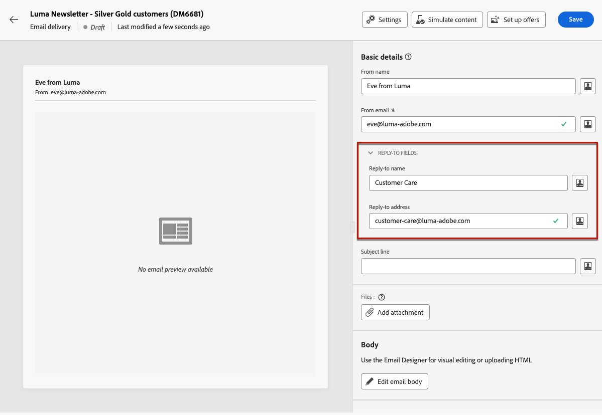
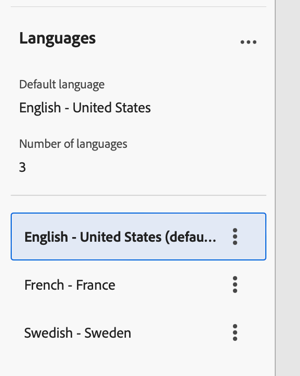

# Configurar el contenido de correo electrónico {#edit-content}

>[!CONTEXTUALHELP]
>id="acw_deliveries_email_content"
>title="Definición del contenido del correo electrónico"
>abstract="La pantalla **Editar contenido** le permite definir elementos básicos del mensaje, como la dirección del remitente y la línea de asunto, realizar acciones adicionales como añadir archivos adjuntos u ofertas y acceder al Diseñador de correo electrónico para darle a su mensaje un aspecto pulido."

>[!CONTEXTUALHELP]
>id="acw_deliveries_email_header"
>title="Establecer las propiedades del correo electrónico"
>abstract="La sección **Detalles básicos** le permite actualizar la dirección del remitente y la dirección de respuesta, así como definir la línea de asunto mediante el Editor de expresiones."

>[!CONTEXTUALHELP]
>id="acw_deliveries_email_attachment"
>title="Adjuntar archivos a un correo electrónico"
>abstract="Seleccione uno o varios archivos para insertarlos en su mensaje. Para evitar problemas de rendimiento, se recomienda no adjuntar más de un archivo por correo electrónico."

>[!CONTEXTUALHELP]
>id="acw_deliveries_email_options"
>title="Editar seguimiento"
>abstract="De forma predeterminada, el seguimiento está habilitado para el envío, lo que significa que se realiza el seguimiento de todos los vínculos incluidos en el contenido del mensaje. Puede desactivar esta opción desde aquí."
>additional-url="https://experienceleague.adobe.com/es/docs/campaign-web/v8/content/email-design/design-content/message-tracking" text="Adición de vínculos y seguimiento de mensajes"

>[!CONTEXTUALHELP]
>id="acw_deliveries_email_multilingual"
>title="Añadir idiomas"
>abstract="En esta pestaña, encontrará una lista de idiomas en los que se va a realizar el envío. Para añadir más idiomas, haga clic en el botón Añadir idioma o duplique otro idioma con esta pestaña."

La pantalla del correo electrónico **[!UICONTROL Editar contenido]** le permite:

* Defina los elementos básicos del mensaje, como la dirección del remitente y la línea de asunto
* Realizar acciones adicionales, como agregar archivos adjuntos o configurar ofertas
* Acceda a [Email Designer](get-started-email-designer.md#start-authoring) para comenzar a crear el contenido apropiado de su correo electrónico
* Añada variantes de idioma a los envíos.

>[!NOTE]
>
>Todos los campos de texto editables de esta pantalla se pueden rellenar con campos de personalización. [Obtenga información sobre cómo personalizar el contenido](../personalization/personalize.md)

## Configuración de la entrega

Para configurar o editar el contenido de un correo electrónico, siga los pasos a continuación.

1. Haga clic en el botón **[!UICONTROL Editar contenido]** de la pantalla [panel de envío de correo electrónico](../email/create-email.md).

   {zoomable="yes"}

1. Se abre la pantalla de edición de contenido de correo electrónico.

   {zoomable="yes"}

   >[!NOTE]
   >
   >Si está configurando un correo electrónico nuevo, los campos **[!UICONTROL De nombre]** y **[!UICONTROL De correo electrónico]** ya se han rellenado.

1. El campo **[!UICONTROL Nombre desde]** se define en la plantilla de correo electrónico. Si desea modificarlo, utilice un nombre fácilmente identificable por los destinatarios, como el nombre de su marca, para aumentar la velocidad de apertura de sus envíos.

   >[!NOTE]
   >
   >Para mejorar aún más la experiencia del destinatario, puede agregar el nombre de una persona como, por ejemplo, &quot;Eva de Luma&quot;.

1. El campo de dirección **[!UICONTROL De correo electrónico]** también se define en la plantilla de correo electrónico. Asegúrese de que el dominio de dirección coincida con el subdominio que delegó en Adobe.

   >[!NOTE]
   >
   >Puede cambiar la parte que precede a &#39;@&#39;, pero no la dirección de dominio.

1. Expanda la sección **[!UICONTROL Campos de respuesta]**. El nombre y las direcciones del remitente se utilizan de forma predeterminada para las respuestas. Sin embargo, Adobe recomienda utilizar una dirección real existente, como el servicio de atención al cliente de su marca. En este caso, si un destinatario envía una respuesta, el equipo de atención al cliente podrá atenderla.

   {zoomable="yes"}

1. Defina la **[!UICONTROL Línea de asunto]** del correo electrónico. Escriba el asunto directamente en el campo dedicado o abra el Editor de expresiones para agregar [personalización](../personalization/personalize.md) mediante varios atributos, fragmentos de expresiones u ofertas.

1. Si desea adjuntar un archivo al correo electrónico, haga clic en el botón **[!UICONTROL Agregar archivo adjunto]** y, a continuación, seleccione uno o varios archivos.

   >[!NOTE]
   >
   >Para evitar problemas de rendimiento, se recomienda no adjuntar más de un archivo por correo electrónico.

   <!--limitation on size + number of files?-->

1. Si desea enviar ofertas con su correo electrónico, selecciónelas con el botón **[!UICONTROL Configurar ofertas]**.

   A continuación, puede insertarlos en el correo electrónico mediante campos de personalización. [Aprenda a enviar ofertas](../msg/offers.md)

## Editar el cuerpo del correo electrónico

1. Haga clic en el botón **[!UICONTROL Editar cuerpo del correo electrónico]** para estructurar y diseñar el contenido del correo electrónico con [Email Designer](get-started-email-designer.md#start-authoring).

   >[!NOTE]
   >
   >También puede pasar el ratón sobre la vista previa del correo electrónico y seleccionar **[!UICONTROL Abrir diseñador de correo electrónico]**.

   En estas secciones encontrará información adicional sobre cómo diseñar el contenido del correo electrónico:

   * [Crear correos electrónicos desde cero](create-email-content.md)
   * [Estilos del contenido](get-started-email-style.md)

1. De forma predeterminada, el seguimiento está habilitado para el envío. Puede desactivar esta opción desde **[!UICONTROL Funciones opcionales]**. [Aprenda a añadir vínculos y a administrar el seguimiento](message-tracking.md)

1. Una vez definido el contenido del correo electrónico, utilice el botón **[!UICONTROL Simular contenido]** para comprobar cómo se muestra antes de enviarlo. [Obtenga información sobre cómo obtener una vista previa y probar tu correo electrónico](../preview-test/preview-test.md).

## Configuración de un envío multilingüe

En la interfaz de usuario web de Campaign, puede configurar los envíos de correo electrónico como multilingües, lo que le permite enviar mensajes en función del idioma preferido de un perfil. Cuando no se define ninguna preferencia, el mensaje se envía en el idioma predeterminado.

En un envío multilingüe, la administración de idiomas se basa en variantes. Cada variante representa un idioma.

Durante la creación de la entrega, puede añadir el número de variantes correspondiente al número de idiomas necesarios en el mensaje. También puede definir el idioma predeterminado al añadir nuevos idiomas.

### Añadir una variante de idioma

Para crear variantes de idioma, siga estos pasos:

1. Haga clic en el botón **[!UICONTROL Agregar idioma]** en la sección superior de la pantalla de configuración de correo electrónico.

   >[!IMPORTANT]
   >
   >El botón **[!UICONTROL Agregar idioma]** solo está disponible si la dimensión de destino contiene el esquema de idioma. Para obtener más información sobre los esquemas y las dimensiones de Target, consulte la [documentación detallada](https://experienceleague.adobe.com/es/docs/campaign-web/v8/audiences/targeting-dimensions){target=_blank}.

   {zoomable="yes"}

1. Seleccione el idioma que desee agregar en la lista desplegable **[!UICONTROL Idioma]**. Al agregar el primer idioma, se establece como predeterminado y el contenido actual es el predeterminado. Cuando se añaden nuevos idiomas, el contenido se basa en el contenido predeterminado.

   >[!NOTE]
   >
   >Los idiomas disponibles a través de esta lista dependen de los valores definidos por el atributo Language (valores como: system, user, dbenum, etc.) Obtenga más información acerca de la administración de la enumeración en esta [sección](https://experienceleague.adobe.com/es/docs/campaign-web/v8/conf/enumerations){target=_blank}.

   {zoomable="yes"}

   Por ejemplo, en inglés (EE.UU.):

   {zoomable="yes"}

1. Repita este proceso para agregar otros idiomas. El panel **[!UICONTROL Idioma]** muestra la lista de idiomas que has elegido, el número de idiomas diferentes y también el idioma predeterminado.

   Por ejemplo, si ha elegido inglés, francés y sueco, puede ver estos 3 idiomas como se muestra a continuación:

   {zoomable="yes"}

   Puede hacer clic en el botón Expandir situado en la esquina superior derecha para eliminar todos los idiomas.

### Defina el contenido del correo electrónico para cada variante

Una vez configurados los idiomas, defina el contenido del correo electrónico que se enviará a los perfiles con este idioma preferido.

Para definir el contenido de un correo electrónico, siga estos pasos:

1. Abra [Email Designer](get-started-email-designer.md#start-authoring) haciendo clic en el botón **[!UICONTROL Editar cuerpo del correo electrónico]**.

   >[!NOTE]
   >
   >También puede pasar el ratón sobre la vista previa del correo electrónico y seleccionar **[!UICONTROL Abrir diseñador de correo electrónico]**.

   {zoomable="yes"}

1. Puede obtener una vista previa de la entrega haciendo clic en el botón **[!UICONTROL Simular contenido]** y elegir el perfil y el idioma en que se muestra el correo electrónico.

1. En la ventana Simular contenido, puede cambiar los perfiles para previsualizar el contenido del correo electrónico correspondiente al idioma configurado para ese perfil.

   {zoomable="yes"}

### Duplicar o quitar variantes de idioma

Puede hacer clic en el botón Expandir situado en la esquina superior derecha y hacer clic en el botón **[!UICONTROL Eliminar todas las variantes]** para eliminar todos los idiomas.

{zoomable="yes"}

Para quitar una variante de idioma, haga clic en los tres puntos a la derecha de la pestaña y seleccione Quitar.

Para duplicar una variante de idioma, haga clic en los tres puntos a la derecha de la pestaña y seleccione Duplicar. Si elige duplicar un idioma distinto del predeterminado, el contenido duplicado se basará en el idioma que elija duplicar.

1. Una vez definido el contenido del correo electrónico, utilice el botón **[!UICONTROL Simular contenido]** para comprobar cómo se muestra antes de enviarlo. [Obtenga información sobre cómo obtener una vista previa y probar tu correo electrónico](../preview-test/preview-test.md).