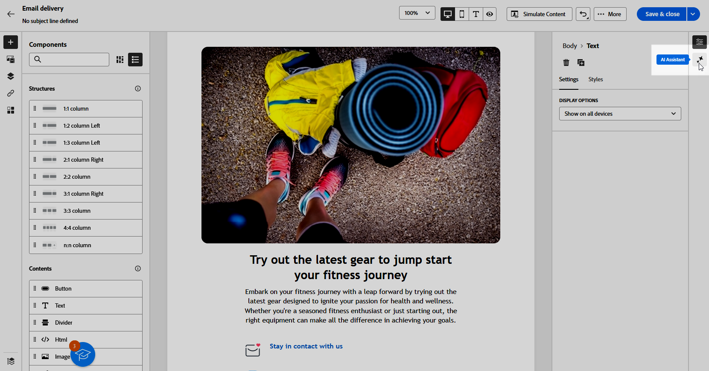
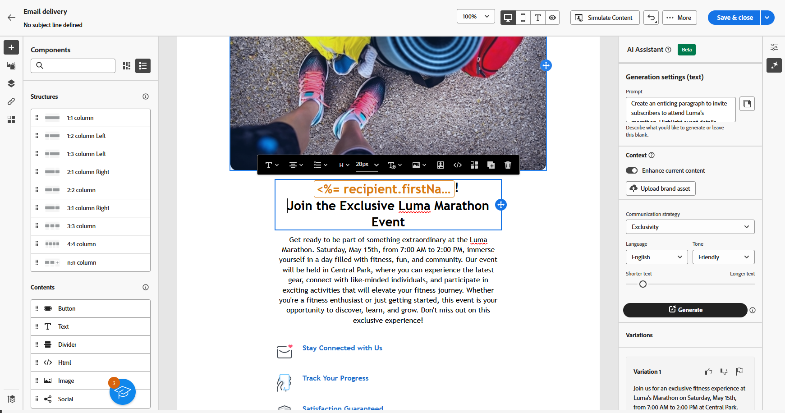
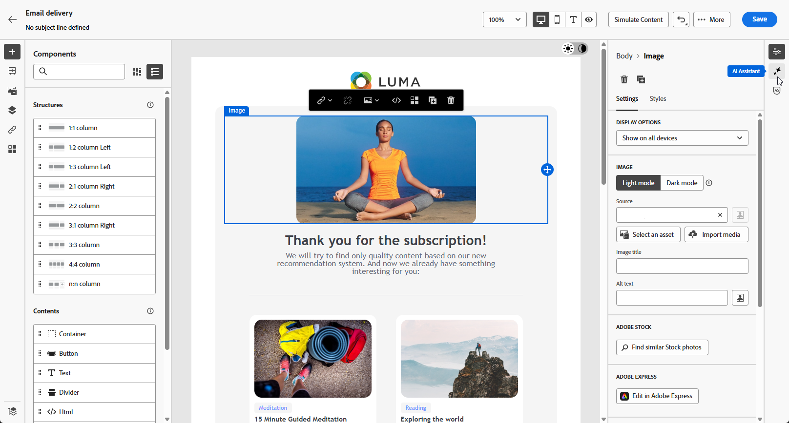
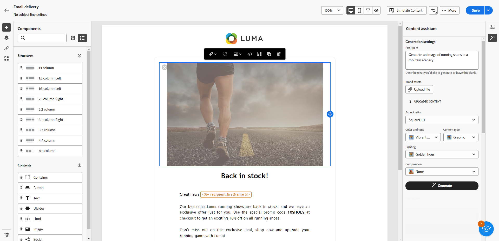

# Generación de correo electrónico con el asistente de IA {#generative-content}

>[!IMPORTANT]
>
>Antes de empezar a usar esta capacidad, lea las [Protecciones y limitaciones](generative-gs.md#generative-guardrails) relacionadas.
>> 
>
>Debe aceptar un [acuerdo de usuario](https://www.adobe.com/legal/licenses-terms/adobe-dx-gen-ai-user-guidelines.html){target="_blank"} antes de usar el Asistente de IA en Adobe Campaign Web. Para obtener más información, póngase en contacto con su representante Adobe.

Una vez que haya creado y personalizado sus correos electrónicos, utilice el asistente de IA en Adobe Campaign Web para mejorar su contenido.

El asistente de IA de Adobe Campaign Web ayuda a optimizar el impacto de las entregas mediante la generación de correos electrónicos completos, contenido de texto de destino e imágenes adaptadas para resonar con la audiencia. Esto mejora sus campañas de correo electrónico para una mejor participación.

Con sus campañas de correo electrónico, utilice el asistente de IA para generar correos electrónicos, textos o imágenes completos. Explore las pestañas siguientes para aprender a utilizar el asistente de IA en la web de Adobe Campaign.

>[!BEGINTABS]

>[!TAB Generación completa de correo electrónico]

En el siguiente ejemplo, aproveche el asistente de IA en Adobe Campaign Web para refinar un correo electrónico existente y personalizarlo para un evento especial.

1. Después de crear y configurar tu envío por correo electrónico, haz clic en **[!UICONTROL Editar contenido]**.

   Para obtener más información sobre cómo configurar su envío por correo electrónico, consulte [esta página](../email/create-email-content.md).

1. Personalice el diseño según sea necesario y acceda al menú **[!UICONTROL Asistente de IA]**.

   {zoomable="yes"}

1. Habilite la opción **[!UICONTROL Usar contenido original]** para el asistente de IA a fin de personalizar el nuevo contenido en función del contenido seleccionado.

1. Ajuste el contenido describiendo lo que desea generar en el campo **[!UICONTROL Preguntar]**.

   Si necesita ayuda para redactar el mensaje, acceda a la **[!UICONTROL Biblioteca de mensajes]**, que ofrece una amplia gama de ideas para mejorar los envíos.

   {zoomable="yes"}

1. Cambie **[!UICONTROL Subject line]** o **[!UICONTROL Preheader]** para incluirlos en la generación de variantes.

1. Adapte el mensaje utilizando la opción **[!UICONTROL Configuración de texto]**:

   * **[!UICONTROL Estrategia de comunicación]**: elige el estilo de comunicación más adecuado para el texto generado.
   * **[!UICONTROL Tono]**: Asegúrese de que el tono del correo electrónico resuene en la audiencia. Tanto si desea sonar informativo, lúdico o persuasivo, AI Assistant adapta el mensaje en consecuencia.

   {zoomable="yes"}

1. Elija su **[!UICONTROL configuración de imagen]**:

   * **[!UICONTROL Tipo de contenido]**: Categorice la naturaleza del elemento visual y distinga entre distintas formas de representación visual, como fotografías, gráficos o arte.
   * **[!UICONTROL Intensidad visual]**: controla el impacto de la imagen ajustando su intensidad. Un ajuste más bajo (2) crea un aspecto más suave, mientras que un ajuste más alto (10) hace que la imagen sea más vibrante.
   * **[!UICONTROL Color y tono]**: ajusta el aspecto general de los colores y el estado de ánimo o atmósfera transmitidos.
   * **[!UICONTROL Iluminación]**: modifique la iluminación de la imagen para dar forma a su atmósfera y resaltar elementos específicos.
   * **[!UICONTROL Composición]**: organice los elementos dentro del marco de la imagen.

1. En el menú **[!UICONTROL Brand assets]**, haga clic en **[!UICONTROL Cargar recurso de marca]** para agregar cualquier recurso de marca que proporcione contexto adicional al Asistente de IA o seleccione uno cargado anteriormente.

   Los archivos cargados anteriormente están disponibles en la lista desplegable **[!UICONTROL Recursos de marca cargados]**. Cambie los recursos que desee incluir en la generación.

   {zoomable="yes"}

1. Una vez que la solicitud esté lista, haga clic en **[!UICONTROL Generar]**.

1. Examine las **[!UICONTROL variaciones]** generadas y haga clic en **[!UICONTROL Vista previa]** para ver una versión en pantalla completa de la variación seleccionada o en **[!UICONTROL Aplicar]** para reemplazar el contenido actual.

1. Haga clic en el icono de porcentaje para ver su **[!UICONTROL puntuación de alineación de marca]** e identificar cualquier desalineación con su marca.

   Más información sobre [puntuación de alineación de marca](../content/brands-score.md).

   {zoomable="yes"}

1. Vaya a la opción **[!UICONTROL Refinar]** en la ventana de **[!UICONTROL vista previa]** para obtener acceso a características de personalización adicionales:

   * **[!UICONTROL Reformular]**: el Asistente de IA reformula su mensaje de diferentes maneras, manteniendo su escritura fresca y atractiva para diversas audiencias.
   * **[!UICONTROL Use un lenguaje más sencillo]**: Simplifique su idioma para garantizar la claridad y accesibilidad para una audiencia más amplia.

   También puedes cambiar el **[!UICONTROL tono]** y la **[!UICONTROL estrategia de comunicación]** de tu texto.

   {zoomable="yes"}

1. Abra la pestaña **[!UICONTROL Alineación de marca]** para ver cómo se ajusta su contenido a las [directrices de marca](../content/brands.md).

1. Haz clic en **[!UICONTROL Seleccionar]** cuando encuentres el contenido apropiado.

1. Inserte campos de personalización para personalizar el contenido del correo electrónico en función de los datos del perfil. A continuación, haga clic en el botón **[!UICONTROL Simular contenido]** para controlar la renderización y comprobar la configuración de personalización con perfiles de prueba. [Más información](../preview-test/preview-content.md)

Al definir el contenido, la audiencia y la programación, prepare su envío por correo electrónico. [Más información](../monitor/prepare-send.md)

>[!TAB Generación de solo texto]

En el siguiente ejemplo, aproveche el asistente de IA para mejorar el contenido de la invitación por correo electrónico para un evento próximo.

1. Después de crear y configurar tu envío por correo electrónico, haz clic en **[!UICONTROL Editar contenido]**.

   Para obtener más información sobre cómo configurar su envío por correo electrónico, consulte [esta página](../email/create-email-content.md).

1. Seleccione un **[!UICONTROL componente Texto]** para segmentar contenido específico y acceda al menú **[!UICONTROL Asistente de IA]**.

   {zoomable="yes"}

1. Habilite la opción **[!UICONTROL Usar contenido original]** para el asistente de IA a fin de personalizar el nuevo contenido en función del contenido seleccionado.

1. Ajuste el contenido describiendo lo que desea generar en el campo **[!UICONTROL Preguntar]**.

   Si necesita ayuda para redactar el mensaje, acceda a la **[!UICONTROL Biblioteca de mensajes]**, que ofrece una amplia gama de ideas para mejorar los envíos.

   {zoomable="yes"}

1. Adapte el mensaje utilizando la opción **[!UICONTROL Configuración de texto]**:

   * **[!UICONTROL Estrategia de comunicación]**: elige el estilo de comunicación más adecuado para el texto generado.
   * **[!UICONTROL Tono]**: Asegúrese de que el tono del correo electrónico resuene en la audiencia. Tanto si desea sonar informativo, lúdico o persuasivo, AI Assistant adapta el mensaje en consecuencia.
   * **Longitud del texto**: utilice el control deslizante para seleccionar la longitud deseada del texto.

   {zoomable="yes"}

1. En el menú **[!UICONTROL Brand assets]**, haga clic en **[!UICONTROL Cargar recurso de marca]** para agregar cualquier recurso de marca que proporcione contexto adicional al Asistente de IA o seleccione uno cargado anteriormente.

   Los archivos cargados anteriormente están disponibles en la lista desplegable **[!UICONTROL Recursos de marca cargados]**. Cambie los recursos que desee incluir en la generación.

1. Una vez que la solicitud esté lista, haga clic en **[!UICONTROL Generar]**.

1. Examine las **[!UICONTROL variaciones]** generadas y haga clic en **[!UICONTROL Vista previa]** para ver una versión en pantalla completa de la variación seleccionada o en **[!UICONTROL Aplicar]** para reemplazar el contenido actual.

1. Haga clic en el icono de porcentaje para ver su **[!UICONTROL puntuación de alineación de marca]** e identificar cualquier desalineación con su marca.

   Más información sobre [puntuación de alineación de marca](../content/brands-score.md).

   {zoomable="yes"}

1. Vaya a la opción **[!UICONTROL Refinar]** en la ventana de **[!UICONTROL vista previa]** para obtener acceso a características de personalización adicionales:

   * **[!UICONTROL Usar como contenido de referencia]**: la variante elegida sirve como contenido de referencia para generar otros resultados.
   * **[!UICONTROL Elaborar]**: amplía temas específicos y proporciona detalles adicionales para una mejor comprensión y participación.
   * **[!UICONTROL Resumir]**: condense los puntos clave en resúmenes claros y concisos para atraer la atención y alentar a que sigan leyendo.
   * **[!UICONTROL Reformular]**: reformula tu mensaje de diferentes maneras, manteniendo tu escritura fresca y atractiva para diversas audiencias.
   * **[!UICONTROL Use un lenguaje más sencillo]**: Simplifique su idioma para garantizar la claridad y accesibilidad para una audiencia más amplia.

   También puedes cambiar el **[!UICONTROL tono]** y la **[!UICONTROL estrategia de comunicación]** de tu texto.

   {zoomable="yes"}

1. Abra la pestaña **[!UICONTROL Alineación de marca]** para ver cómo se ajusta su contenido a las [directrices de marca](../content/brands.md).

1. Haz clic en **[!UICONTROL Seleccionar]** cuando encuentres el contenido apropiado.

1. Inserte campos de personalización para personalizar el contenido del correo electrónico en función de los datos del perfil. A continuación, haga clic en el botón **[!UICONTROL Simular contenido]** para controlar la renderización y comprobar la configuración de personalización con perfiles de prueba. [Más información](../preview-test/preview-content.md)

Al definir el contenido, la audiencia y la programación, prepare su envío por correo electrónico. [Más información](../monitor/prepare-send.md)

>[!TAB Generación de imágenes]

En el siguiente ejemplo, aprenda a aprovechar el asistente de IA para optimizar y mejorar sus recursos, lo que garantiza una experiencia más fácil de usar.

1. Después de crear y configurar tu envío por correo electrónico, haz clic en **[!UICONTROL Editar contenido]**.

   Para obtener más información sobre cómo configurar su envío por correo electrónico, consulte [esta página](../email/create-email-content.md).

1. Complete **[!UICONTROL detalles básicos]** para su envío. Una vez finalizado, haga clic en **[!UICONTROL Editar contenido de correo electrónico]**.

1. Seleccione el recurso que desea cambiar con el asistente de IA.

1. En el menú de la derecha, seleccione **[!UICONTROL Asistente de IA]**.

   {zoomable="yes"}

1. Habilite la opción **[!UICONTROL Estilo de referencia]** para que el Asistente de IA personalice el nuevo contenido en función del contenido seleccionado.

1. Ajuste el contenido describiendo lo que desea generar en el campo **[!UICONTROL Preguntar]**.

   Si necesita ayuda para redactar el mensaje, acceda a la **[!UICONTROL Biblioteca de mensajes]**, que ofrece una amplia gama de ideas para mejorar los envíos.

   {zoomable="yes"}

1. Adapte el mensaje utilizando la opción **[!UICONTROL Configuración de imagen]**:

   * **[!UICONTROL Proporción de aspecto]**: determine la anchura y la altura del recurso. Elija entre proporciones comunes, como 16:9, 4:3, 3:2 o 1:1, o indique un tamaño personalizado.
   * **[!UICONTROL Tipo de contenido]**: Categorice la naturaleza del elemento visual y distinga entre distintas formas de representación visual, como fotografías, gráficos o arte.
   * **[!UICONTROL Intensidad visual]**: controla el impacto de la imagen ajustando su intensidad. Un ajuste más bajo (2) crea un aspecto más suave, mientras que un ajuste más alto (10) hace que la imagen sea más vibrante.
   * **[!UICONTROL Color y tono]**: ajusta el aspecto general de los colores y el estado de ánimo o atmósfera transmitidos.
   * **[!UICONTROL Iluminación]**: modifique la iluminación de la imagen para dar forma a su atmósfera y resaltar elementos específicos.
   * **[!UICONTROL Composición]**: organice los elementos dentro del marco de la imagen.

   {zoomable="yes"}

1. En el menú **[!UICONTROL Brand assets]**, haga clic en **[!UICONTROL Cargar recurso de marca]** para agregar cualquier recurso de marca que proporcione contexto adicional al Asistente de IA o seleccione uno cargado anteriormente.

   Los archivos cargados anteriormente están disponibles en la lista desplegable **[!UICONTROL Recursos de marca cargados]**. Cambie los recursos que desee incluir en la generación.

1. Una vez que esté satisfecho con la configuración de la solicitud, haga clic en **[!UICONTROL Generar]**.

1. Examine las **[!UICONTROL variaciones]** generadas y haga clic en **[!UICONTROL Vista previa]** para ver una versión en pantalla completa de la variación seleccionada o en **[!UICONTROL Aplicar]** para reemplazar el contenido actual.

1. Haga clic en el icono de porcentaje para ver su **[!UICONTROL puntuación de alineación de marca]** e identificar cualquier desalineación con su marca.

   Más información sobre [puntuación de alineación de marca](../content/brands-score.md).

   {zoomable="yes"}

1. Elija **[!UICONTROL Generar]** similar si desea ver imágenes relacionadas con esta variante.

1. Abra la pestaña **[!UICONTROL Alineación de marca]** para ver cómo se ajusta su contenido a las [directrices de marca](../content/brands.md).

1. Haz clic en **[!UICONTROL Seleccionar]** cuando encuentres el contenido apropiado.

1. Después de definir el contenido del mensaje, haga clic en el botón **[!UICONTROL Simular contenido]** para controlar la representación y comprobar la configuración de personalización con perfiles de prueba. [Más información](../preview-test/preview-content.md)

1. Al definir el contenido, la audiencia y la programación, prepare su envío por correo electrónico. [Más información](../monitor/prepare-send.md)

>[!ENDTABS]

## Vídeos explicativos {#video}

Aprenda a utilizar el asistente de IA para generar contenido, texto e imágenes completos de correo electrónico.

>[!VIDEO](https://video.tv.adobe.com/v/3428984)