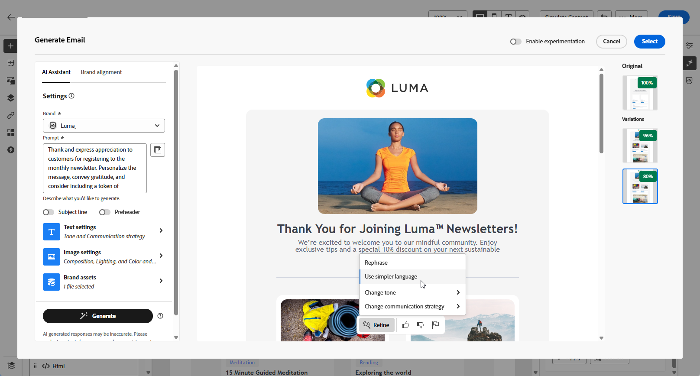

# Generación de correo electrónico con el asistente de IA {#generative-content}

>[!IMPORTANT]
>
>Antes de empezar a usar esta capacidad, lea [Protecciones y limitaciones](generative-gs.md#generative-guardrails) relacionadas.
> 
>
>Debe aceptar un [acuerdo de usuario](https://www.adobe.com/legal/licenses-terms/adobe-dx-gen-ai-user-guidelines.html){target="_blank"} para poder usar el Asistente de IA en Adobe Campaign Web. Para obtener más información, póngase en contacto con su representante Adobe.

Una vez creados y personalizados los correos electrónicos, utilice el asistente de IA en la web de Adobe Campaign en Campaign con tecnología de IA generativa para llevar el contenido al siguiente nivel.

El asistente de IA de la web de Adobe Campaign puede ayudarle a optimizar el impacto de sus envíos mediante la generación de correos electrónicos completos, contenido de texto de destino e incluso imágenes específicamente diseñadas para interesar a su audiencia. Esto optimiza las campañas de correo electrónico para una mejor participación.

Con sus campañas de correo electrónico, puede utilizar el asistente de IA para generar correos electrónicos, textos o imágenes completos. Explore las pestañas siguientes para aprender a utilizar el asistente de IA en Adobe Campaign Web.

>[!BEGINTABS]

>[!TAB Generación completa de correo electrónico]

En el siguiente ejemplo, utilizaremos el asistente de IA en Adobe Campaign Web para refinar un correo electrónico existente y personalizarlo para un evento especial.

1. Después de crear y configurar tu envío por correo electrónico, haz clic en **[!UICONTROL Editar contenido]**.

   Para obtener más información sobre cómo configurar su envío por correo electrónico, consulte [esta página](../email/create-email-content.md).

1. Personalice el diseño según sea necesario y acceda al menú **[!UICONTROL Asistente de IA]**.

   {zoomable="yes"}

1. Habilite la opción **[!UICONTROL Usar contenido original]** para que el asistente de IA personalice el nuevo contenido en función del contenido seleccionado.

1. Ajuste el contenido describiendo lo que desea generar en el campo **[!UICONTROL Preguntar]**.

   Si está buscando ayuda para redactar el mensaje, acceda a la **[!UICONTROL Biblioteca de mensajes]**, que ofrece una amplia gama de ideas para mejorar los envíos.

   {zoomable="yes"}

1. Puede alternar **[!UICONTROL Línea de asunto]** o **[!UICONTROL Encabezado previo]** para incluirlos en la generación de variante.

1. Adapte el mensaje con la opción **[!UICONTROL Configuración de texto]**:

   * **[!UICONTROL Estrategia de comunicación]**: elige el estilo de comunicación más adecuado para el texto generado.
   * **[!UICONTROL Tono]**: el tono del correo electrónico debe interesar a la audiencia. Tanto si desea sonar informativo, lúdico o persuasivo, el asistente de IA puede adaptar el mensaje en consecuencia.

   {zoomable="yes"}

1. Elija su **[!UICONTROL configuración de imagen]**:

   * **[!UICONTROL Tipo de contenido]**: Esto categoriza la naturaleza del elemento visual, distinguiendo entre diferentes formas de representación visual como fotografías, gráficos o arte.
   * **[!UICONTROL Intensidad visual]**: puede controlar el impacto de la imagen ajustando su intensidad. Un ajuste inferior (2) creará una apariencia más suave y restringida, mientras que un ajuste superior (10) hará que la imagen sea más vibrante y visualmente potente.
   * **[!UICONTROL Color y tono]**: El aspecto general de los colores de una imagen y el estado de ánimo o atmósfera que transmite.
   * **[!UICONTROL Iluminación]**: hace referencia al relámpago presente en una imagen, que da forma a su atmósfera y resalta elementos específicos.
   * **[!UICONTROL Composición]**: hace referencia a la disposición de elementos dentro del marco de una imagen

   {zoomable="yes"}

1. En el menú **[!UICONTROL Brand assets]**, haga clic en **[!UICONTROL Cargar recurso de marca]** para agregar cualquier recurso de marca que contenga contenido que pueda proporcionar contexto adicional con el asistente de IA o seleccione uno cargado anteriormente.

   Los archivos cargados anteriormente están disponibles en la lista desplegable **[!UICONTROL Recursos de marca cargados]**. Simplemente, cambie los recursos que desee incluir en la generación.

1. Una vez que la solicitud esté lista, haga clic en **[!UICONTROL Generar]**.

1. Examine las **[!UICONTROL variaciones]** generadas y haga clic en **[!UICONTROL Vista previa]** para ver una versión en pantalla completa de la variación seleccionada.

1. Vaya a la opción **[!UICONTROL Refinar]** en la ventana de **[!UICONTROL vista previa]** para obtener acceso a características de personalización adicionales:

   * **[!UICONTROL Reformular]**: el Ayudante de IA puede reformular el mensaje de diferentes maneras, lo que mantiene la escritura fresca y atractiva para diversas audiencias.

   * **[!UICONTROL Use un lenguaje más sencillo]**: aproveche el asistente de IA para simplificar el lenguaje y garantizar la claridad y accesibilidad para una audiencia más amplia.

   También puedes cambiar el **[!UICONTROL tono]** y la **[!UICONTROL estrategia de comunicación]** de tu texto.

   {zoomable="yes"}

1. Haga clic en **[!UICONTROL Seleccionar]** cuando encuentre el contenido apropiado.

1. Inserte campos de personalización para personalizar el contenido del correo electrónico en función de los datos de perfiles. A continuación, haga clic en el botón **[!UICONTROL Simular contenido]** para controlar la renderización y compruebe la configuración de personalización con perfiles de prueba. [Más información](../preview-test/preview-content.md)

   {zoomable="yes"}

Una vez definido el contenido, la audiencia y la programación, estará listo para preparar la entrega por correo electrónico. [Más información](../monitor/prepare-send.md)

>[!TAB Generación de solo texto]

En el siguiente ejemplo, aprovecharemos el asistente de IA para mejorar el contenido de nuestra invitación por correo electrónico para nuestro próximo evento.

1. Después de crear y configurar tu envío por correo electrónico, haz clic en **[!UICONTROL Editar contenido]**.

   Para obtener más información sobre cómo configurar su envío por correo electrónico, consulte [esta página](../email/create-email-content.md).

1. Seleccione un **[!UICONTROL componente Texto]** para solamente segmentar un contenido específico. y acceder al menú **[!UICONTROL Asistente de IA]**.

   {zoomable="yes"}

1. Habilite la opción **[!UICONTROL Usar contenido original]** para que el asistente de IA personalice el nuevo contenido en función del contenido seleccionado.

1. Ajuste el contenido describiendo lo que desea generar en el campo **[!UICONTROL Preguntar]**.

   Si está buscando ayuda para redactar el mensaje, acceda a la **[!UICONTROL Biblioteca de mensajes]**, que ofrece una amplia gama de ideas para mejorar los envíos.

   {zoomable="yes"}

1. Adapte el mensaje con la opción **[!UICONTROL Configuración de texto]**:

   * **[!UICONTROL Estrategia de comunicación]**: elige el estilo de comunicación más adecuado para el texto generado.
   * **[!UICONTROL Tono]**: el tono del correo electrónico debe interesar a la audiencia. Tanto si desea sonar informativo, lúdico o persuasivo, el asistente de IA puede adaptar el mensaje en consecuencia.
   * **Longitud del texto**: utilice el control deslizante para seleccionar la longitud deseada del texto.

   {zoomable="yes"}

1. En el menú **[!UICONTROL Brand assets]**, haga clic en **[!UICONTROL Cargar recurso de marca]** para agregar cualquier recurso de marca que contenga contenido que pueda proporcionar contexto adicional con el asistente de IA o seleccione uno cargado anteriormente.

   Los archivos cargados anteriormente están disponibles en la lista desplegable **[!UICONTROL Recursos de marca cargados]**. Simplemente, cambie los recursos que desee incluir en la generación.

1. Una vez que la solicitud esté lista, haga clic en **[!UICONTROL Generar]**.

1. Examine las **[!UICONTROL variaciones]** generadas y haga clic en **[!UICONTROL Vista previa]** para ver una versión en pantalla completa de la variación seleccionada.

1. Vaya a la opción **[!UICONTROL Refinar]** en la ventana de **[!UICONTROL vista previa]** para obtener acceso a características de personalización adicionales:

   * **[!UICONTROL Usar como contenido de referencia]**: la variante elegida servirá como contenido de referencia para generar otros resultados.

   * **[!UICONTROL Elaborar]**: el Asistente de IA puede ayudarle a ampliar temas específicos y proporcionar detalles adicionales para una mejor comprensión y participación.

   * **[!UICONTROL Resumir]**: La información larga puede sobrecargar los destinatarios de correo electrónico. Utilice el asistente de IA para condensar los puntos clave en resúmenes claros y concisos que llamen la atención y los animen a leer más.

   * **[!UICONTROL Reformular]**: el Asistente de IA puede reformular su mensaje de diferentes maneras, manteniendo su escritura fresca y atractiva para diversas audiencias.

   * **[!UICONTROL Use un lenguaje más sencillo]**: aproveche el asistente de IA para simplificar el lenguaje y garantizar la claridad y accesibilidad para una audiencia más amplia.

   También puedes cambiar el **[!UICONTROL tono]** y la **[!UICONTROL estrategia de comunicación]** de tu texto.

   {zoomable="yes"}

1. Haga clic en **[!UICONTROL Seleccionar]** cuando encuentre el contenido apropiado.

1. Inserte campos de personalización para personalizar el contenido del correo electrónico en función de los datos de perfiles. A continuación, haga clic en el botón **[!UICONTROL Simular contenido]** para controlar la renderización y compruebe la configuración de personalización con perfiles de prueba. [Más información](../preview-test/preview-content.md)

Una vez definido el contenido, la audiencia y la programación, estará listo para preparar la entrega por correo electrónico. [Más información](../monitor/prepare-send.md)

>[!TAB Generación de imágenes]

En el siguiente ejemplo, aprenda a aprovechar el asistente de IA para optimizar y mejorar sus recursos, lo que garantiza una experiencia más fácil de usar.

1. Después de crear y configurar tu envío por correo electrónico, haz clic en **[!UICONTROL Editar contenido]**.

   Para obtener más información sobre cómo configurar su envío por correo electrónico, consulte [esta página](../email/create-email-content.md).

1. Complete **[!UICONTROL detalles básicos]** para su envío. Una vez finalizado, haga clic en **[!UICONTROL Editar contenido de correo electrónico]**.

1. Seleccione el recurso que desea cambiar con el asistente de IA.

1. En el menú de la derecha, seleccione **[!UICONTROL Asistente de IA]**.

   {zoomable="yes"}

1. Habilite la opción **[!UICONTROL Estilo de referencia]** para que el asistente de IA personalice el nuevo contenido en función del contenido seleccionado.

1. Ajuste el contenido describiendo lo que desea generar en el campo **[!UICONTROL Preguntar]**.

   Si está buscando ayuda para redactar el mensaje, acceda a la **[!UICONTROL Biblioteca de mensajes]**, que ofrece una amplia gama de ideas para mejorar los envíos.

   {zoomable="yes"}

1. Adapte el mensaje con la opción **[!UICONTROL Configuración de imagen]**:

   * **[!UICONTROL Proporción de aspecto]**: determina la anchura y la altura del recurso. Tiene la opción de elegir entre proporciones comunes, como 16:9, 4:3, 3:2 o 1:1, o bien puede introducir un tamaño personalizado.
   * **[!UICONTROL Tipo de contenido]**: Esto categoriza la naturaleza del elemento visual, distinguiendo entre diferentes formas de representación visual como fotografías, gráficos o arte.
   * **[!UICONTROL Intensidad visual]**: puede controlar el impacto de la imagen ajustando su intensidad. Un ajuste inferior (2) creará una apariencia más suave y restringida, mientras que un ajuste superior (10) hará que la imagen sea más vibrante y visualmente potente.
   * **[!UICONTROL Color y tono]**: El aspecto general de los colores de una imagen y el estado de ánimo o atmósfera que transmite.
   * **[!UICONTROL Iluminación]**: hace referencia al relámpago presente en una imagen, que da forma a su atmósfera y resalta elementos específicos.
   * **[!UICONTROL Composición]**: hace referencia a la disposición de elementos dentro del marco de una imagen

   {zoomable="yes"}

1. En el menú **[!UICONTROL Brand assets]**, haga clic en **[!UICONTROL Cargar recurso de marca]** para agregar cualquier recurso de marca que contenga contenido que pueda proporcionar contexto adicional con el asistente de IA o seleccione uno cargado anteriormente.

   Los archivos cargados anteriormente están disponibles en la lista desplegable **[!UICONTROL Recursos de marca cargados]**. Simplemente, cambie los recursos que desee incluir en la generación.

1. Una vez que esté satisfecho con la configuración de la solicitud, haga clic en **[!UICONTROL Generar]**.

1. Examine **[!UICONTROL sugerencias de variación]** para encontrar el recurso deseado.

   Haga clic en **[!UICONTROL Vista previa]** para ver una versión en pantalla completa de la variación seleccionada.

   {zoomable="yes"}

1. Elija **[!UICONTROL Generar]** similar si desea ver imágenes relacionadas con esta variante.

   {zoomable="yes"}

1. Haga clic en **[!UICONTROL Seleccionar]** cuando encuentre el contenido apropiado.

1. Después de definir el contenido del mensaje, haga clic en el botón **[!UICONTROL Simular contenido]** para controlar la representación y compruebe la configuración de personalización con perfiles de prueba.  [Más información](../preview-test/preview-content.md)

1. Una vez definido el contenido, la audiencia y la programación, estará listo para preparar la entrega por correo electrónico. [Más información](../monitor/prepare-send.md)

>[!ENDTABS]

## Vídeos explicativos {#video}

Aprenda a utilizar el asistente de IA para generar contenido, texto e imágenes completos de correo electrónico.

>[!VIDEO](https://video.tv.adobe.com/v/3428984)

