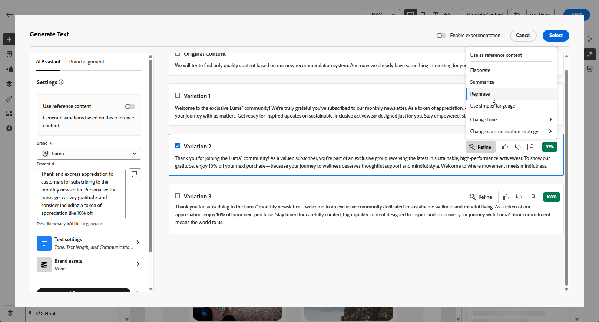

# Generación de correo electrónico con el asistente de IA {#generative-content}

>[!BEGINSHADEBOX]

**Tabla de contenido**

* [Introducción al asistente de IA](generative-gs.md)
* **[Generación de correo electrónico con el asistente de IA](generative-content.md)**
* [Generación de SMS con el asistente de IA](generative-sms.md)
* [Generación de notificaciones push con el asistente de IA](generative-push.md)

>[!ENDSHADEBOX]

Una vez creados y personalizados los correos electrónicos, utilice el asistente de IA de Journey Optimizer en Campaign con tecnología de IA generativa para llevar el contenido al siguiente nivel.

El asistente de IA puede ayudarle a optimizar el impacto de sus envíos sugiriendo contenido diferente que es más probable que resuene en su audiencia.

>[!NOTE]
>
>Antes de empezar a utilizar esta capacidad, lea la información relacionada [Protecciones y limitaciones](generative-gs.md#guardrails-and-limitations).

## Generación de contenido con el asistente de IA {#generative-text}

Así es como tu asistente de IA puede ayudarte a escribir correos electrónicos atractivos:

* **Resumir**: La información larga puede sobrecargar los destinatarios de correo electrónico. Utilice el asistente de IA para condensar los puntos clave en resúmenes claros y concisos que llamen la atención y los animen a leer más.

* **Elaborado**: el asistente de IA puede ayudarle a ampliar temas específicos, proporcionando detalles adicionales para una mejor comprensión y participación.

* **Simplificar idioma**: aproveche el asistente de IA para simplificar el lenguaje y garantizar la claridad y accesibilidad para una audiencia más amplia.

* **Reformular**: el asistente de IA puede reformular su mensaje de diferentes maneras, manteniendo su escritura fresca y atractiva para diversas audiencias.

* **Cambiar tono**: el tono del correo electrónico debe interesar a la audiencia. Tanto si desea sonar informativo, lúdico o persuasivo, el asistente de IA puede adaptar el mensaje en consecuencia.

En el siguiente ejemplo, aprovecharemos el asistente de IA para mejorar el contenido de nuestra invitación por correo electrónico para nuestro próximo evento.

1. Después de crear y configurar la entrega por correo electrónico, haga clic en **[!UICONTROL Editar contenido]**.

   Para obtener más información sobre cómo configurar la entrega por correo electrónico, consulte [esta página](../email/create-email-content.md).

1. Personalice el correo electrónico según sea necesario y acceda al **[!UICONTROL Asistente de IA]** menú.

   También puede seleccionar una **[!UICONTROL Componente Texto]** para dirigirse únicamente a un contenido específico.

   {zoomable=&quot;yes&quot;}

1. Habilite la **[!UICONTROL Usar contenido original]** para que el asistente de IA personalice el nuevo contenido en función de su envío, nombre de envío y audiencia seleccionada.

   >[!IMPORTANT]
   >
   > El mensaje siempre debe estar vinculado a un contexto específico cargando un recurso de marca o habilitando **[!UICONTROL Mejora del contenido actual]** opción.

1. Ajuste el contenido describiendo lo que desea generar en la variable **[!UICONTROL Preguntar]** field.

   Si busca ayuda para crear el indicador, acceda al **[!UICONTROL Biblioteca de mensajes]** que proporciona una amplia gama de ideas rápidas para mejorar las entregas.

   {zoomable=&quot;yes&quot;}

1. Puede alternar el **[!UICONTROL Línea de asunto]** o **[!UICONTROL Preencabezado]** para incluirlos en la generación de variantes.

   Tenga en cuenta que esto está disponible si no seleccionó un componente Texto específico.

1. Clic **[!UICONTROL Cargar recurso de marca]** para añadir cualquier recurso de marca que contenga contenido que pueda proporcionar contexto adicional, utilice el asistente de IA.

   {zoomable=&quot;yes&quot;}

1. Adapte el indicador con las diferentes opciones:

   * **[!UICONTROL Estrategia de comunicación]**: seleccione el método de comunicación deseado para el texto generado.
   * **[!UICONTROL Idioma]**: elija el idioma del contenido de la variante.
   * **[!UICONTROL Tono]**: Asegúrese de que el texto sea apropiado para su audiencia y propósito.
   * **[!UICONTROL Longitud]**: seleccione la longitud del contenido mediante el regulador de intervalo. Solo está disponible si ha seleccionado un componente Texto específico.

   {zoomable=&quot;yes&quot;}

1. Una vez que la solicitud esté lista, haga clic en **[!UICONTROL Generar]**.

1. Examine el contenido generado **[!UICONTROL Variaciones]** y haga clic en **[!UICONTROL Previsualizar]** para ver una versión en pantalla completa de la variación seleccionada.

1. Vaya a **[!UICONTROL Refinar]** dentro de la opción **[!UICONTROL Previsualizar]** para acceder a funciones de personalización adicionales y ajustar la variación a sus preferencias.

   Clic **[!UICONTROL Seleccionar]** una vez encontrado el contenido adecuado.

   {zoomable=&quot;yes&quot;}

1. Inserte campos de personalización para personalizar el contenido del correo electrónico en función de los datos de perfiles. A continuación, haga clic en **[!UICONTROL Simular contenido]** para controlar el procesamiento y comprobar la configuración de personalización con perfiles de prueba. [Más información](../preview-test/preview-content.md)

   {zoomable=&quot;yes&quot;}

Una vez definido el contenido, la audiencia y la programación, estará listo para preparar la entrega por correo electrónico. [Más información](../monitor/prepare-send.md)

## Generación de imágenes con el asistente de IA {#generative-image}

Aproveche el asistente de IA para generar imágenes diversas y adaptadas a sus campañas de correo electrónico. Por ejemplo, se puede utilizar para lo siguiente:

* **Generar**: genere una amplia gama de imágenes atractivas diseñadas específicamente para sus campañas de correo electrónico. El control granular de ajustes como la paleta de colores, los rayos y la composición le permite interactuar con segmentos de audiencia distintos y lograr sus objetivos de campaña únicos.

* **Generar elemento similar**: utilice el asistente de IA para generar imágenes similares a partir de una variante seleccionada.

* **Recurso de marca**: optimice la selección de imágenes para campañas de correo electrónico aprovechando los recursos internos de la marca y las fuentes externas, como los Adobes Firefly.

En el siguiente ejemplo, aprenda a aprovechar el asistente de IA para optimizar y mejorar su contenido, lo que garantiza una experiencia más fácil de usar. Siga estos pasos:

1. Después de crear y configurar la entrega por correo electrónico, haga clic en **[!UICONTROL Editar contenido]**.

   Para obtener más información sobre cómo configurar la entrega por correo electrónico, consulte [esta página](../email/create-email-content.md).

1. Rellene el **[!UICONTROL Detalles básicos]** para su envío. Una vez finalizado, haga clic en **[!UICONTROL Editar contenido de correo electrónico]**.

1. Seleccione el recurso que desea cambiar con el asistente de IA.

1. En el menú derecho, seleccione **[!UICONTROL Asistente de IA]**.

   {zoomable=&quot;yes&quot;}

1. Ajuste el contenido describiendo lo que desea generar en la variable **[!UICONTROL Preguntar]** field.

   Si busca ayuda para crear el indicador, acceda al **[!UICONTROL Biblioteca de mensajes]** que proporciona una amplia gama de ideas rápidas para mejorar las entregas.

   {zoomable=&quot;yes&quot;}

1. Clic **[!UICONTROL Cargar recurso de marca]** para añadir cualquier recurso de marca que contenga contenido que pueda proporcionar contexto adicional, utilice el asistente de IA.

   >[!IMPORTANT]
   >
   > El mensaje siempre debe estar vinculado a un contexto específico.

1. Adapte el indicador con las diferentes opciones:

   * **[!UICONTROL Proporción de aspecto]**: Determina la anchura y la altura del recurso. Tiene la opción de elegir entre proporciones comunes, como 16:9, 4:3, 3:2 o 1:1, o bien puede introducir un tamaño personalizado.
   * **[!UICONTROL Color y tono]**: El aspecto general de los colores dentro de una imagen y el estado de ánimo o atmósfera que transmite.
   * **[!UICONTROL Tipo de contenido]**: Esto categoriza la naturaleza del elemento visual, distinguiendo entre diferentes formas de representación visual como fotos, gráficos o arte.
   * **[!UICONTROL Iluminación]**: Se refiere al rayo presente en una imagen, que da forma a su atmósfera y resalta elementos específicos.
   * **[!UICONTROL Composición]**: hace referencia a la disposición de elementos dentro del marco de una imagen

   {zoomable=&quot;yes&quot;}

1. Una vez que esté satisfecho con la configuración de la solicitud, haga clic en **[!UICONTROL Generar]**.

1. Examine la **[!UICONTROL Sugerencias de variación]** para encontrar el recurso deseado.

   Clic **[!UICONTROL Previsualizar]** para ver una versión en pantalla completa de la variación seleccionada.

   {zoomable=&quot;yes&quot;}

1. Elegir **[!UICONTROL Mostrar elementos similares]** si desea ver imágenes relacionadas con esta variante.

1. Clic **[!UICONTROL Seleccionar]** una vez encontrado el contenido adecuado.

   {zoomable=&quot;yes&quot;}

1. Después de definir el contenido del mensaje, haga clic en **[!UICONTROL Simular contenido]** para controlar el procesamiento y comprobar la configuración de personalización con perfiles de prueba.  [Más información](../preview-test/preview-content.md)

   {zoomable=&quot;yes&quot;}

1. Una vez definido el contenido, la audiencia y la programación, estará listo para preparar la entrega por correo electrónico. [Más información](../monitor/prepare-send.md)
