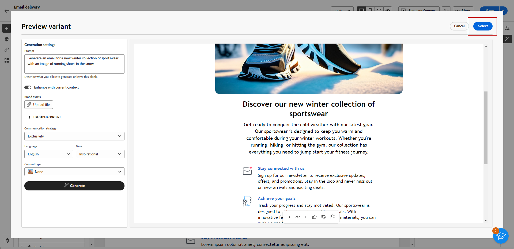

# Generación de un correo electrónico con el asistente de IA {#generative-email}

El asistente de IA de Campaign mejora el impacto de su comunicación al generar automáticamente contenido de correo electrónico completo, lo que le ahorra tiempo y garantiza una calidad coherente. Con la IA generativa, puede crear sin esfuerzo correos electrónicos atractivos que resuenen con su audiencia, lo que hace que su comunicación sea más eficaz y eficiente.

>[!NOTE]
>
>Antes de empezar a usar esta capacidad, lea [Protecciones y limitaciones](generative-gs.md#guardrails-and-limitations) relacionadas.

Para generar contenido de correo electrónico con el asistente de IA, siga los pasos a continuación. También puede mejorar un contenido existente con el Asistente de IA, como se detalla en [esta página](generative-content.md).

1. Después de crear y configurar la entrega por correo electrónico, haga clic en **[!UICONTROL Crear contenido]**.

   Para obtener más información sobre cómo configurar su envío por correo electrónico, consulte [esta página](../email/create-email-content.md).

1. Complete **[!UICONTROL detalles básicos]** para su envío. Una vez finalizado, haga clic en **[!UICONTROL Editar cuerpo del correo electrónico]**.

1. Elija la plantilla de diseño en la que desea que el asistente de IA base el correo electrónico generado.

   También puede importar un archivo de HTML.

1. En el menú de la derecha, seleccione **[!UICONTROL Generación de experiencias]**.

   {zoomable="yes"}

1. Ajuste el contenido describiendo lo que desea generar.

   Estos son algunos ejemplos de mensajes:

   * Para una newsletter: genere una newsletter mensual con artículos de viajes, elementos destacados de destino y ofertas de suscriptores exclusivas.
   * Para comentarios y encuestas: cree un correo electrónico para invitar a los clientes a proporcionar comentarios sobre su experiencia reciente con el software y participar en una encuesta de mejora de productos.
   * Para correos electrónicos de aniversario o cumpleaños: genere un correo electrónico de cumpleaños, celebrando el día especial del cliente y ofreciéndole un descuento de cumpleaños.

   {zoomable="yes"}

1. Seleccione **[!UICONTROL Cargar archivo]** si desea agregar cualquier recurso de marca que contenga contenido que pueda proporcionar contexto adicional con el Ayudante de IA.

   También puede hacer clic en **[!UICONTROL Contenido cargado]** para buscar los archivos que se han actualizado anteriormente. Tenga en cuenta que el contenido cargado está disponible exclusivamente para que el usuario actual lo reutilice.

1. Seleccione la **[!UICONTROL estrategia de comunicación]** que mejor se adapte a sus necesidades. Esto afectará al tono y al estilo del correo electrónico generado.

1. Elija el **[!UICONTROL idioma]** y el **[!UICONTROL tono]** que desea que tenga el texto generado. Esto garantizará que el texto sea apropiado para su audiencia y propósito.

   {zoomable="yes"}

1. Personalice la configuración de recursos de **[!UICONTROL tipo de contenido]** para que coincida con las características de recursos que desee.

1. Una vez que la solicitud esté lista, haga clic en **[!UICONTROL Generar]**.

1. Examine **[!UICONTROL sugerencias de variación]** para encontrar el correo electrónico deseado. Haga clic en **[!UICONTROL Vista previa]** para ver una versión en pantalla completa de la variación seleccionada.

   {zoomable="yes"}

1. Haga clic en **[!UICONTROL Seleccionar]** cuando encuentre el contenido apropiado.

   {zoomable="yes"}

1. Inserte campos de personalización para personalizar el contenido del correo electrónico en función de los datos de perfiles o personalice aún más el contenido si es necesario. [Más información sobre la personalización de contenido](../personalization/personalize.md)

1. Después de definir el contenido del correo electrónico, haga clic en el botón **[!UICONTROL Simular contenido]** para controlar la renderización y compruebe la configuración de personalización con perfiles de prueba.  [Más información](../preview-test/preview-content.md)

   {zoomable="yes"}

1. Una vez definido el contenido, la audiencia y la programación, estará listo para preparar la entrega por correo electrónico. [Más información](../monitor/prepare-send.md)
