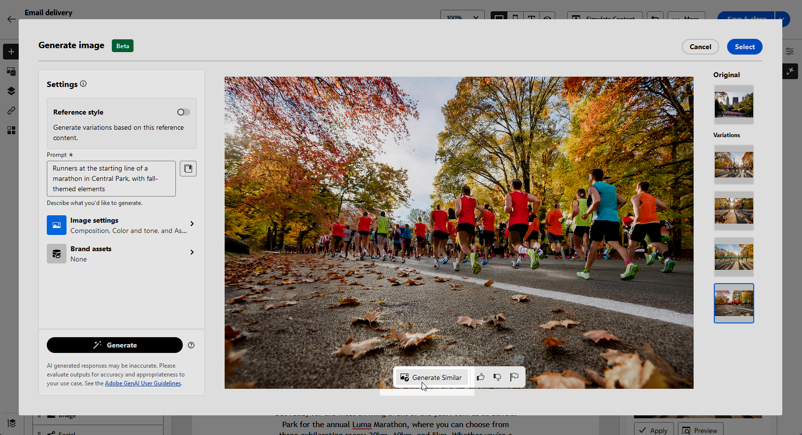

# Generación de imágenes de correo electrónico con el asistente de contenido {#generative-image}

Después de crear y personalizar los correos electrónicos, puede mejorar el contenido con el asistente de contenido, con tecnología de IA generativa. Esta función simplifica el proceso de personalización y mejora de contenido.

Para generar y mejorar imágenes en los correos electrónicos con el asistente de contenido, siga los pasos a continuación. También puede crear el contenido completo del HTML con el Ayudante de contenido, como se detalla en [esta página](generative-email.md), o generar contenido de texto, como se explica en [esta página](generative-content.md).

>[!NOTE]
>
>Antes de empezar a usar esta capacidad, lea [Protecciones y limitaciones](generative-gs.md#guardrails-and-limitations) relacionadas.

En el siguiente ejemplo, aprenda a aprovechar el asistente de contenido para optimizar y mejorar el contenido, lo que garantiza una experiencia más fácil de usar. Siga estos pasos:

1. Después de crear y configurar tu envío por correo electrónico, haz clic en **[!UICONTROL Editar contenido]**.

   Para obtener más información sobre cómo configurar su envío por correo electrónico, consulte [esta página](../email/create-email-content.md).

1. Complete **[!UICONTROL detalles básicos]** para su envío. Una vez finalizado, haga clic en **[!UICONTROL Editar contenido de correo electrónico]**.

1. Seleccione el recurso que desea cambiar con el Ayudante de contenido.

1. En el menú de la derecha, seleccione **[!UICONTROL Generación de experiencias]**.

   {zoomable="yes"}

1. Añada un mensaje para ajustar mejor los resultados.

   {zoomable="yes"}

1. Seleccione **[!UICONTROL Cargar archivo]** si desea agregar cualquier recurso de marca que contenga contenido que pueda proporcionar contexto adicional al Ayudante de contenido.

   También puede hacer clic en **[!UICONTROL Contenido cargado]** para buscar los archivos que se han actualizado anteriormente. Tenga en cuenta que el contenido cargado está disponible exclusivamente para que el usuario actual lo reutilice.

1. Seleccione **[!UICONTROL Proporción de aspecto]** del recurso. Determina la anchura y la altura del recurso.

   Tiene la opción de elegir entre proporciones comunes como 16:9, 4:3, 3:2 o 1:1, o puede introducir un tamaño personalizado.

1. Personalice la configuración de **[!UICONTROL Color y tono]**, **[!UICONTROL Tipo de contenido]**, **[!UICONTROL Iluminación]** y **[!UICONTROL Composición]** para que coincida con las características de recurso que desee.

   {zoomable="yes"}

1. Una vez que esté satisfecho con la configuración de la solicitud, haga clic en **[!UICONTROL Generar]**.

1. Examine **[!UICONTROL sugerencias de variación]** para encontrar el recurso deseado. Haga clic en **[!UICONTROL Vista previa]** para ver una versión en pantalla completa de la variación seleccionada.

   {zoomable="yes"}

1. Haga clic en **[!UICONTROL Seleccionar]** cuando encuentre el contenido apropiado.

   {zoomable="yes"}

1. Después de definir el contenido del mensaje, haga clic en el botón **[!UICONTROL Simular contenido]** para controlar la representación y compruebe la configuración de personalización con perfiles de prueba.  [Más información](../preview-test/preview-content.md)

   {zoomable="yes"}

1. Una vez definido el contenido, la audiencia y la programación, estará listo para preparar la entrega por correo electrónico. [Más información](../monitor/prepare-send.md)
