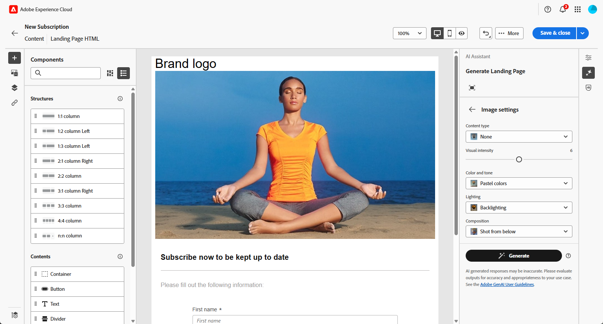

# Generación de la página de aterrizaje con el Asistente de IA{#generative-lp}

>[!CONTEXTUALHELP]
>id="acw_homepage_welcome_rn5"
>title="Generación de páginas de aterrizaje con IA"
>abstract="Ya puede usar el Asistente de IA para crear la página de aterrizaje, lo que le permite generar texto, imágenes o diseños de página completos."
>additional-url="https://experienceleague.adobe.com/docs/campaign-web/v8/release-notes/release-notes.html?lang=es" text="Consulte las notas de la versión"

>[!IMPORTANT]
>
>Antes de empezar a usar esta capacidad, lea las [Protecciones y limitaciones](generative-gs.md#generative-guardrails) relacionadas.
> 
>
>Debe aceptar un [acuerdo de usuario](https://www.adobe.com/legal/licenses-terms/adobe-dx-gen-ai-user-guidelines.html) para poder usar el Asistente de IA en Adobe Campaign Web. Para obtener más información, póngase en contacto con su representante Adobe.

Transforme sus páginas de aterrizaje con el asistente de IA en la web de Adobe Campaign, con tecnología de IA generativa.

Cree contenido impactante sin esfuerzo, incluidas páginas completas, fragmentos de texto personalizados y elementos visuales personalizados que resuenen con su audiencia, lo que aumenta la participación y la interacción.

Explore las pestañas siguientes para aprender a utilizar el asistente de IA en Adobe Campaign Web.

>[!BEGINTABS]

>[!TAB Generación de página de aterrizaje completa]

En el siguiente ejemplo, aprenda a aprovechar el asistente de IA para refinar una plantilla de página de aterrizaje existente.

1. Después de crear y configurar la página de aterrizaje, haga clic en **[!UICONTROL Editar contenido]**.

   Para obtener más información sobre cómo configurar su página de aterrizaje, consulte [esta página](../landing-pages/create-lp.md).

1. Personalice el diseño según sea necesario y acceda al menú **[!UICONTROL Asistente de IA]**.

   {zoomable="yes"}

1. Habilite la opción **[!UICONTROL Usar contenido original]** para que el asistente de IA personalice el nuevo contenido en función del contenido seleccionado.

1. Ajuste el contenido describiendo lo que desea generar en el campo **[!UICONTROL Preguntar]**.

   Si necesita ayuda para redactar el mensaje, acceda a la **[!UICONTROL Biblioteca de mensajes]**, que proporciona una amplia gama de ideas para mejorar su página de aterrizaje.

   {zoomable="yes"}

1. Adapte el mensaje con la opción **[!UICONTROL Configuración de texto]**:

   * **[!UICONTROL Estrategia de comunicación]**: elige el estilo de comunicación más adecuado para el texto generado.
   * **[!UICONTROL Tono]**: el tono de la página de aterrizaje debería interesar a la audiencia. Tanto si desea sonar informativo, lúdico o persuasivo, el asistente de IA puede adaptar el mensaje en consecuencia.

   {zoomable="yes"}

1. Elija su **[!UICONTROL configuración de imagen]**:

   * **[!UICONTROL Tipo de contenido]**: Categorice la naturaleza del elemento visual y distinga entre distintas formas de representación visual, como fotografías, gráficos o arte.
   * **[!UICONTROL Intensidad visual]**: controla el impacto de la imagen ajustando su intensidad. Un ajuste más bajo (2) crea un aspecto más suave, mientras que un ajuste más alto (10) hace que la imagen sea más vibrante.
   * **[!UICONTROL Color y tono]**: ajusta el aspecto general de los colores de una imagen y el estado de ánimo o atmósfera que transmite.
   * **[!UICONTROL Iluminación]**: modifique la iluminación presente en una imagen para dar forma a su atmósfera y resaltar elementos específicos.
   * **[!UICONTROL Composición]**: organice los elementos dentro del marco de una imagen.

   {zoomable="yes"}

1. En el menú **[!UICONTROL Brand assets]**, haga clic en **[!UICONTROL Cargar recurso de marca]** para agregar cualquier recurso de marca que proporcione contexto adicional al Asistente de IA o seleccione uno cargado anteriormente.

   Los archivos cargados anteriormente están disponibles en la lista desplegable **[!UICONTROL Recursos de marca cargados]**. Cambie los recursos que desee incluir en la generación.

   {zoomable="yes"}

1. Una vez que la solicitud esté lista, haga clic en **[!UICONTROL Generar]**.

1. Examine las **[!UICONTROL variaciones]** generadas y haga clic en **[!UICONTROL Vista previa]** para ver una versión en pantalla completa de la variación seleccionada.

1. Vaya a la opción **[!UICONTROL Refinar]** en la ventana de **[!UICONTROL vista previa]** para obtener acceso a características de personalización adicionales:

   * **[!UICONTROL Reformular]**: el Ayudante de IA puede reformular el mensaje de diferentes maneras, lo que mantiene la escritura fresca y atractiva para diversas audiencias.
   * **[!UICONTROL Use un lenguaje más sencillo]**: Simplifique su idioma para garantizar la claridad y accesibilidad para una audiencia más amplia.

   También puedes cambiar el **[!UICONTROL tono]** y la **[!UICONTROL estrategia de comunicación]** de tu texto.

   {zoomable="yes"}

1. Haz clic en **[!UICONTROL Seleccionar]** cuando encuentres el contenido apropiado.

1. Inserte campos de personalización para personalizar el contenido de la página de aterrizaje en función de los datos del perfil. A continuación, haga clic en el botón **[!UICONTROL Simular contenido]** para controlar la renderización y comprobar la configuración de personalización con perfiles de prueba. [Más información](../landing-pages/create-lp.md#test-landing-page).

Una vez que la página de aterrizaje esté lista, publíquela para que esté disponible para usarla en un mensaje. [Más información](../landing-pages/create-lp.md#publish-landing-page).

>[!TAB Generación de solo texto]

En el siguiente ejemplo, aprenda a aprovechar el asistente de IA para mejorar el contenido de la página de aterrizaje.

1. Después de crear y configurar la página de aterrizaje, haga clic en **[!UICONTROL Editar contenido]**.

   Para obtener más información sobre cómo configurar su página de aterrizaje, consulte [esta página](../landing-pages/create-lp.md).

1. Seleccione un **[!UICONTROL componente Texto]** para segmentar contenido específico y acceda al menú **[!UICONTROL Asistente de IA]**.

   {zoomable="yes"}

1. Habilite la opción **[!UICONTROL Usar contenido original]** para que el asistente de IA personalice el nuevo contenido en función del contenido seleccionado.

1. Ajuste el contenido describiendo lo que desea generar en el campo **[!UICONTROL Preguntar]**.

   Si necesita ayuda para redactar el mensaje, acceda a la **[!UICONTROL Biblioteca de mensajes]**, que proporciona una amplia gama de ideas para mejorar sus páginas de aterrizaje.

   {zoomable="yes"}

1. Adapte el mensaje con la opción **[!UICONTROL Configuración de texto]**:

   * **[!UICONTROL Estrategia de comunicación]**: elige el estilo de comunicación más adecuado para el texto generado.
   * **[!UICONTROL Tono]**: el tono de la página de aterrizaje debería interesar a la audiencia. Tanto si desea sonar informativo, lúdico o persuasivo, el asistente de IA puede adaptar el mensaje en consecuencia.
   * **Longitud del texto**: utilice el control deslizante para seleccionar la longitud deseada del texto.

   {zoomable="yes"}

1. En el menú **[!UICONTROL Brand assets]**, haga clic en **[!UICONTROL Cargar recurso de marca]** para agregar cualquier recurso de marca que proporcione contexto adicional al Asistente de IA o seleccione uno cargado anteriormente.

   Los archivos cargados anteriormente están disponibles en la lista desplegable **[!UICONTROL Recursos de marca cargados]**. Cambie los recursos que desee incluir en la generación.

   {zoomable="yes"}

1. Una vez que la solicitud esté lista, haga clic en **[!UICONTROL Generar]**.

1. Examine las **[!UICONTROL variaciones]** generadas y haga clic en **[!UICONTROL Vista previa]** para ver una versión en pantalla completa de la variación seleccionada.

1. Vaya a la opción **[!UICONTROL Refinar]** en la ventana de **[!UICONTROL vista previa]** para obtener acceso a características de personalización adicionales:

   * **[!UICONTROL Usar como contenido de referencia]**: la variante elegida servirá como contenido de referencia para generar otros resultados.
   * **[!UICONTROL Elaborar]**: amplía temas específicos y proporciona detalles adicionales para una mejor comprensión y participación.
   * **[!UICONTROL Resumir]**: condense la información larga en resúmenes claros y concisos que capten la atención y fomenten la lectura.
   * **[!UICONTROL Reformular]**: reformula tu mensaje de diferentes maneras, manteniendo tu escritura fresca y atractiva para diversas audiencias.
   * **[!UICONTROL Use un lenguaje más sencillo]**: Simplifique su idioma para garantizar la claridad y accesibilidad para una audiencia más amplia.

   También puedes cambiar el **[!UICONTROL tono]** y la **[!UICONTROL estrategia de comunicación]** de tu texto.

   {zoomable="yes"}

1. Haz clic en **[!UICONTROL Seleccionar]** cuando encuentres el contenido apropiado.

1. Inserte campos de personalización para personalizar el contenido de la página de aterrizaje en función de los datos del perfil. A continuación, haga clic en el botón **[!UICONTROL Simular contenido]** para controlar la renderización y comprobar la configuración de personalización con perfiles de prueba. [Más información](../landing-pages/create-lp.md#test-landing-page).

Una vez que la página de aterrizaje esté lista, publíquela para que esté disponible para usarla en un mensaje. [Más información](../landing-pages/create-lp.md#publish-landing-page).

>[!TAB Generación solo de imagen]

En el siguiente ejemplo, aprenda a aprovechar el asistente de IA para optimizar y mejorar sus recursos, lo que garantiza una experiencia más fácil de usar.

1. Después de crear y configurar la página de aterrizaje, haga clic en **[!UICONTROL Editar contenido]**.

   Para obtener más información sobre cómo configurar su página de aterrizaje, consulte [esta página](../landing-pages/create-lp.md).

1. Seleccione el recurso que desea cambiar con el asistente de IA.

1. En el menú de la derecha, seleccione **[!UICONTROL Asistente de IA]**.

   {zoomable="yes"}

1. Habilite la opción **[!UICONTROL Estilo de referencia]** para que el asistente de IA personalice el nuevo contenido en función del contenido de referencia. También puede cargar una imagen para añadir contexto a la variación.

1. Ajuste el contenido describiendo lo que desea generar en el campo **[!UICONTROL Preguntar]**.

   Si necesita ayuda para redactar el mensaje, acceda a la **[!UICONTROL Biblioteca de mensajes]**, que proporciona una amplia gama de ideas para mejorar sus páginas de aterrizaje.

   {zoomable="yes"}

1. Adapte el mensaje con la opción **[!UICONTROL Configuración de imagen]**:

   * **[!UICONTROL Proporción de aspecto]**: determine la anchura y la altura del recurso. Elija entre proporciones comunes, como 16:9, 4:3, 3:2 o 1:1, o introduzca un tamaño personalizado.
   * **[!UICONTROL Tipo de contenido]**: Categorice la naturaleza del elemento visual y distinga entre distintas formas de representación visual, como fotografías, gráficos o arte.
   * **[!UICONTROL Intensidad visual]**: controla el impacto de la imagen ajustando su intensidad. Un ajuste más bajo (2) crea un aspecto más suave, mientras que un ajuste más alto (10) hace que la imagen sea más vibrante.
   * **[!UICONTROL Color y tono]**: ajusta el aspecto general de los colores de una imagen y el estado de ánimo o atmósfera que transmite.
   * **[!UICONTROL Iluminación]**: modifique la iluminación presente en una imagen para dar forma a su atmósfera y resaltar elementos específicos.
   * **[!UICONTROL Composición]**: organice los elementos dentro del marco de una imagen.

   {zoomable="yes"}

1. En el menú **[!UICONTROL Brand assets]**, haga clic en **[!UICONTROL Cargar recurso de marca]** para agregar cualquier recurso de marca que proporcione contexto adicional al Asistente de IA o seleccione uno cargado anteriormente.

   Los archivos cargados anteriormente están disponibles en la lista desplegable **[!UICONTROL Recursos de marca cargados]**. Cambie los recursos que desee incluir en la generación.

1. Una vez que esté satisfecho con la configuración de la solicitud, haga clic en **[!UICONTROL Generar]**.

1. Examine **[!UICONTROL sugerencias de variación]** para encontrar el recurso deseado.

   Haga clic en **[!UICONTROL Vista previa]** para ver una versión en pantalla completa de la variación seleccionada.

1. Elija **[!UICONTROL Generar]** similar si desea ver imágenes relacionadas con esta variante.

   {zoomable="yes"}

1. Haz clic en **[!UICONTROL Seleccionar]** cuando encuentres el contenido apropiado.

1. Después de definir el contenido del mensaje, haga clic en el botón **[!UICONTROL Simular contenido]** para controlar la representación y comprobar la configuración de personalización con perfiles de prueba. [Más información](../landing-pages/create-lp.md#test-landing-page).

Una vez que la página de aterrizaje esté lista, publíquela para que esté disponible para usarla en un mensaje. [Más información](../landing-pages/create-lp.md#publish-landing-page).

>[!ENDTABS]