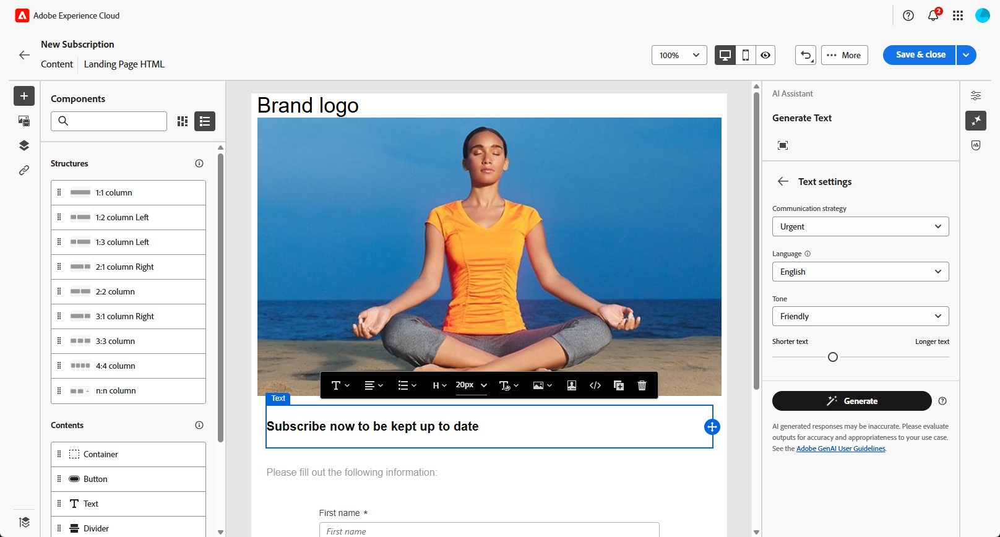

# Generación de la página de aterrizaje con el Asistente de IA{#generative-lp}

>[!CONTEXTUALHELP]
>id="acw_homepage_welcome_rn5"
>title="Generación de páginas de aterrizaje con IA"
>abstract="Ya puede usar el Asistente de IA para crear la página de aterrizaje, lo que le permite generar texto, imágenes o diseños de página completos."
>additional-url="https://experienceleague.adobe.com/docs/campaign-web/v8/release-notes/release-notes.html?lang=es" text="Consulte las notas de la versión"

>[!IMPORTANT]
>
>Antes de empezar a utilizar esta capacidad, lea las Barreras y limitaciones](generative-gs.md#generative-guardrails) relacionadas[.
> 
>
>Debe aceptar un [acuerdo](https://www.adobe.com/legal/licenses-terms/adobe-dx-gen-ai-user-guidelines.html) usuario para poder usar el Asistente de IA en Adobe Campaign web. Para obtener más información, póngase en contacto con su representante Adobe.

Transforme sus páginas de destino con el Asistente de IA en Adobe Campaign Web, impulsado por IA generativa.

Cree sin esfuerzo contenido impactantes, incluidas páginas completas, fragmentos de texto personalizados e imágenes personalizadas que resuenan con su audiencia, impulsando una mayor participación e interacción.

Explore las pestañas siguientes para aprender a utilizar el Asistente de IA en Adobe Campaign web.

>[!BEGINTABS]

>[!TAB Generación página de aterrizaje completa]

En el siguiente ejemplo, aprenda a impulsar el Asistente de IA para perfeccionar un plantilla página de aterrizaje existente.

1. Después de crear y configurar el página de aterrizaje, haga clic en **[!UICONTROL Editar contenido]**.

   Para obtener más información sobre cómo configurar su página de aterrizaje, consulte [este Página](../landing-pages/create-lp.md).

1. Personalice su diseño según sea necesario y acceda al menú AI **[!UICONTROL Assistant]** .

   {zoomable="yes"}

1. Habilite la **[!UICONTROL opción Usar contenido]** original para que el Asistente de IA personalice las nuevas contenido en función del contenido seleccionado.

1. Ajuste el contenido describiendo lo que desea generar en el **[!UICONTROL campo Preguntar]** .

   Si necesita ayuda para elaborar su mensaje, acceda a la **[!UICONTROL Biblioteca]** de avisos, que proporciona una amplia gama de ideas rápidas para mejorar su página de aterrizaje.

   {zoomable="yes"}

1. Adapte el mensaje con la opción Configuración ]**de**[!UICONTROL  texto:

   * **[!UICONTROL Estrategia]** de comunicación: elige el estilo de comunicación más adecuado para el texto generado.
   * **[!UICONTROL Tono]**: El tono de tu página de aterrizaje debe resonar con tu audiencia. Ya sea que desee sonar informativo, juguetón o persuasivo, el Asistente de IA puede adaptar el mensaje en consecuencia.

   {zoomable="yes"}

1. Elija la **[!UICONTROL configuración]** Imagen:

   * **[!UICONTROL Tipo]** de contenido: Categoriza la naturaleza del elemento visual, distinguiendo entre diferentes formas de representación visual, como fotos, gráficos o arte.
   * **[!UICONTROL Intensidad]** visual: controla el impacto de la imagen ajustando su intensidad. Un ajuste más bajo (2) crea una apariencia más suave, mientras que un ajuste más alto (10) hace que la imagen sea más vibrante.
   * **[!UICONTROL Color y tono]**: Ajuste la apariencia general de los colores dentro de una imagen y el estado de ánimo o la atmósfera que transmite.
   * **[!UICONTROL Iluminación]**: Modifica la iluminación presente en una imagen para dar forma a su atmósfera y resaltar elementos específicos.
   * **[!UICONTROL Composición]**: Organizar elementos dentro del marco de una imagen.

   {zoomable="yes"}

1. En el **[!UICONTROL menú activos]** de marca, haga clic en **[!UICONTROL Cargar marca recurso]** para agregar cualquier marca recurso que proporcione contexto adicional al Asistente de IA, o seleccione uno cargado anteriormente.

   Los archivos cargados anteriormente están disponibles en la **[!UICONTROL lista desplegable activos marca]** cargado. Cambie los activos desea incluir en su generación.

   {zoomable="yes"}

1. Una vez que el mensaje esté listo, haga clic en **[!UICONTROL Generar]**.

1. Examinar las variaciones generadas **** y haga clic en **[!UICONTROL Vista previa]** para vista una versión a pantalla completa de la variación seleccionada.

1. Navegue hasta la **[!UICONTROL opción Refinar]** en la ventana Vista previa **** para acceder a funciones de personalización adicionales:

   * **[!UICONTROL Refrasear]**: El Asistente de IA puede reformular su mensaje de diferentes maneras, manteniendo su escritura fresca y atractiva para diversas audiencias.
   * **[!UICONTROL Use un lenguaje]** más simple: simplifique su lenguaje para garantizar claridad y accesibilidad para un audiencia más amplio.

   También puedes cambiar la **[!UICONTROL estrategia]** de tono ]**y**[!UICONTROL  comunicación de tu texto.

   {zoomable="yes"}

1. Haga clic en **[!UICONTROL Seleccionar]** una vez que encuentre el contenido adecuado.

1. Inserte campos de personalización para personalizar los contenido de página de aterrizaje basándose en perfil datos. A continuación, haga clic en el **[!UICONTROL botón Simular contenido]** para controlar la representación y comprobar la configuración de personalización con prueba perfiles. [Más información](../landing-pages/create-lp.md#test-landing-page).

Una vez que el página de aterrizaje esté listo, publicar para que esté disponible para usarlo en un mensaje. [Más información](../landing-pages/create-lp.md#publish-landing-page).

>[!TAB Generación de sólo texto]

En el siguiente ejemplo, aprenda a impulsar el Asistente de IA para mejorar la contenido de su página de aterrizaje.

1. Después de crear y configurar el página de aterrizaje, haga clic en **[!UICONTROL Editar contenido]**.

   Para obtener más información sobre cómo configurar su página de aterrizaje, consulte [este Página](../landing-pages/create-lp.md).

1. Seleccione un **[!UICONTROL componente]** Texto para destino contenido específico y acceda al menú AI **[!UICONTROL Assistant]** .

   {zoomable="yes"}

1. Habilite la **[!UICONTROL opción Usar contenido]** original para que el Asistente de IA personalice las nuevas contenido en función del contenido seleccionado.

1. Ajuste el contenido describiendo lo que desea generar en el **[!UICONTROL campo Preguntar]** .

   Si necesita ayuda para elaborar su mensaje, acceda a la **[!UICONTROL Biblioteca]** de avisos, que proporciona una amplia gama de ideas rápidas para mejorar sus páginas de destino.

   {zoomable="yes"}

1. Adapte el mensaje con la opción Configuración ]**de**[!UICONTROL  texto:

   * **[!UICONTROL Estrategia]** de comunicación: elige el estilo de comunicación más adecuado para el texto generado.
   * **[!UICONTROL Tono]**: El tono de tu página de aterrizaje debe resonar con tu audiencia. Ya sea que desee sonar informativo, juguetón o persuasivo, el Asistente de IA puede adaptar el mensaje en consecuencia.
   * **Longitud** del texto: Utilice el regulador para seleccionar la longitud deseada de su texto.

   {zoomable="yes"}

1. En el **[!UICONTROL menú activos]** de marca, haga clic en **[!UICONTROL Cargar marca recurso]** para agregar cualquier marca recurso que proporcione contexto adicional al Asistente de IA, o seleccione uno cargado anteriormente.

   Los archivos cargados anteriormente están disponibles en la **[!UICONTROL lista desplegable activos marca]** cargado. Cambie los activos desea incluir en su generación.

   {zoomable="yes"}

1. Una vez que el mensaje esté listo, haga clic en **[!UICONTROL Generar]**.

1. Examinar las variaciones generadas **** y haga clic en **[!UICONTROL Vista previa]** para vista una versión a pantalla completa de la variación seleccionada.

1. Navegue hasta la **[!UICONTROL opción Refinar]** en la ventana Vista previa **** para acceder a funciones de personalización adicionales:

   * **[!UICONTROL Usar como contenido]** de referencia: La variante elegida servirá como contenido de referencia para generar otros resultados.
   * **[!UICONTROL Elaborar]**: Amplíe temas específicos, proporcionando detalles adicionales para una mejor comprensión y participación.
   * **[!UICONTROL Resumir]**: Condensar información extensa en resúmenes claros y concisos que llamen la atención y fomenten la lectura.
   * **[!UICONTROL Reformulación]**: Reformule su mensaje de diferentes maneras, manteniendo su escritura fresca y atractiva para diversas audiencias.
   * **[!UICONTROL Use un lenguaje]** más simple: simplifique su lenguaje para garantizar claridad y accesibilidad para un audiencia más amplio.

   También puedes cambiar la **[!UICONTROL estrategia]** de tono ]**y**[!UICONTROL  comunicación de tu texto.

   {zoomable="yes"}

1. Haga clic en **[!UICONTROL Seleccionar]** una vez que encuentre el contenido adecuado.

1. Inserte campos de personalización para personalizar los contenido de página de aterrizaje basándose en perfil datos. A continuación, haga clic en el **[!UICONTROL botón Simular contenido]** para controlar la representación y comprobar la configuración de personalización con prueba perfiles. [Más información](../landing-pages/create-lp.md#test-landing-page).

Una vez que el página de aterrizaje esté listo, publicar para que esté disponible para usarlo en un mensaje. [Más información](../landing-pages/create-lp.md#publish-landing-page).

>[!TAB Imagen única generación]

En el siguiente ejemplo, aprenda a impulsar el Asistente de IA para optimizar y mejorar su activos, garantizando un experiencia más fácil de usuario.

1. Después de crear y configurar el página de aterrizaje, haga clic en **[!UICONTROL Editar contenido]**.

   Para obtener más información sobre cómo configurar su página de aterrizaje, consulte [este Página](../landing-pages/create-lp.md).

1. Seleccione la recurso que desea cambiar con el Asistente de IA.

1. En el menú de la derecha, seleccione **[!UICONTROL AI Assistant (Asistente]** de IA).

   {zoomable="yes"}

1. Habilite la opción Estilo ]**de**[!UICONTROL  referencia para que el Asistente de IA personalice nuevas contenido basadas en el contenido de referencia. También puede cargar una imagen para añadir contexto a la variación.

1. Ajuste el contenido describiendo lo que desea generar en el **[!UICONTROL campo Preguntar]** .

   Si necesita ayuda para elaborar su mensaje, acceda a la **[!UICONTROL Biblioteca]** de avisos, que proporciona una amplia gama de ideas rápidas para mejorar sus páginas de destino.

   {zoomable="yes"}

1. Personalice el mensaje con la opción de configuración ]**Imagen**[!UICONTROL :

   * **[!UICONTROL Relación]** de aspecto: determina la anchura y la altura del recurso. Elija entre proporciones comunes como 16:9, 4:3, 3:2 o 1:1, o introduzca un tamaño personalizado.
   * **[!UICONTROL Tipo]** de contenido: Categoriza la naturaleza del elemento visual, distinguiendo entre diferentes formas de representación visual, como fotos, gráficos o arte.
   * **[!UICONTROL Intensidad]** visual: controla el impacto de la imagen ajustando su intensidad. Un ajuste más bajo (2) crea una apariencia más suave, mientras que un ajuste más alto (10) hace que la imagen sea más vibrante.
   * **[!UICONTROL Color y tono]**: Ajuste la apariencia general de los colores dentro de una imagen y el estado de ánimo o la atmósfera que transmite.
   * **[!UICONTROL Iluminación]**: Modifica la iluminación presente en una imagen para dar forma a su atmósfera y resaltar elementos específicos.
   * **[!UICONTROL Composición]**: Organizar elementos dentro del marco de una imagen.

   {zoomable="yes"}

1. En el **[!UICONTROL menú activos]** de marca, haga clic en **[!UICONTROL Cargar marca recurso]** para agregar cualquier marca recurso que proporcione contexto adicional al Asistente de IA, o seleccione uno cargado anteriormente.

   Los archivos cargados anteriormente están disponibles en la **[!UICONTROL lista desplegable activos marca]** cargado. Cambie los activos desea incluir en su generación.

1. Una vez que esté satisfecho con la configuración oportuna, haga clic en **[!UICONTROL Generar]**.

1. Examinar las sugerencias ]**de**[!UICONTROL  variación para encontrar la recurso deseada.

   Haga clic en **[!UICONTROL Vista previa]** para vista una versión de pantalla completa de la variación seleccionada.

1. Seleccione **[!UICONTROL Generar similares]** si desea vista imágenes relacionadas a esta variante.

   {zoomable="yes"}

1. Haga clic en **[!UICONTROL Seleccionar]** una vez que encuentre el contenido adecuado.

1. Después de definir el contenido del mensaje, haga clic en el **[!UICONTROL botón Simular contenido]** para controlar la representación y comprobar la configuración personalización con prueba perfiles. [Más información](../landing-pages/create-lp.md#test-landing-page).

Una vez que el página de aterrizaje esté listo, publicar para que esté disponible para usarlo en un mensaje. [Más información](../landing-pages/create-lp.md#publish-landing-page).

>[!ENDTABS]