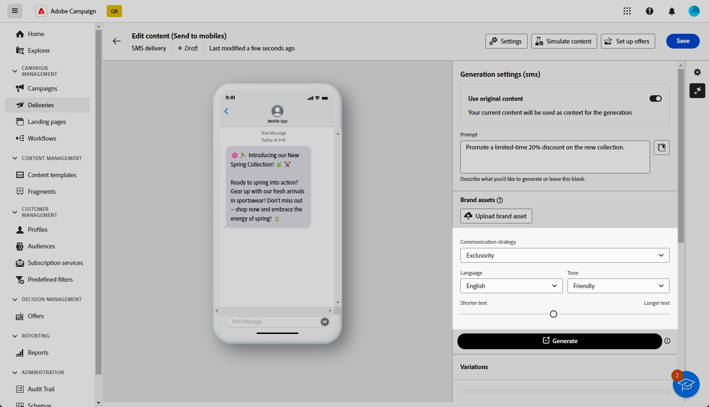
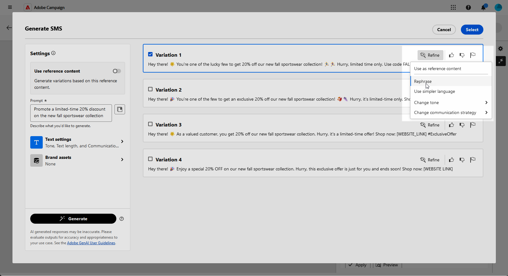
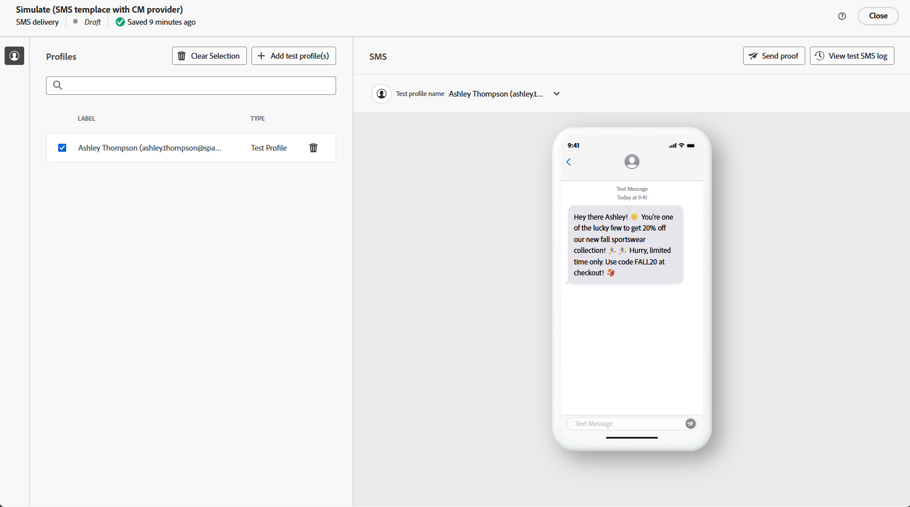

# Generación de SMS con el asistente de IA {#generative-sms}

>[!BEGINSHADEBOX]

**Tabla de contenido**

* [Introducción al asistente de IA](generative-gs.md)
* [Generación de correo electrónico con el asistente de IA](generative-content.md)
* **[Generación de SMS con el asistente de IA](generative-sms.md)**
* [Generación de notificaciones push con el asistente de IA](generative-push.md)

>[!ENDSHADEBOX]

Una vez que haya creado y personalizado sus mensajes SMS para adaptarlos a su audiencia, lleve su comunicación al siguiente nivel con la ayuda del asistente de IA en Campaign, con tecnología de IA innovadora.

Esta práctica herramienta proporciona sugerencias inteligentes para perfeccionar el contenido, lo que garantiza que los mensajes resuenen de forma eficaz y maximice la participación.

>[!NOTE]
>
>Antes de empezar a utilizar esta capacidad, lea la información relacionada [Protecciones y limitaciones](generative-gs.md#guardrails-and-limitations).

1. Después de crear y configurar el envío de SMS, haga clic en **[!UICONTROL Editar contenido]**.

   Para obtener más información sobre cómo configurar la entrega de SMS, consulte [esta página](../sms/create-sms.md).

1. Rellene el **[!UICONTROL Detalles básicos]** para su envío. Una vez finalizado, haga clic en **[!UICONTROL Editar contenido]**.

1. Personalice su mensaje SMS según sea necesario. [Más información](../sms/content-sms.md)

1. Acceda a la **[!UICONTROL Mostrar asistente de IA]** menú.

   {zoomable=&quot;yes&quot;}

1. Habilite la **[!UICONTROL Usar contenido original]** para que el asistente de IA personalice el nuevo contenido en función de su envío, nombre de envío y audiencia seleccionada.

   >[!IMPORTANT]
   >
   > El mensaje siempre debe estar vinculado al contenido actual.

1. Ajuste el contenido describiendo lo que desea generar en la variable **[!UICONTROL Preguntar]** field.

   Si busca ayuda para crear el indicador, acceda al **[!UICONTROL Biblioteca de mensajes]** que proporciona una amplia gama de ideas rápidas para mejorar las entregas.

   {zoomable=&quot;yes&quot;}

1. Seleccionar **[!UICONTROL Cargar recurso de marca]** para añadir cualquier recurso de marca que contenga contenido que pueda proporcionar contexto adicional, utilice el asistente de IA.

1. Adapte el indicador con las diferentes opciones:

   * **[!UICONTROL Estrategia de comunicación]**: seleccione el método de comunicación deseado para el texto generado.
   * **[!UICONTROL Idioma]**: elija el idioma del contenido de la variante.
   * **[!UICONTROL Tono]**: Asegúrese de que el texto sea apropiado para su audiencia y propósito.
   * **[!UICONTROL Longitud]**: seleccione la longitud del contenido mediante el regulador de intervalo.

   {zoomable=&quot;yes&quot;}

1. Una vez que la solicitud esté lista, haga clic en **[!UICONTROL Generar]**.

1. Examine el contenido generado **[!UICONTROL Variaciones]** y haga clic en **[!UICONTROL Previsualizar]** para ver una versión en pantalla completa de la variación seleccionada.

1. Vaya a **[!UICONTROL Refinar]** dentro de la opción **[!UICONTROL Previsualizar]** para acceder a funciones de personalización adicionales y ajustar la variación a sus preferencias:

   * **Simplificar idioma**: el asistente de IA le ayuda a escribir mensajes claros y concisos que todos puedan comprender.

   * **Reformular**: el asistente de IA reformula el mensaje para mantener las cosas atractivas para diferentes audiencias.

   {zoomable=&quot;yes&quot;}

1. Clic **[!UICONTROL Seleccionar]** una vez encontrado el contenido adecuado.

1. Inserte campos de personalización para personalizar el contenido de SMS en función de los datos de perfiles. [Más información sobre la personalización de contenido](../personalization/personalize.md)

   {zoomable=&quot;yes&quot;}

1. Después de definir el contenido del mensaje, haga clic en **[!UICONTROL Simular contenido]** para controlar el procesamiento y comprobar la configuración de personalización con perfiles de prueba. [Más información](../preview-test/preview-content.md)

   {zoomable=&quot;yes&quot;}

Una vez definido el contenido, la audiencia y la programación, estará listo para preparar la entrega de SMS. [Más información](../monitor/prepare-send.md)
