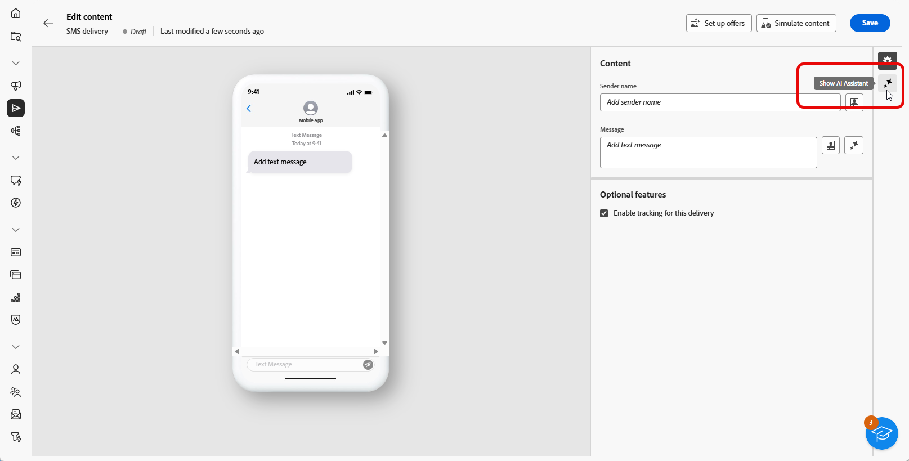
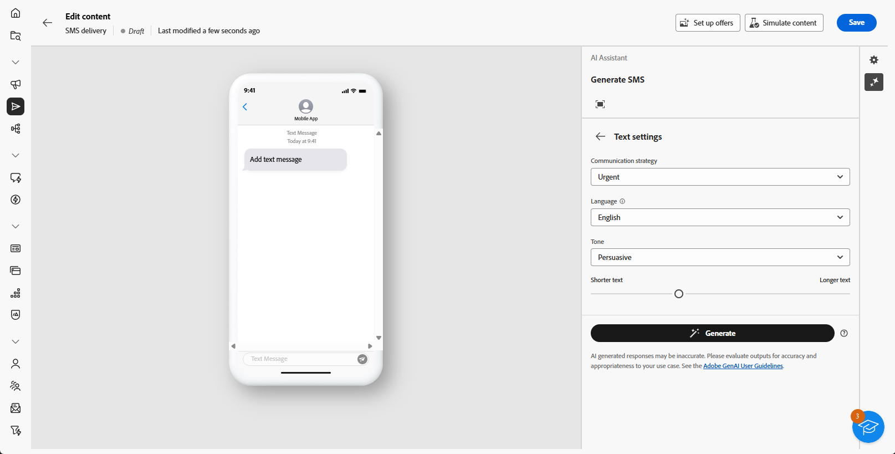

# Generación de SMS con el asistente de IA {#generative-sms}

>[!BEGINSHADEBOX]

**Tabla de contenido**

* [Introducción al asistente de IA](generative-gs.md)
* [Generación de correo electrónico con el asistente de IA](generative-content.md)
* **[Generación de SMS con el asistente de IA](generative-sms.md)**
* [Generación de notificaciones push con el asistente de IA](generative-push.md)

>[!ENDSHADEBOX]

Una vez que haya creado y personalizado sus mensajes SMS para adaptarlos a su audiencia, lleve su comunicación al siguiente nivel con la ayuda del asistente de IA en Campaign, con tecnología de IA innovadora.

Esta práctica herramienta proporciona sugerencias inteligentes para perfeccionar el contenido, lo que garantiza que los mensajes resuenen de forma eficaz y maximice la participación.

>[!NOTE]
>
>Antes de empezar a utilizar esta capacidad, lea la información relacionada [Protecciones y limitaciones](generative-gs.md#guardrails-and-limitations).

1. Después de crear y configurar el envío de SMS, haga clic en **[!UICONTROL Editar contenido]**.

   Para obtener más información sobre cómo configurar la entrega de SMS, consulte [esta página](../sms/create-sms.md).

1. Rellene el **[!UICONTROL Detalles básicos]** para su envío. Una vez finalizado, haga clic en **[!UICONTROL Editar contenido]**.

1. Personalice su mensaje SMS según sea necesario. [Más información](../sms/content-sms.md)

1. Acceda a la **[!UICONTROL Mostrar asistente de IA]** menú.

   {zoomable=&quot;yes&quot;}

1. Ajuste el contenido describiendo lo que desea generar en la variable **[!UICONTROL Preguntar]** field.

   Si busca ayuda para crear el indicador, acceda al **[!UICONTROL Biblioteca de mensajes]** que proporciona una amplia gama de ideas rápidas para mejorar las entregas.

   {zoomable=&quot;yes&quot;}

1. Habilite la **[!UICONTROL Mejorar con el contexto actual]** para que el asistente de IA personalice el nuevo contenido en función de su envío, nombre de envío y audiencia seleccionada.

   >[!IMPORTANT]
   >
   > El mensaje siempre debe estar vinculado a un contexto específico cargando un recurso de marca o habilitando **[!UICONTROL Mejora del contenido actual]** opción.

1. Seleccionar **[!UICONTROL Cargar recurso de marca]** para añadir cualquier recurso de marca que contenga contenido que pueda proporcionar contexto adicional, utilice el asistente de IA.

1. Seleccione el **[!UICONTROL Estrategia de comunicación]** que mejor se adapte a sus necesidades. Esto afectará al tono y al estilo del texto generado.

1. Elija la **[!UICONTROL Idioma]** y **[!UICONTROL Tono]** que desea que tenga el texto generado. Esto garantizará que el texto sea apropiado para su audiencia y propósito.

   {zoomable=&quot;yes&quot;}

1. Utilice el control deslizante para definir la longitud del texto generado.

1. Una vez que la solicitud esté lista, haga clic en **[!UICONTROL Generar]**.

1. Examine el contenido generado **[!UICONTROL Variaciones]** y haga clic en **[!UICONTROL Aplicar]** una vez encontrado el contenido adecuado.

   Clic **[!UICONTROL Previsualizar]** para ver una versión en pantalla completa de la variación seleccionada.

   {zoomable=&quot;yes&quot;}

1. Inserte campos de personalización para personalizar el contenido de SMS en función de los datos de perfiles. [Más información sobre la personalización de contenido](../personalization/personalize.md)

   {zoomable=&quot;yes&quot;}

1. Después de definir el contenido del mensaje, haga clic en **[!UICONTROL Simular contenido]** para controlar el procesamiento y comprobar la configuración de personalización con perfiles de prueba. [Más información](../preview-test/preview-content.md)

   {zoomable=&quot;yes&quot;}

1. Una vez definido el contenido, la audiencia y la programación, estará listo para preparar la entrega de SMS. [Más información](../monitor/prepare-send.md)
