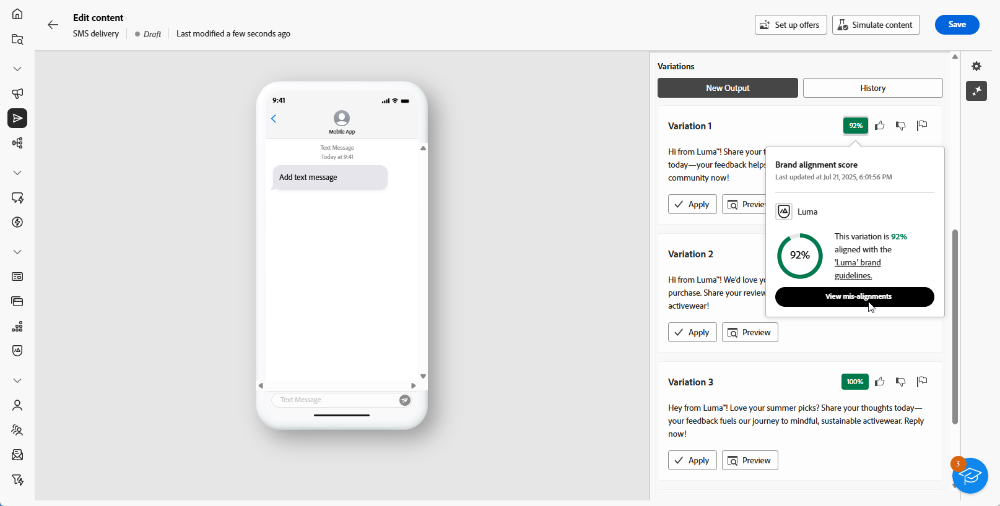

# Generación de SMS con el asistente de IA: acelerador de contenido {#generative-sms}

>[!IMPORTANT]
>
>Antes de empezar a usar esta capacidad, lea [Protecciones y limitaciones](generative-gs.md#generative-guardrails) relacionadas.
> 
>
>Debe aceptar un [acuerdo de usuario](https://www.adobe.com/legal/licenses-terms/adobe-dx-gen-ai-user-guidelines.html) para poder usar el Asistente de IA en Adobe Campaign Web para la aceleración de contenido. Para obtener más información, póngase en contacto con su representante Adobe.

Una vez que haya creado y personalizado sus mensajes SMS para adaptarlos a su audiencia, lleve su comunicación al siguiente nivel con la ayuda del asistente de IA en Adobe Campaign Web para la aceleración de contenido en Campaign, con tecnología de IA innovadora.

Esta práctica herramienta proporciona sugerencias inteligentes para perfeccionar el contenido, lo que garantiza que los mensajes resuenen de forma eficaz y maximice la participación.

>[!BEGINTABS]

>[!TAB Generación completa de SMS]

1. Después de crear y configurar tu envío de SMS, haz clic en **[!UICONTROL Editar contenido]**.

   Para obtener más información sobre cómo configurar su envío de SMS, consulte [esta página](../sms/create-sms.md).

1. Complete **[!UICONTROL detalles básicos]** para su envío. Una vez finalizado, haga clic en **[!UICONTROL Editar contenido]**.

1. Acceda al menú **[!UICONTROL Mostrar asistente de IA]**.

   {zoomable="yes"}

1. Ajuste el contenido describiendo lo que desea generar en el campo **[!UICONTROL Preguntar]**.

   Si está buscando ayuda para redactar el mensaje, acceda a la **[!UICONTROL Biblioteca de mensajes]**, que ofrece una amplia gama de ideas para mejorar los envíos.

   {zoomable="yes"}

1. Adapte el mensaje con la opción **[!UICONTROL Configuración de texto]**:

   * **[!UICONTROL Estrategia de comunicación]**: elige el estilo de comunicación más adecuado para el texto generado.
   * **[!UICONTROL Tono]**: el tono del correo electrónico debe interesar a la audiencia. Tanto si desea sonar informativo, lúdico o persuasivo, el asistente de IA puede adaptar el mensaje en consecuencia.
   * **Longitud del texto**: utilice el control deslizante para seleccionar la longitud deseada del texto.

   {zoomable="yes"}

1. En el menú **[!UICONTROL Brand assets]**, haga clic en **[!UICONTROL Cargar recurso de marca]** para agregar cualquier recurso de marca que contenga contenido que pueda proporcionar contexto adicional con el asistente de IA o seleccione uno cargado anteriormente.

   Los archivos cargados anteriormente están disponibles en la lista desplegable **[!UICONTROL Recursos de marca cargados]**. Simplemente, cambie los recursos que desee incluir en la generación.

1. Una vez que la solicitud esté lista, haga clic en **[!UICONTROL Generar]**.

1. Examine las **[!UICONTROL variaciones]** generadas y haga clic en **[!UICONTROL Vista previa]** para ver una versión en pantalla completa de la variación seleccionada.

   {zoomable="yes"}

1. Vaya a la opción **[!UICONTROL Refinar]** dentro de la ventana de **[!UICONTROL Vista previa]** para acceder a características de personalización adicionales y ajustar la variación a sus preferencias:

   * **[!UICONTROL Usar como contenido de referencia]**: la variante elegida servirá como contenido de referencia para generar otros resultados.

   * **[!UICONTROL Use un lenguaje más sencillo]**: el asistente de IA le ayuda a escribir mensajes claros y concisos que todos puedan entender.

   * **[!UICONTROL Reformular]**: el Asistente de IA reformula el mensaje para mantener las cosas atractivas para distintas audiencias.

   También puedes cambiar el **[!UICONTROL tono]** y la **[!UICONTROL estrategia de comunicación]** de tu texto.

   {zoomable="yes"}

1. Haga clic en **[!UICONTROL Seleccionar]** cuando encuentre el contenido apropiado.

1. Inserte campos de personalización para personalizar el contenido de SMS en función de los datos de perfiles. [Más información sobre la personalización de contenido](../personalization/personalize.md)

   {zoomable="yes"}

1. Después de definir el contenido del mensaje, haga clic en el botón **[!UICONTROL Simular contenido]** para controlar la representación y compruebe la configuración de personalización con perfiles de prueba. [Más información](../preview-test/preview-content.md)

   {zoomable="yes"}

Una vez definido el contenido, la audiencia y la programación, estará listo para preparar la entrega de SMS. [Más información](../monitor/prepare-send.md)

>[!TAB Generación de solo texto]

1. Después de crear y configurar tu envío de SMS, haz clic en **[!UICONTROL Editar contenido]**.

   Para obtener más información sobre cómo configurar su envío de SMS, consulte [esta página](../sms/create-sms.md).

1. Complete **[!UICONTROL detalles básicos]** para su envío. Una vez finalizado, haga clic en **[!UICONTROL Editar contenido]**.

1. Personalice su mensaje SMS según sea necesario. [Más información](../sms/content-sms.md)

1. Acceda al menú **[!UICONTROL Asistente de IA]** junto a su campo **[!UICONTROL Mensaje]**.

   {zoomable="yes"}

1. Habilite la opción **[!UICONTROL Usar contenido de referencia]** para el Ayudante de IA para la aceleración de contenido a fin de personalizar el nuevo contenido en función del contenido seleccionado.

1. Ajuste el contenido describiendo lo que desea generar en el campo **[!UICONTROL Preguntar]**.

   Si está buscando ayuda para crear su mensaje, acceda a la **[!UICONTROL Biblioteca de mensajes]**, que proporciona una amplia gama de ideas para mejorar sus campañas.

   {zoomable="yes"}

1. Adapte el mensaje con la opción **[!UICONTROL Configuración de texto]**:

   * **[!UICONTROL Estrategia de comunicación]**: seleccione el enfoque de comunicación que desee para el texto generado.
   * **[!UICONTROL Idioma]**: elige el idioma del contenido de la variante.
   * **[!UICONTROL Tono]**: Asegúrese de que el texto sea apropiado para su audiencia y propósito.
   * **[!UICONTROL Longitud]**: seleccione la longitud del contenido mediante el regulador de intervalo.

   {zoomable="yes"}

1. En el menú **[!UICONTROL Brand assets]**, haga clic en **[!UICONTROL Cargar recurso de marca]** para agregar cualquier recurso de marca que contenga contenido que pueda proporcionar contexto adicional con el asistente de IA o seleccione uno cargado anteriormente.

   Los archivos cargados anteriormente están disponibles en la lista desplegable **[!UICONTROL Recursos de marca cargados]**. Simplemente, cambie los recursos que desee incluir en la generación.

1. Una vez que la solicitud esté lista, haga clic en **[!UICONTROL Generar]**.

1. Examine las **[!UICONTROL variaciones]** generadas y haga clic en **[!UICONTROL Vista previa]** para ver una versión en pantalla completa de la variación seleccionada.

1. Vaya a la opción **[!UICONTROL Refinar]** dentro de la ventana de **[!UICONTROL Vista previa]** para acceder a características de personalización adicionales y ajustar la variación a sus preferencias:

   * **[!UICONTROL Usar como contenido de referencia]**: la variante elegida servirá como contenido de referencia para generar otros resultados.

   * **[!UICONTROL Reformular]**: el Asistente de IA puede reformular su mensaje de diferentes maneras, manteniendo su escritura fresca y atractiva para diversas audiencias.

   * **[!UICONTROL Use un lenguaje más sencillo]**: aproveche el asistente de IA para simplificar el lenguaje y garantizar la claridad y accesibilidad para una audiencia más amplia.

   También puedes cambiar el **[!UICONTROL tono]** y la **[!UICONTROL estrategia de comunicación]** de tu texto.

   {zoomable="yes"}

1. Haga clic en **[!UICONTROL Seleccionar]** cuando encuentre el contenido apropiado.

1. Inserte campos de personalización para personalizar el contenido de SMS en función de los datos de perfiles. [Más información sobre la personalización de contenido](../personalization/personalize.md)

1. Después de definir el contenido del mensaje, haga clic en el botón **[!UICONTROL Simular contenido]** para controlar la representación y compruebe la configuración de personalización con perfiles de prueba. [Más información](../preview-test/preview-content.md)

   {zoomable="yes"}

Una vez definido el contenido, la audiencia y la programación, estará listo para preparar la entrega de SMS. [Más información](../monitor/prepare-send.md)

>[!ENDTABS]
