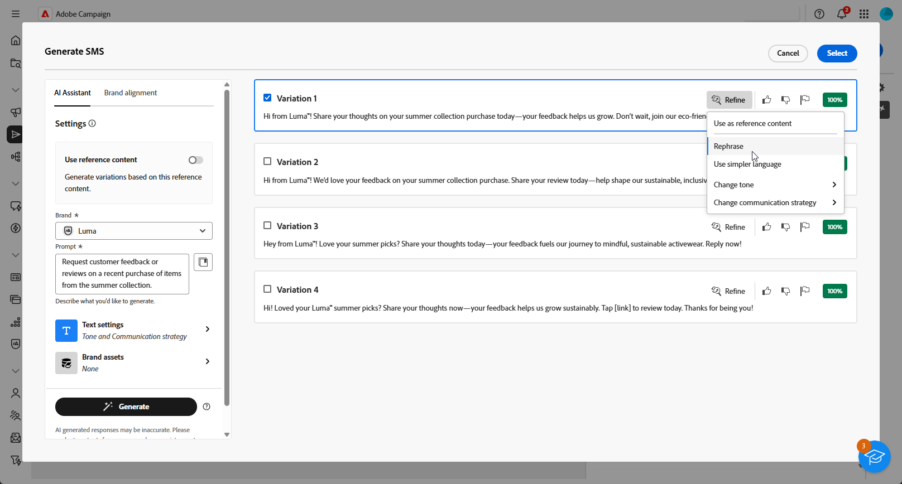

# Generación de SMS con el asistente de IA {#generative-sms}

>[!IMPORTANT]
>
>Antes de empezar a usar esta capacidad, lea las [Protecciones y limitaciones](generative-gs.md#generative-guardrails) relacionadas.
> 
>
>Debe aceptar un [acuerdo de usuario](https://www.adobe.com/legal/licenses-terms/adobe-dx-gen-ai-user-guidelines.html) antes de usar el Asistente de IA en Adobe Campaign Web. Para obtener más información, póngase en contacto con su representante Adobe.

Una vez que haya creado y personalizado sus mensajes SMS para adaptarlos a su audiencia, aumente su comunicación con el asistente de IA en Adobe Campaign Web, con tecnología de IA innovadora.

Esta herramienta proporciona sugerencias inteligentes para refinar el contenido, lo que garantiza que los mensajes resuenen de forma eficaz y maximice la participación.

>[!BEGINTABS]

>[!TAB Generación completa de SMS]

1. Después de crear y configurar tu envío de SMS, haz clic en **[!UICONTROL Editar contenido]**.

   Para obtener más información sobre cómo configurar su envío de SMS, consulte [esta página](../sms/create-sms.md).

1. Complete **[!UICONTROL detalles básicos]** para su envío. Una vez finalizado, haga clic en **[!UICONTROL Editar contenido]**.

1. Acceda al menú **[!UICONTROL Mostrar asistente de IA]**.

   {zoomable="yes"}

1. Ajuste el contenido describiendo lo que desea generar en el campo **[!UICONTROL Preguntar]**.

   Si necesita ayuda para redactar el mensaje, acceda a la **[!UICONTROL Biblioteca de mensajes]**, que ofrece una amplia gama de ideas para mejorar los envíos.

   {zoomable="yes"}

1. Adapte el mensaje utilizando la opción **[!UICONTROL Configuración de texto]**:

   * **[!UICONTROL Estrategia de comunicación]**: elige el estilo de comunicación más adecuado para el texto generado.
   * **[!UICONTROL Tono]**: Asegúrese de que el tono del correo electrónico resuene en la audiencia. Tanto si desea sonar informativo, lúdico o persuasivo, AI Assistant adapta el mensaje en consecuencia.
   * **Longitud del texto**: utilice el control deslizante para seleccionar la longitud deseada del texto.

   {zoomable="yes"}

1. En el menú **[!UICONTROL Brand assets]**, haga clic en **[!UICONTROL Cargar recurso de marca]** para agregar cualquier recurso de marca que contenga contenido que proporcione contexto adicional al Asistente de IA o seleccione uno cargado anteriormente.

   Los archivos cargados anteriormente están disponibles en la lista desplegable **[!UICONTROL Recursos de marca cargados]**. Cambie los recursos que desee incluir en la generación.

1. Una vez que la solicitud esté lista, haga clic en **[!UICONTROL Generar]**.

1. Examine las **[!UICONTROL variaciones]** generadas y haga clic en **[!UICONTROL Vista previa]** para ver una versión en pantalla completa de la variación seleccionada.

   {zoomable="yes"}

1. Vaya a la opción **[!UICONTROL Refinar]** dentro de la ventana de **[!UICONTROL Vista previa]** para acceder a características de personalización adicionales y ajustar la variación a sus preferencias:

   * **[!UICONTROL Usar como contenido de referencia]**: la variante elegida sirve como contenido de referencia para generar otros resultados.
   * **[!UICONTROL Use un lenguaje más sencillo]**: el Asistente para IA le ayuda a escribir mensajes claros y concisos que todos puedan entender.
   * **[!UICONTROL Reformular]**: el Asistente de IA reformula el mensaje para que resulte atractivo para distintas audiencias.

   También puedes cambiar el **[!UICONTROL tono]** y la **[!UICONTROL estrategia de comunicación]** de tu texto.

   {zoomable="yes"}

1. Haz clic en **[!UICONTROL Seleccionar]** cuando encuentres el contenido apropiado.

1. Inserte campos de personalización para personalizar el contenido de SMS en función de los datos de perfil. [Más información acerca de la personalización de contenido](../personalization/personalize.md).

   {zoomable="yes"}

1. Después de definir el contenido del mensaje, haga clic en el botón **[!UICONTROL Simular contenido]** para controlar la representación y comprobar la configuración de personalización con perfiles de prueba. [Más información](../preview-test/preview-content.md).

   {zoomable="yes"}

Al definir el contenido, la audiencia y la programación, prepare el envío de SMS. [Más información](../monitor/prepare-send.md).

>[!TAB Generación de solo texto]

1. Después de crear y configurar tu envío de SMS, haz clic en **[!UICONTROL Editar contenido]**.

   Para obtener más información sobre cómo configurar su envío de SMS, consulte [esta página](../sms/create-sms.md).

1. Complete **[!UICONTROL detalles básicos]** para su envío. Una vez finalizado, haga clic en **[!UICONTROL Editar contenido]**.

1. Personalice su mensaje SMS según sea necesario. [Más información](../sms/content-sms.md).

1. Acceda al menú **[!UICONTROL Asistente de IA]** junto a su campo **[!UICONTROL Mensaje]**.

   {zoomable="yes"}

1. Habilite la opción **[!UICONTROL Usar contenido de referencia]** para el asistente de IA a fin de personalizar el nuevo contenido en función del contenido seleccionado.

1. Ajuste el contenido describiendo lo que desea generar en el campo **[!UICONTROL Preguntar]**.

   Si necesita ayuda para redactar el mensaje, acceda a la **[!UICONTROL Biblioteca de mensajes]**, que proporciona una amplia gama de ideas para mejorar sus campañas.

   {zoomable="yes"}

1. Adapte el mensaje utilizando la opción **[!UICONTROL Configuración de texto]**:

   * **[!UICONTROL Estrategia de comunicación]**: seleccione el enfoque de comunicación que desee para el texto generado.
   * **[!UICONTROL Idioma]**: elige el idioma del contenido de la variante.
   * **[!UICONTROL Tono]**: Asegúrese de que el texto sea apropiado para su audiencia y propósito.
   * **[!UICONTROL Longitud]**: seleccione la longitud del contenido mediante el regulador de intervalo.

   {zoomable="yes"}

1. En el menú **[!UICONTROL Brand assets]**, haga clic en **[!UICONTROL Cargar recurso de marca]** para agregar cualquier recurso de marca que contenga contenido que proporcione contexto adicional al Asistente de IA o seleccione uno cargado anteriormente.

   Los archivos cargados anteriormente están disponibles en la lista desplegable **[!UICONTROL Recursos de marca cargados]**. Cambie los recursos que desee incluir en la generación.

1. Una vez que la solicitud esté lista, haga clic en **[!UICONTROL Generar]**.

1. Examine las **[!UICONTROL variaciones]** generadas y haga clic en **[!UICONTROL Vista previa]** para ver una versión en pantalla completa de la variación seleccionada.

1. Vaya a la opción **[!UICONTROL Refinar]** dentro de la ventana de **[!UICONTROL Vista previa]** para acceder a características de personalización adicionales y ajustar la variación a sus preferencias:

   * **[!UICONTROL Usar como contenido de referencia]**: la variante elegida sirve como contenido de referencia para generar otros resultados.
   * **[!UICONTROL Reformular]**: el Asistente de IA puede reformular su mensaje de diferentes maneras, manteniendo su escritura fresca y atractiva para diversas audiencias.
   * **[!UICONTROL Use un lenguaje más sencillo]**: aproveche el Asistente para IA a fin de simplificar su lenguaje y garantizar la claridad y accesibilidad para una audiencia más amplia.

   También puedes cambiar el **[!UICONTROL tono]** y la **[!UICONTROL estrategia de comunicación]** de tu texto.

   {zoomable="yes"}

1. Haz clic en **[!UICONTROL Seleccionar]** cuando encuentres el contenido apropiado.

1. Inserte campos de personalización para personalizar el contenido de SMS en función de los datos de perfil. [Más información acerca de la personalización de contenido](../personalization/personalize.md).

1. Después de definir el contenido del mensaje, haga clic en el botón **[!UICONTROL Simular contenido]** para controlar la representación y comprobar la configuración de personalización con perfiles de prueba. [Más información](../preview-test/preview-content.md).

   {zoomable="yes"}

Al definir el contenido, la audiencia y la programación, prepare el envío de SMS. [Más información](../monitor/prepare-send.md).

>[!ENDTABS]