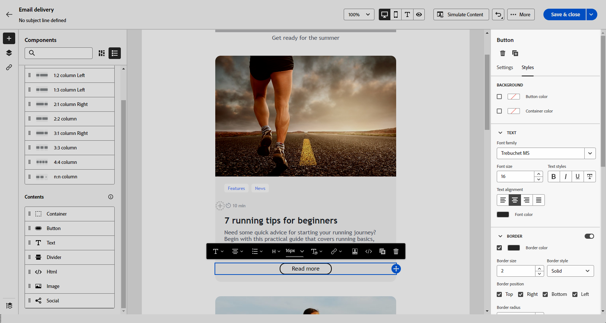

# Introducción al estilo del correo electrónico {#get-started-email-style}

Una vez que empiece a crear el contenido del correo electrónico en [!DNL Adobe Campaign], puede ajustar una serie de parámetros y atributos de estilo desde el panel de configuración de Designer de correo electrónico.

Puede aplicar los cambios al cuerpo del correo electrónico, a un componente de estructura o a un componente de contenido.

{zoomable="yes"}

Siga los vínculos a continuación para aprender a ajustar algunas de las configuraciones de estilo en el correo electrónico:

* Obtenga información sobre cómo [personalizar el fondo del correo electrónico](backgrounds.md)
* Obtenga información sobre cómo [administrar la alineación vertical y el relleno](alignment-and-padding.md)
* Obtenga información sobre cómo [definir un estilo para los vínculos del correo electrónico](styling-links.md)
* Obtenga información sobre cómo [personalizar atributos de estilo en línea](inline-styling.md)
