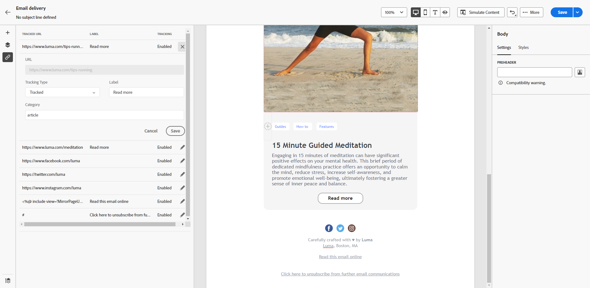

# Adición de vínculos y seguimiento de mensajes {#tracking}

Utilice la Designer de correo electrónico para añadir vínculos al contenido y realizar un seguimiento de los mensajes enviados, lo que le permite supervisar el comportamiento de los destinatarios.

## Inserción de vínculos {#insert-links}

Al diseñar un mensaje, puede agregar vínculos al contenido.

>[!NOTE]
>
>Cuando el seguimiento está habilitado, se realiza el seguimiento de todos los vínculos incluidos en el contenido del mensaje.

Para insertar vínculos en el contenido del correo electrónico, siga estos pasos:

1. Seleccione un elemento y haga clic en **[!UICONTROL Insertar vínculo]** en la barra de herramientas contextual.

1. Elija el tipo de vínculo que desea crear:

   {zoomable="yes"}

   * **[!UICONTROL Vínculo externo]**: inserte un vínculo a una dirección URL externa.

     >[!AVAILABILITY]
     >
     >Las siguientes capacidades (vínculo a **[!UICONTROL página de aterrizaje]**, **[!UICONTROL vínculo de suscripción]** y **[!UICONTROL vínculo de baja]**) están en disponibilidad limitada (LA). Están restringidos a los clientes que migran **de Adobe Campaign Standard a Adobe Campaign v8** y no se pueden implementar en ningún otro entorno.

   * **[!UICONTROL Página de aterrizaje]**: inserte un vínculo a una página de aterrizaje. Si selecciona una página de aterrizaje dinámica (con la opción **[!UICONTROL Service from URL]** seleccionada), puede seleccionar cualquier servicio de la lista. [Más información](../landing-pages/create-lp.md#define-actions-on-form-submission)

     {zoomable="yes"}

   * **[!UICONTROL Vínculo de suscripción]**: inserte un vínculo a un servicio de suscripción. Cuando los usuarios hacen clic en el vínculo, se les dirige a la página de aterrizaje de suscripción a la que se hace referencia en el servicio seleccionado. [Más información](../audience/manage-services.md#create-service)

     {zoomable="yes"}

   * **[!UICONTROL Vínculo de baja]**: inserte un vínculo a un servicio de baja. Cuando los suscriptores hacen clic en el vínculo, se les dirige a la página de aterrizaje de baja a la que se hace referencia en el servicio seleccionado. [Más información](../audience/manage-services.md#create-service)

   <!--* **[!UICONTROL Mirror page]**: Add a link to display the email content in a web browser. [Learn more]-->

1. Introduzca la dirección URL deseada en el campo correspondiente o seleccione una página de aterrizaje o un servicio y defina la configuración y los estilos del vínculo.

1. Agregue una **[!UICONTROL Etiqueta]** y un **[!UICONTROL Vínculo]**.

1. Guarde los cambios.

1. Después de crear el vínculo, modifíquelo desde la ficha **[!UICONTROL Configuración]** si es necesario.

   * Edite el vínculo y cambie su **[!UICONTROL destino]**.
   * Seleccione si desea subrayar el vínculo marcando la opción correspondiente.

   {zoomable="yes"}

>[!NOTE]
>
>Los mensajes de correo electrónico de tipo marketing deben incluir un vínculo de no participación, que no es necesario para los mensajes transaccionales. La categoría del mensaje (**[!UICONTROL Marketing]** o **[!UICONTROL Transaccional]**) se define en el nivel de superficie de canal y al crear el mensaje.

Incluya un vínculo específico a la página espejo en todos sus mensajes de correo electrónico. Obtenga más información sobre la página espejo en [esta sección](mirror-page.md).

## Administrar seguimiento {#manage-tracking}

[Email Designer](create-email-content.md) le permite administrar las direcciones URL rastreadas, como editar el tipo de seguimiento para cada vínculo.

1. Haga clic en el icono **[!UICONTROL Vínculos]** del panel izquierdo para mostrar la lista de todas las direcciones URL del contenido que se van a rastrear.

   Esta lista proporciona una vista centralizada y ayuda a localizar cada dirección URL en el contenido del correo electrónico.

1. Para editar un vínculo, haga clic en el icono de lápiz correspondiente.

   {zoomable="yes"}

1. Modifique el **[!UICONTROL Tipo de seguimiento]** si es necesario:

   {zoomable="yes"}

   Para cada URL rastreada, establezca el modo de seguimiento en uno de estos valores:

   * **[!UICONTROL Rastreado]**: activa el seguimiento para esta dirección URL.
   * **[!UICONTROL Exclusión]**: marca esta dirección URL como una dirección URL de exclusión o de baja.
   * **[!UICONTROL Página espejo]**: marca esta dirección URL como una dirección URL de página espejo.
   * **[!UICONTROL Nunca]**: Impide el seguimiento de esta dirección URL. <!--This information is saved: if the URL appears again in a future message, its tracking is automatically deactivated.-->

1. Agregue una **[!UICONTROL Categoría]** al vínculo para agrupar los vínculos rastreados y haga clic en **[!UICONTROL Guardar]**.

   {zoomable="yes"}

1. Después de realizar el envío, puede acceder al informe. En el menú **[!UICONTROL Seguimiento]**, las **[!UICONTROL URL y flujos de clics]** muestran las direcciones URL de su envío más visitadas. [Más información](../reporting/gs-reports.md)