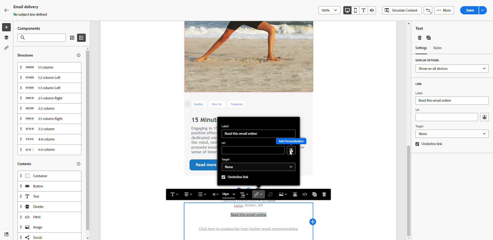

# Página espejo {#mirror-page}

La página espejo es una versión en línea del correo electrónico. Añadir un vínculo a la página espejo es una buena práctica para el marketing por correo electrónico. Los usuarios pueden acceder a la página espejo de un correo electrónico, por ejemplo, si experimentan problemas de procesamiento o imágenes rotas al verlo en su bandeja de entrada. También se recomienda proporcionar una versión en línea por motivos de accesibilidad o para fomentar el uso compartido en medios sociales.

La página espejo generada por Adobe Campaign incluye todos los datos de personalización.

{width="600" align="left"}

## Añadir un vínculo a la página espejo {#link-to-mirror-page}

En Adobe Campaign, inserte un vínculo a la página espejo en el contenido del correo electrónico utilizando el **bloque de personalización** específico. El bloque de personalización integrado **Vínculo a página espejo** inserta el siguiente código en el contenido del correo electrónico: `<%@ include view='MirrorPage' %>`.

Para añadir un vínculo a una página espejo en el correo electrónico, siga estos pasos:

1. Seleccione un elemento (texto o imagen) y haga clic en **[!UICONTROL Insertar vínculo]** en la barra de herramientas contextual.

   {zoomable="yes"}

1. Seleccione el icono **[!UICONTROL Añadir personalización]** para acceder al menú de personalización.

   {zoomable="yes"}

1. En el menú **[!UICONTROL Fragmentos]**, seleccione **[!UICONTROL URL de página espejo]** y haga clic en **[!UICONTROL Agregar]**. [Aprenda a utilizar fragmentos de expresiones](../content/use-expression-fragments.md)

   {zoomable="yes"}

La página espejo se crea automáticamente.

Cuando se envía el correo electrónico, los destinatarios que hacen clic en el vínculo de la página espejo ven el contenido del correo electrónico en su explorador web predeterminado.

De manera predeterminada, el período de retención de una página espejo es de **60 días**. Después de este período, la página espejo ya no está disponible.

>[!CAUTION]
>
>* Los vínculos de la página espejo se generan automáticamente y no se pueden editar. Incluyen todos los datos personalizados cifrados necesarios para procesar el correo electrónico original. El uso de atributos personalizados con valores grandes puede generar direcciones URL de página espejo largas, lo que puede impedir que el vínculo funcione en exploradores web con una longitud de URL máxima.
>
>* En la prueba enviada a los perfiles de prueba, el vínculo a la página espejo no está activo. Solo está activo en los mensajes finales.

## Generación de páginas espejo {#mirror-page-generation}

De forma predeterminada, Adobe Campaign genera automáticamente la página espejo si el contenido del correo electrónico no está vacío y contiene un vínculo a la página espejo (también conocido como vínculo espejo).

Controle el modo de generación de la página espejo de correo electrónico mediante las opciones disponibles en las propiedades de entrega. [Más información](../advanced-settings/delivery-settings.md#mirror)