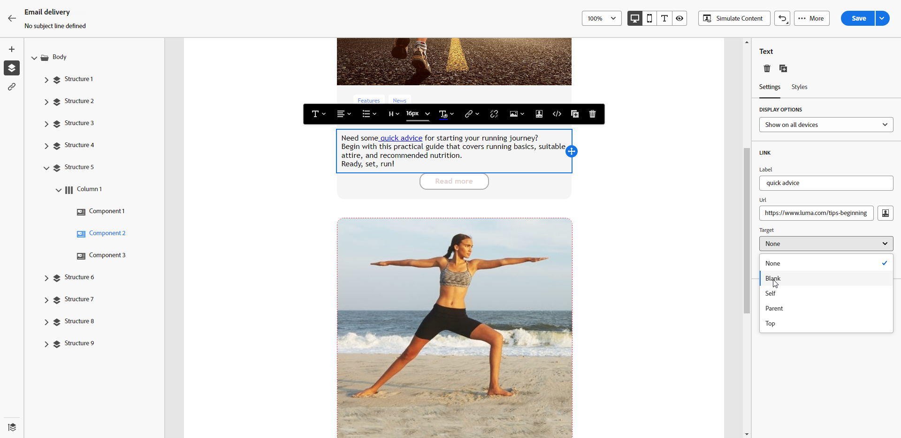

# Definición de un estilo para los vínculos {#styling-links}

Puede subrayar un vínculo y seleccionar su color y destino en el Diseñador de correo electrónico.

1. En un componente de **[!UICONTROL Texto]** donde se inserta un vínculo, seleccione el vínculo.

1. En la ficha **[!UICONTROL Configuración]**, marque **[!UICONTROL Subrayar vínculo]** para subrayar la etiqueta.

   {zoomable="yes"}

1. Elija cómo se redirige a su público con la lista desplegable **[!UICONTROL Destinatario]**:

   * **[!UICONTROL Ninguno]**: abre el vínculo en el mismo fotograma en el que se hizo clic (predeterminado).
   * **[!UICONTROL En blanco]**: abre el vínculo en una nueva ventana o ficha.
   * **[!UICONTROL Self]**: abre el vínculo en el mismo marco en el que se hizo clic.
   * **[!UICONTROL Principal]**: abre el vínculo en el marco principal.
   * **[!UICONTROL Top]**: abre el vínculo en todo el cuerpo de la ventana.

   {zoomable="yes"}

1. Para cambiar el color del vínculo, haga clic en **[!UICONTROL Color del vínculo]** en la pestaña **[!UICONTROL Estilos]**.

   {zoomable="yes"}

1. Guarde los cambios.