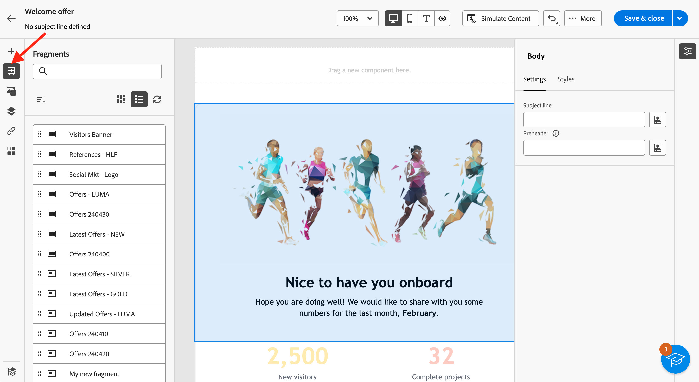

# Añadir fragmentos visuales a los correos electrónicos {#use-visual-fragments}

Puede utilizar un fragmento visual en una [envío por correo electrónico](get-started-email-designer.md), o en un [plantilla de contenido](use-email-templates.md).

>[!NOTE]
>
>Obtenga información sobre cómo crear y administrar fragmentos en [esta sección](fragments.md).

## Usar un fragmento {#use-fragment}

Para insertar un fragmento en un contenido de correo electrónico, siga los pasos a continuación:

1. Abra cualquier contenido de correo electrónico o plantilla con la variable [Diseñador de correo electrónico](get-started-email-designer.md).

1. Seleccione el **[!UICONTROL Fragmentos]** del carril izquierdo.

   

1. Se muestra la lista de todos los fragmentos visuales creados en la zona protegida actual. Puede hacer lo siguiente:

   * Busque un fragmento específico escribiendo su etiqueta.
   * Ordene los fragmentos en orden ascendente o descendente.
   * Cambie la forma en que se muestran los fragmentos (tarjetas o vista de lista).

   >[!NOTE]
   >
   >Los fragmentos se ordenan por fecha de creación: los fragmentos visuales añadidos recientemente se muestran primero en la lista.

   Si algunos fragmentos se modificaron o agregaron mientras editaba el contenido, haga clic en **Actualizar** para actualizar la lista con los cambios más recientes.

1. Arrastre y suelte cualquier fragmento de la lista en el área en la que desee insertarlo. Al igual que cualquier otro componente, puede mover el fragmento por el contenido.

1. Seleccione el fragmento para mostrar sus opciones en el panel derecho.

   

   Desde el **[!UICONTROL Configuración]** pestaña, puede:

   * Elija los dispositivos en los que desea que se muestre el fragmento.
   * Abra el fragmento en una nueva pestaña para editarlo si es necesario. [Más información](../email/fragments.md#edit-fragments)

   Puede personalizar aún más el fragmento mediante el **[!UICONTROL Estilos]** pestaña.

1. Si es necesario, puede romper la herencia con el fragmento original. [Más información](#break-inheritance)
También puede eliminar el fragmento del contenido o duplicarlo. Estas acciones se pueden realizar directamente desde el menú contextual que se muestra sobre el fragmento.

1. Añada tantos fragmentos como desee y **[!UICONTROL Guardar]** sus cambios.

## Romper herencia {#break-inheritance}

Al editar un fragmento visual, los cambios se sincronizan. Se propagan automáticamente a todas las entregas de correo electrónico y a las plantillas de contenido que contienen ese fragmento.

Cuando se añaden a un correo electrónico o a una plantilla de contenido, los fragmentos se sincronizan de forma predeterminada.

Sin embargo, puede romper la herencia del fragmento original. En ese caso, el contenido del fragmento se copia en el diseño actual y los cambios ya no se sincronizan.

Para interrumpir la herencia, siga los pasos a continuación:

1. Seleccione el fragmento.

1. Haga clic en el icono de desbloqueo de la barra de herramientas contextual.

   

1. Ese fragmento se convierte en un elemento independiente que ya no está vinculado al fragmento original. Edítela como cualquier otro componente de contenido en el contenido. [Más información](content-components.md)
