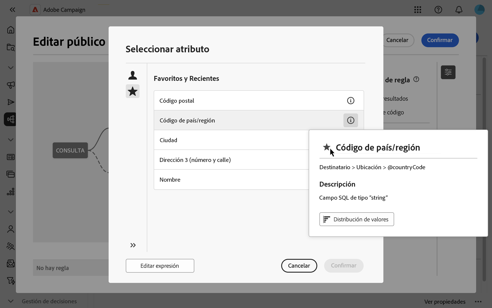

# Seleccionar atributos y añadirlos a favoritos {#folders}

La interfaz de usuario web de Campaign permite a los usuarios seleccionar atributos de la base de datos en varias ubicaciones, según la acción que se realice. Por ejemplo, se pueden seleccionar atributos al definir columnas de salida para una entrega de correo directo o un archivo que se va a extraer. Del mismo modo, se pueden seleccionar atributos al utilizar el modelador de consultas para crear reglas, filtros o generar audiencias.

Para reutilizar rápidamente atributos que se utilizan con frecuencia, añádalos a Favoritos. Esto garantiza que sean fácilmente accesibles para tareas futuras. Además de los favoritos, los usuarios pueden ver y utilizar los atributos seleccionados más recientemente.

La interfaz también proporciona una herramienta de distribución de valores, que le permite visualizar la distribución de los valores de un atributo dentro de una tabla. Esta herramienta ayuda a identificar el rango y la frecuencia de los valores, lo que garantiza la coherencia de los datos al crear consultas o expresiones.

## Atributos favoritos y recientes {#favorites}

>[!CONTEXTUALHELP]
>id="acw_attribute_picker_favorites_recents"
>title="Favoritos y recientes"
>abstract="El menú **[!UICONTROL Favoritos y recientes]** del selector de atributos proporciona una vista organizada de los atributos que ha añadido a favoritos, junto con una lista de los atributos utilizados recientemente. Los atributos favoritos aparecen primero, seguidos de los utilizados recientemente, lo que facilita la localización de los atributos que necesita."

El menú **[!UICONTROL Favoritos y recientes]** del selector de atributos proporciona una vista organizada de los atributos agregados a favoritos, junto con una lista de los atributos utilizados recientemente. Los atributos favoritos aparecen primero, seguidos de los utilizados recientemente, lo que facilita la localización de los atributos necesarios.

Para añadir un atributo a favoritos, pase el puntero por encima del botón de información y seleccione el icono de estrella. A continuación, el atributo se agrega automáticamente a la lista de favoritos. Para quitar un atributo de los favoritos, vuelva a seleccionar el icono de estrella.

Los usuarios pueden agregar hasta 20 atributos a los favoritos. Los atributos favoritos y recientes se asocian con cada usuario dentro de una organización, lo que garantiza la accesibilidad en diferentes equipos y proporciona una experiencia perfecta entre dispositivos.

## Identificar la distribución de valores dentro de una tabla {#distribution}

El botón **Distribución de valores**, disponible en el panel de información de un atributo, permite a los usuarios analizar la distribución de valores para ese atributo dentro de la tabla. Esta función es útil para comprender los valores disponibles, sus recuentos y porcentajes. También ayuda a evitar problemas como mayúsculas o ortografía incoherentes al crear consultas o expresiones.

En el caso de los atributos con un gran número de valores, la herramienta solo muestra los veinte primeros. En estos casos, aparece una notificación **[!UICONTROL Carga parcial]** para indicar esta limitación. Aplique filtros avanzados para refinar los resultados mostrados y centrarse en valores específicos o subconjuntos de datos. Encontrará instrucciones detalladas sobre el uso de filtros [aquí](../get-started/work-with-folders.md#filter-the-values).

Para obtener información adicional sobre el uso de la herramienta de distribución de valores en diferentes contextos, consulte las siguientes secciones:

* [Distribución de valores en una carpeta](../get-started/work-with-folders.md##distribution-values-folder)
* [Distribución de valores en una consulta](../query/build-query.md#distribution-values-query)