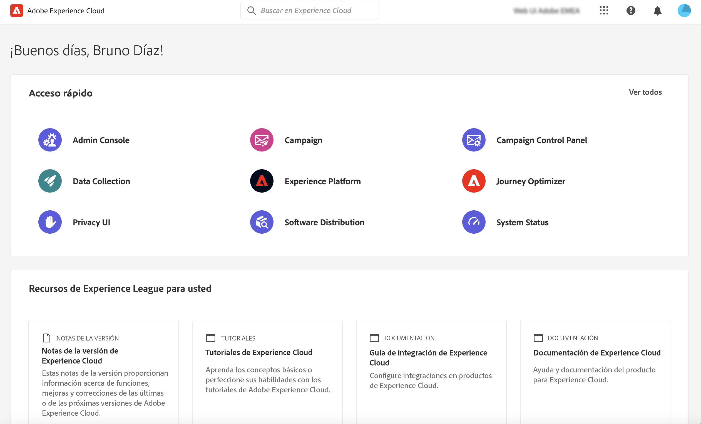
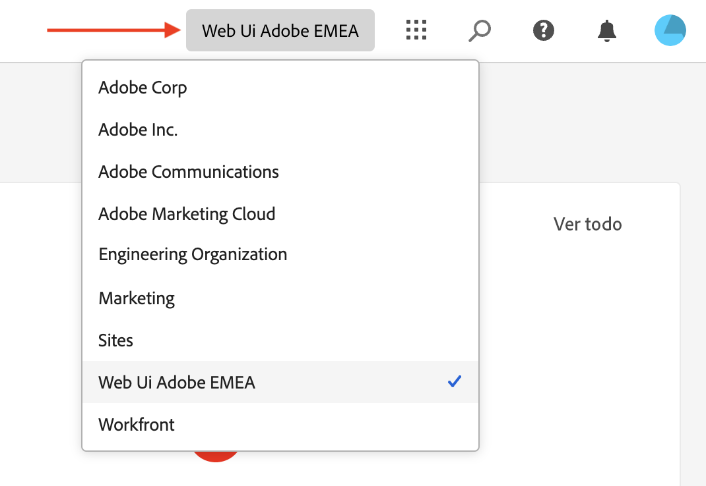
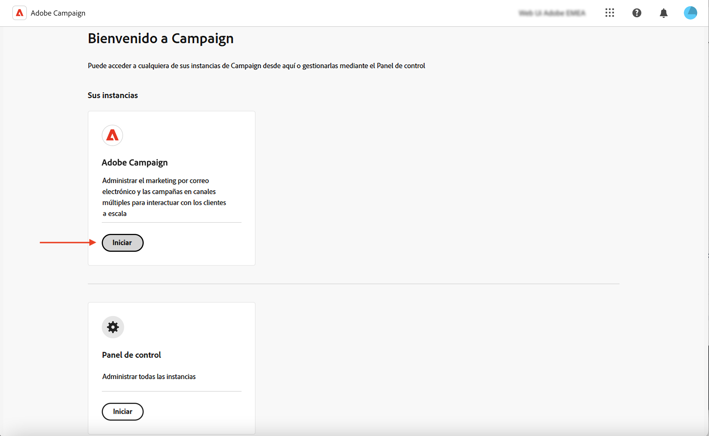

# Conexión a Adobe Campaign {#connect-to-campaign}

Experience Cloud es la familia integrada de aplicaciones, productos y servicios de marketing digital de Adobe. Desde su intuitiva interfaz, puede acceder rápidamente a sus aplicaciones, funciones de productos y servicios en la nube. Obtenga información sobre cómo conectarse a Adobe Experience Cloud y acceder a la interfaz web de Adobe Campaign v8 en esta página.

## Iniciar sesión en Adobe Experience Cloud {#sign-in-to-exc}

Normalmente, los administradores de Experience Cloud otorgan acceso a aplicaciones y servicios. Siga los pasos de la invitación del correo electrónico al Experience Cloud.

Para iniciar sesión en Adobe Experience Cloud, los pasos básicos son:

1. Conéctese a [Adobe Experience Cloud](https://experience.adobe.com/){target="_blank"}.

1. Inicie sesión con su Adobe ID o Enterprise ID. Obtenga más información acerca de los tipos de identidad en Adobe en [este artículo](https://helpx.adobe.com/es/enterprise/using/identity.html){target="_blank"}.

   Después de iniciar sesión en Experience Cloud, puede acceder rápidamente a todas sus soluciones y aplicaciones.

   

1. Compruebe que se encuentra en la organización correcta.

   {width="50%" align="left"}

   Obtenga más información acerca de la organización en Adobe Experience Cloud en [este artículo](https://experienceleague.adobe.com/docs/core-services/interface/administration/organizations.html?lang=es){target="_blank"}.

## Acceso a Adobe Campaign {#access-to-campaign}

Para acceder al entorno de Campaign, seleccione **Campaign** desde la página de inicio de Adobe Experience Cloud.

Si tiene acceso a varios entornos, incluido el Panel de control de Campaign de Campaign, haga clic en **Launch** en la tarjeta de organización.

También puede utilizar el conmutador de soluciones para buscar entre las soluciones de Adobe Experience Cloud.

## Navegación superior de Adobe Experience Cloud {#top-bar}

Utilice la barra superior de la interfaz para lo siguiente:

* compartir sus comentarios como probador beta
* Cambiar entre organizaciones e instancias.
* Cambiar entre las aplicaciones de Adobe Experience Cloud.
* Acceder a páginas de ayuda, ponerse en contacto con el servicio de asistencia técnica y compartir comentarios. Puede buscar artículos de ayuda y vídeos desde el campo de búsqueda.

{width="50%" align="left"}

## Preferencias de idioma {#language-pref}

La web de la versión 8 de Campaign está disponible actualmente en los siguientes idiomas:

* Inglés (EE. UU.) - EN-US
* Francés - FR
* Alemán - DE
* Italiano - IT
* Español - ES
* Portugués (Brasil) - PTBR
* Japonés - JP
* Coreano - KR
* Chino simplificado - CHS
* Chino tradicional - CHT

El idioma predeterminado de la web de Campaign viene determinado por el idioma preferido especificado en el perfil de usuario. No está relacionado con el idioma del servidor de Campaign y de la consola del cliente.

Para cambiar el idioma, haga lo siguiente:

1. Haga clic en el icono del perfil, en la parte superior derecha, y luego seleccione **Preferencias**.
1. A continuación, haga clic en el vínculo de idioma mostrado debajo de su dirección de correo electrónico.
1. Seleccione el idioma preferido y haga clic en **Guardar**. Puede seleccionar un segundo idioma en caso de que el componente que esté utilizando no esté localizado en su primer idioma.

## Tema oscuro {#dark-theme}

Puede cambiar al tema oscuro desde el icono de perfil. Utilice la alternancia **Tema oscuro** para habilitarlo o deshabilitarlo.

La configuración del perfil de usuario y las preferencias de cuenta se detallan en [esta sección](https://experienceleague.adobe.com/docs/core-services/interface/experience-cloud.html#preferences){target="_blank"}.

Obtenga más información acerca de los componentes de la interfaz central de Experience Cloud en [esta documentación](https://experienceleague.adobe.com/docs/core-services/interface/experience-cloud.html){target="_blank"}.

