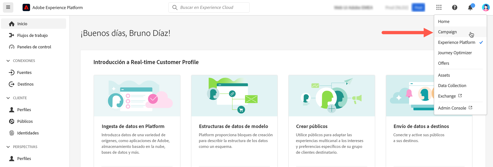

# Conexión a Adobe Campaign {#connect-to-campaign}

Experience Cloud es la familia integrada de aplicaciones, productos y servicios de marketing digital de Adobe. Desde su intuitiva interfaz, puede acceder rápidamente a sus aplicaciones, funciones de productos y servicios en la nube. Obtenga información sobre cómo conectarse a Adobe Experience Cloud y acceder a la interfaz de Adobe Campaign Web en esta página.

## Iniciar sesión en Adobe Experience Cloud {#sign-in-to-exc}

También puede utilizar el inicio de sesión único (SSO) para conectarse a Campaign. Normalmente, los administradores de Experience Cloud otorgan acceso a aplicaciones y servicios. Siga los pasos de la invitación del correo electrónico a Experience Cloud.

Para iniciar sesión en Adobe Experience Cloud, los pasos básicos son:

1. Conéctese a [Adobe Experience Cloud](https://experience.adobe.com/){target="_blank"}.

1. Inicie sesión con su Adobe ID o Enterprise ID. Obtenga más información sobre los tipos de identidad en Adobe en [este artículo](https://helpx.adobe.com/es/enterprise/using/identity.html){target="_blank"}.

   Después de iniciar sesión en Experience Cloud, podrá acceder rápidamente a todas sus soluciones y aplicaciones.

   {zoomable="yes"}

1. Compruebe que se encuentra en la organización correcta.

   {zoomable="yes"}{width="50%" align="left"}

   Obtenga más información sobre las organizaciones de Adobe Experience Cloud en [este artículo](https://experienceleague.adobe.com/docs/core-services/interface/administration/organizations.html?lang=es){target="_blank"}.

## Acceso a Adobe Campaign {#access-to-campaign}

Para acceder a su entorno de Campaign, seleccione **Campaign** en la sección de **Acceso rápido** de la página de inicio de Adobe Experience Cloud.

Si ya está conectado a otra solución de Adobe Experience Cloud, también puede navegar al entorno de Campaign desde el conmutador de soluciones en la parte superior derecha de la pantalla.

{zoomable="yes"}

Si tiene acceso a varios entornos, incluido el Panel de control de Campaign, haga clic en el botón **Iniciar** para la instancia correcta.

{zoomable="yes"}

Ahora está conectado a Campaign. Obtenga información sobre cómo empezar a utilizar la interfaz de usuario en [esta página](user-interface.md).

### Control de acceso {#access-control}

>[!CONTEXTUALHELP]
>id="acw_explorer_permissions_create"
>title="Permiso obligatorio"
>abstract="El administrador debe otorgarle permiso para poder crear este objeto."

>[!CONTEXTUALHELP]
>id="acw_audiences_read_only"
>title="Este público es de solo lectura"
>abstract="No tiene permisos para editar este público. Si es necesario, póngase en contacto con el administrador para que le conceda acceso."

>[!CONTEXTUALHELP]
>id="acw_subscription_services_read_only"
>title="Este servicio es de solo lectura"
>abstract="No tiene permisos para editar este servicio. Si es necesario, póngase en contacto con el administrador para que le conceda acceso."

>[!CONTEXTUALHELP]
>id="acw_recipients_readonlyprofile"
>title="Perfil de solo lectura de los destinatarios"
>abstract="No tiene permisos para editar este perfil. Si es necesario, póngase en contacto con el administrador para que le conceda acceso."

>[!CONTEXTUALHELP]
>id="acw_campaign_read_only"
>title="Esta campaña es de solo lectura"
>abstract="No tiene permisos para editar esta campaña. Si es necesario, póngase en contacto con el administrador para que le conceda acceso."

>[!CONTEXTUALHELP]
>id="acw_deliveries_read_only"
>title="Este envío es de solo lectura"
>abstract="No tiene permisos para editar este envío. Si es necesario, póngase en contacto con el administrador para que le conceda acceso."

>[!CONTEXTUALHELP]
>id="acw_wf_read_only"
>title="Este flujo de trabajo es de solo lectura"
>abstract="No tiene permisos para editar este flujo de trabajo. Si es necesario, póngase en contacto con el administrador para que le conceda acceso."

El control de acceso puede restringir el acceso a objetos y datos de listas principales, como envíos, destinatarios o flujos de trabajo. Estas restricciones también se aplican en el árbol de navegación del Explorador. Además, necesita permisos para crear, eliminar, duplicar y editar objetos desde la interfaz de usuario.

Todos los permisos de la web de Campaign se sincronizan con los permisos de la consola del cliente de Campaign. Solo los administradores de Campaign pueden definir y modificar los permisos de usuario.

A medida que navega por la interfaz de usuario web de Campaign, puede acceder a datos, objetos y funcionalidades en función de sus permisos. Por ejemplo, si no tiene permisos de acceso a una carpeta, no podrá verla. Los permisos también afectan a la administración de objetos y datos. Sin permisos de escritura para una carpeta específica, no se puede crear un envío en dicha carpeta, aunque se pueda ver en la interfaz de usuario.

Puede aprender a [ver y administrar los permisos aquí](permissions.md).

## Navegación superior de Adobe Experience Cloud {#top-bar}

Examine la barra superior de la interfaz para lo siguiente:

* Compartir comentarios sobre la interfaz de usuario web de Campaign
* cambiar entre sus organizaciones
* cambiar entre sus soluciones y aplicaciones de Adobe Experience Cloud
* buscar ayuda sobre [Adobe Experience League](https://experienceleague.adobe.com/docs/?lang=es){target="_blank"}
* comprobar las notificaciones del producto
* editar el perfil de Adobe y administrar la configuración, como [actualizar su idioma favorito](#language-pref) o [cambiar a la temática clara/oscura](#dark-theme)

{zoomable="yes"}{width="50%" align="left"}

## Navegadores admitidos {#browsers}

Adobe Campaign Web está diseñada para funcionar de forma óptima con la última versión de Google Chrome, Safari y Microsoft Edge. Es posible que tenga problemas al utilizar determinadas funciones en versiones anteriores u otros exploradores.

## Preferencias de idioma {#language-pref}

Adobe Campaign Web está disponible actualmente en los siguientes idiomas:

* Inglés (EE. UU.) - EN-US
* Francés - FR
* Alemán - DE
* Italiano - IT
* Español - ES
* Portugués (Brasil) - PTBR
* Japonés - JP
* Coreano - KR
* Chino simplificado - CHS
* Chino tradicional - CHT

El idioma predeterminado de la web de Campaign viene determinado por el idioma preferido especificado en el perfil de usuario. No está relacionado con el idioma del servidor de Campaign y de la consola del cliente.

Para cambiar el idioma, haga lo siguiente:

1. Haga clic en el icono del perfil, en la parte superior derecha, y luego seleccione **Preferencias**.
1. A continuación, haga clic en el vínculo de idioma mostrado debajo de su dirección de correo electrónico.
1. Seleccione el idioma preferido y haga clic en **Guardar**. Puede seleccionar un segundo idioma en caso de que el componente que esté utilizando no se haya localizado en su primer idioma.

<!--
>[!CAUTION]
>
>If you plan to use [AI-powered contextual help](using-ai.md) capabilities, you must set your prefered language to English. Other languages are not supported.
>
-->

## Temáticas oscuras y claras {#dark-theme}

Adobe Campaign está disponible en temáticas claras y oscuras. De forma predeterminada, la interfaz de usuario está habilitada en la temática clara. Para cambiar a la temática oscura, haga clic en su icono de perfil y utilice la opción **Temática oscura** para habilitarla o deshabilitarla.

La configuración del perfil de usuario y las preferencias de cuenta se detallan en [esta sección](https://experienceleague.adobe.com/docs/core-services/interface/experience-cloud.html?lang=es#preferences){target="_blank"}.

Obtenga más información acerca de los componentes de la interfaz central de Experience Cloud en [esta documentación](https://experienceleague.adobe.com/docs/core-services/interface/experience-cloud.html?lang=es){target="_blank"}.
