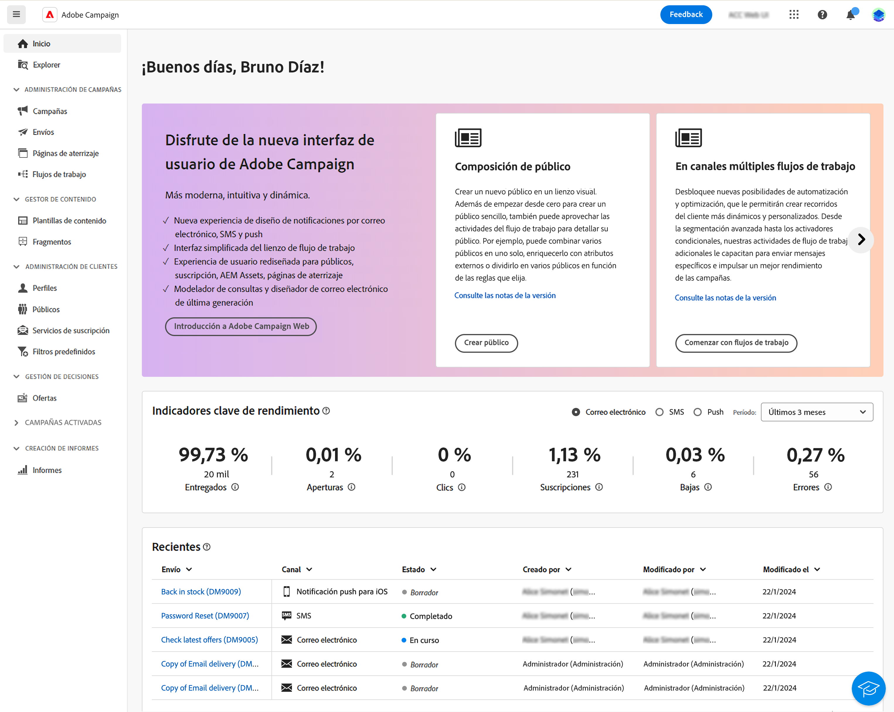

# Introducción a Adobe Campaign Web {#get-started}

>[!CONTEXTUALHELP]
>id="acw_homepage_welcome_learnmore"
>title="Introducción"
>abstract="La nueva interfaz de Adobe Campaign Web ofrece una experiencia del usuario integrada, intuitiva y coherente."

>[!CONTEXTUALHELP]
>id="acw_homepage_learning_learnmore"
>title="Introducción"
>abstract="La nueva interfaz de Adobe Campaign Web ofrece una experiencia del usuario integrada, intuitiva y coherente."

>[!CONTEXTUALHELP]
>id="acw_homepage_learnmore"
>title="Introducción"
>abstract="La nueva interfaz de Adobe Campaign Web ofrece una experiencia del usuario integrada, intuitiva y coherente."

Adobe Campaign ofrece una plataforma para elaborar experiencias multicanal para los clientes, y proporciona un entorno para la orquestación visual de la campaña, la administración de interacciones en tiempo real y la ejecución multicanal.

Adobe Campaign v8 es la herramienta de campañas de última generación creada para diversos canales de marketing como el correo electrónico, las notificaciones push, los SMS y el correo directo. Proporciona sólidas capacidades de ETL y administración de datos para ayudar a diseñar y depurar la campaña perfecta. Su motor de orquestación proporciona programas de marketing multitáctil enriquecidos con un enfoque central en los recorridos impulsados por lotes. También viene acompañado de un servidor de mensajería en tiempo real escalable que permite a los equipos de marketing enviar mensajes predefinidos basados en una carga útil inclusiva desde cualquier sistema de TI para comunicaciones como restablecimiento de contraseñas, confirmación de pedidos, recibos electrónicos y mucho más.

Utilice Campaign para lo siguiente:

* **Impulso de la personalización y la participación mediante una única vista accesible del cliente**
* **Integración de canales de correo electrónico, móviles, en línea y sin conexión en el recorrido del cliente**
* **Automatización de la entrega de mensajes y ofertas significativos y oportunos**

Inicialmente, solo estaba disponible a través de la [consola del cliente](#ac-client). Aunque ahora, Campaign proporciona una nueva web con una interfaz de usuario (IU) mejorada: con mejores en la facilidad de uso, en la accesibilidad, y un nuevo diseño para mejorar significativamente la experiencia del usuario. Esta nueva interfaz de usuario moderna simplifica el diseño y el envío de las campañas de marketing, y aporta coherencia junto con otras soluciones de Adobe, como Adobe Experience Platform.

{zoomable=&quot;yes&quot;}

Esta nueva interfaz de usuario web satisface primero las necesidades del **profesional del negocio** - todas las tareas de administración típicas no están disponibles en esta primera versión, pero se abordarán en versiones posteriores. Tenga en cuenta que, por ahora, no todas las funciones u opciones disponibles en la consola del cliente están disponibles en la nueva interfaz de usuario. En futuras versiones habrá disponibles nuevos casos de uso, opciones y funciones.

Como administrador o usuario experto, si necesita acceder a las funciones de Campaign v8 que no están disponibles en la interfaz de usuario web de Campaign, puede conectarse a [consola de cliente](#ac-client).

>[!NOTE]
>
>La versión de Adobe Campaign Web está actualmente con disponibilidad limitada (LA). El acceso está restringido a un pequeño conjunto de clientes de disponibilidad limitada. Tenga en cuenta que la interfaz de producto, las capacidades y los flujos de uso pueden cambiar sin previo aviso.

Obtenga información sobre cómo conectarse a la web de Adobe Campaign en [esta página](connect-to-campaign.md).

## Acerca de la consola del cliente de Campaign {#ac-client}

La consola del cliente de Campaign es una aplicación basada en el explorador que se instala en el sistema. Utiliza la API de servicios web para conectarse al servidor de aplicaciones de Campaign.

Los datos de campaña se almacenan en el servidor de aplicaciones. Los datos están disponibles tanto desde la consola del cliente como desde la interfaz de usuario web de Campaign. Por ejemplo, si crea una plantilla de envíos mediante la consola del cliente, también estará disponible en la interfaz de usuario web de Campaign. Y si crea una entrega por correo electrónico en la interfaz de usuario web de Campaign, también se puede acceder a esta entrega desde la consola del cliente.

Algunos objetos solo se pueden crear y administrar en la consola del cliente. Pueden ser visibles y utilizarse en la interfaz de usuario web de Campaign, pero no se pueden crear ni modificar desde este entorno. Todos los objetos y componentes de Campaign están disponibles en la vista de Explorer, en el menú de navegación de la izquierda.

Para obtener más información sobre el uso de Campaign v8 con su consola de cliente, consulte la [documentación de Campaign v8 (consola de cliente)](https://experienceleague.adobe.com/docs/campaign/campaign-v8/campaign-home.html?lang=es){target="_blank"}.
