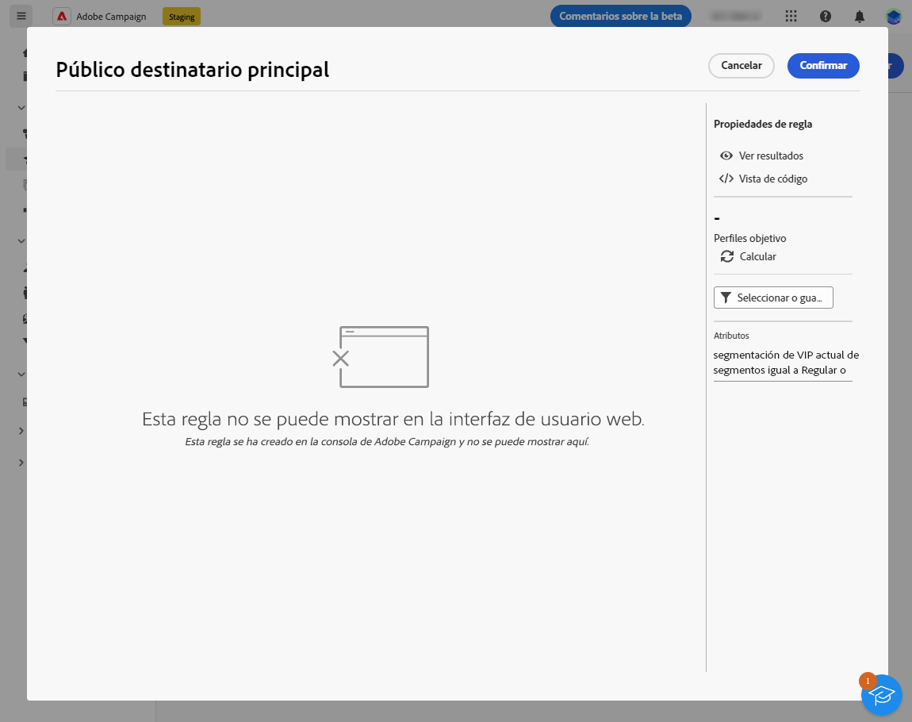

# Mecanismos de protección y limitaciones {#guardrails-limitations}

Al trabajar en la IU web de Campaign con componentes creados o modificados en la consola del cliente de Campaign, se aplican las protecciones y limitaciones que se enumeran a continuación.

## Flujos de trabajo {#wf-guardrails-limitations}

Se puede acceder al mismo flujo de trabajo tanto en la consola como en la interfaz de usuario web. Sin embargo, tenga en cuenta que se aplican ciertas limitaciones.

**Activity Edition**

* Al acceder a un flujo de trabajo de la consola en la interfaz de usuario web, solo puede modificar las actividades compatibles.

**Edición en lienzo**

* Si un flujo de trabajo de la consola tiene varios nodos/ramas de inicio o actividades flotantes, debe agregar una actividad de inicio y una ramificación para conectar los nodos de inicio al nodo principal. También debe eliminar las actividades flotantes.

**Posicionamiento de actividades**

* La posición de los nodos se recalculará (por lo tanto, la posición inicial de las actividades se modificará) solo cuando se haya agregado o eliminado una actividad (no todo el tiempo).

**Opciones no expuestas**

* Las opciones no compatibles no se muestran en la interfaz de usuario web.

**Bucles**

* Los flujos de trabajo, incluidos los bucles, no se muestran en la IU web. Se muestra un mensaje de error.

**Reconciliación y enriquecimiento**

En la consola del cliente de Campaign, la variable **Enriquecimiento** La actividad de puede realizar tanto la reconciliación como el enriquecimiento. En la IU web de Campaign, las funcionalidades de reconciliación aún no están disponibles. Si ha establecido la reconciliación en la actividad de la consola, se mostrará como una actividad no compatible en la interfaz de usuario web.

* Si la variable **Enriquecimiento** actividad en la consola solo realiza un enriquecimiento, la variable **Enriquecimiento** la actividad se muestra en la web.
* Si la variable **Enriquecimiento** la actividad de en la consola solo realiza una reconciliación, se muestra una actividad incompatible.

## Filtros predefinidos {#filters-guardrails-limitations}

Al seleccionar la audiencia de una entrega o al crear una audiencia en un flujo de trabajo, algunos filtros predefinidos no están disponibles en la interfaz de usuario, en esa versión del producto.

Se muestra un mensaje de error específico. Aunque no pueda ver la representación gráfica de la consulta en el generador de reglas y no pueda editar el filtro, puede utilizarlo y ver las condiciones de filtrado y los resultados. También puede acceder a la consulta SQL para comprobar la configuración exacta.

{width="70%" align="left"}

Tenga en cuenta que si genera un filtro en la interfaz Web y lo modifica en la consola con atributos no admitidos, la representación gráfica ya no podrá estar disponible en la interfaz Web. En cualquier caso, puede seguir utilizando el filtro.

A continuación se enumeran los atributos no admitidos.

### Tipos de datos no compatibles {#unsupported-data-type}

Los siguientes tipos de datos disponibles en la consola del cliente no son compatibles al mostrar un filtro o una regla en la interfaz web:

* datetime
* tiempo
* intervalo de tiempo
* doble
* float

### Funciones de filtrado no admitidas {#unsupported-filtering-capabilities}

Cuando se crea un filtro con expresiones y funciones complejas en la consola del cliente, no se puede editar en la interfaz web.

Además, no se admiten los siguientes operadores:

* Tipo numérico
   * está incluido en
   * no en

* Tipo de cadena
   * mayor que
   * menos de
   * mayor o igual que
   * menor o igual que
   * gustar
   * no me gusta

* Tipo de fecha
   * el o después
   * el o antes
   * no es igual a
   * está vacío
   * no está vacío
   * está incluido en
   * no en
   * en última instancia

* Vínculos 1-N
   * COUNT, SUM, AVG, MIN, MAX