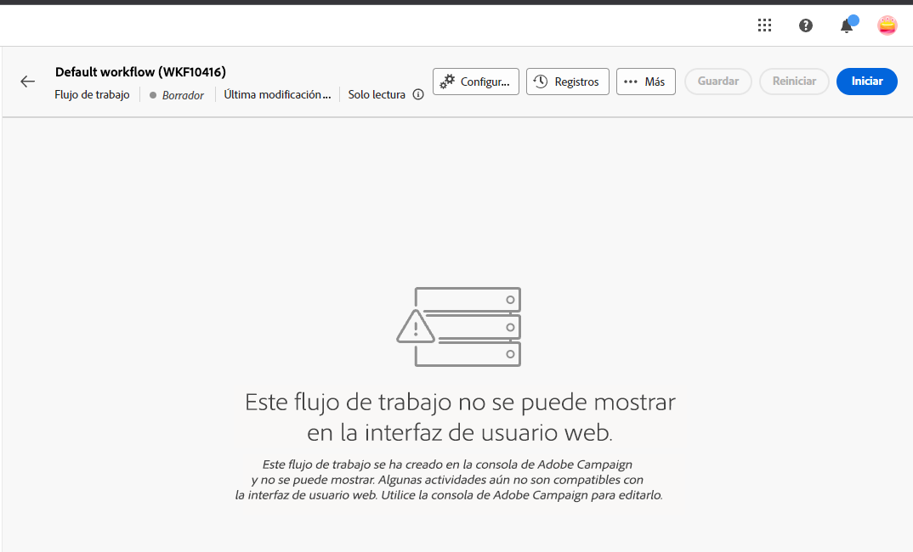
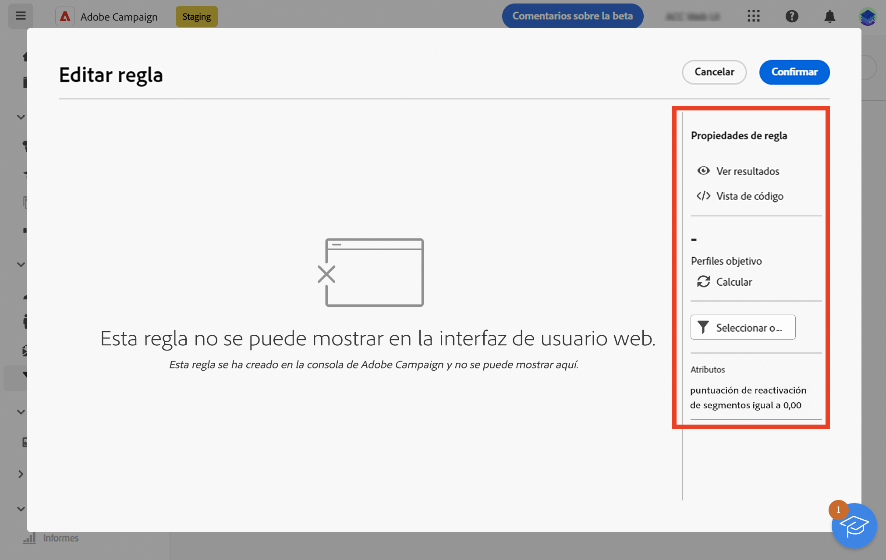
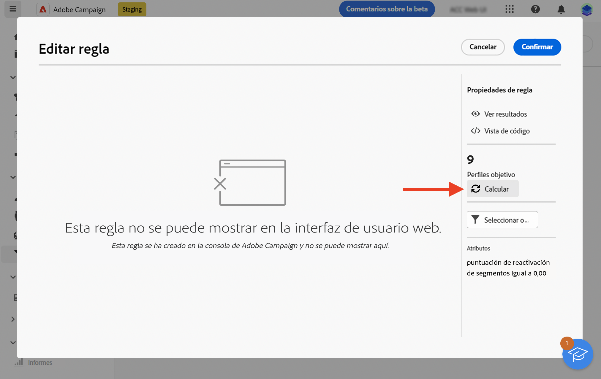
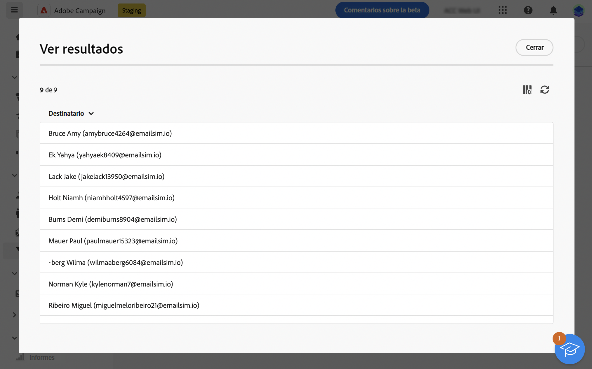

# Mecanismos de protección y limitaciones {#guardrails-limitations}

Al trabajar en la IU web de Campaign con componentes creados o modificados en la consola del cliente de Campaign, se aplican los mecanismos de protección y limitaciones que se enumeran a continuación.

## Flujos de trabajo {#wf-guardrails-limitations}

### Actividades

Las actividades de flujo de trabajo que aún no se admiten en la interfaz de usuario web son de solo lectura y se muestran como actividades incompatibles. Puede ejecutar de todos modos el flujo de trabajo, enviar mensajes, comprobar los registros, etc. Las actividades de flujo de trabajo disponibles tanto en la interfaz de usuario web como en la consola del cliente son editables.

| Consola | IU web |
| --- | --- |
| {width="800px" align="left" zoomable="yes"} | {width="800px" align="left" zoomable="yes"} |

No se muestra la configuración de actividad de flujo de trabajo que aún no es compatible con la interfaz de usuario web. Sin embargo, cuando se ejecuta el flujo de trabajo, se aplica esta configuración.

| Consola | IU web |
| --- | --- |
| {width="800px" align="left" zoomable="yes"} | {width="800px" align="left" zoomable="yes"} |

En la consola, la actividad **Enriquecimiento** puede realizar tanto la reconciliación como el enriquecimiento. En la IU web, las funcionalidades de reconciliación aún no están disponibles. Si ha definido en la consola la configuración de reconciliación en la actividad **Enriquecimiento**, se mostrará como una actividad de solo lectura no compatible en la interfaz de usuario web.

| Consola | IU web |
| --- | --- |
| {width="800px" align="left" zoomable="yes"} | {width="800px" align="left" zoomable="yes"} |

### Lienzo

Al crear un nuevo flujo de trabajo en la interfaz de usuario web, el lienzo solo admite un punto de entrada. Sin embargo, si ha creado un flujo de trabajo en la consola con varios puntos de entrada, puede abrirlo y editarlo en la interfaz de usuario web.

| Consola | IU web |
| --- | --- |
| {width="800px" align="left" zoomable="yes"} | {width="800px" align="left" zoomable="yes"} |

Los bucles aún no están disponibles en la interfaz de usuario web. Si ha creado mediante la consola un flujo de trabajo que incluye un bucle, no podrá acceder a él desde la interfaz de usuario web. Se muestra un mensaje de error.

| Consola | IU web |
| --- | --- |
| {width="800px" align="left" zoomable="yes"} | {width="800px" align="left" zoomable="yes"} |

La posición de los nodos se actualiza cada vez que se añade o elimina una actividad. Si crea un flujo de trabajo en la consola, lo modifica mediante la interfaz de usuario web y lo vuelve a abrir en la consola, es posible que observe algunas imperfecciones de posición menores. Esto no afecta a los procesos y tareas del flujo de trabajo.

| Flujo de trabajo inicial | Cambio de posición |
| --- | --- |
| {width="800px" align="left" zoomable="yes"} | {width="800px" align="left" zoomable="yes"} |

## Filtros predefinidos {#filters-guardrails-limitations}

>[!CONTEXTUALHELP]
>id="acw_predefined_filter_read_only"
>title="Este filtro es de solo lectura"
>abstract="Algunos filtros predefinidos no están disponibles en la interfaz de usuario en esa versión del producto. Estos filtros están marcados como de solo lectura. Aunque no pueda ver la representación gráfica de la consulta en el generador de reglas y no pueda editar el filtro, puede utilizarlo y ver las condiciones de filtrado en la sección **Atributos** de la pantalla."

Al seleccionar el público de un envío o al crear un público en un flujo de trabajo, algunos filtros predefinidos no están disponibles en la interfaz de usuario en esa versión del producto. Estos filtros están marcados como de solo lectura.

Se muestra un mensaje de error específico.

{width="70%" align="left"}

Aunque no pueda ver la representación gráfica de la consulta en el generador de reglas y no pueda editar el filtro, puede utilizarlo y ver las condiciones de filtrado en la sección **Atributos** de la pantalla.

{width="70%" align="left"}

También puede acceder a la consulta SQL para comprobar la configuración exacta. Para ello, haga clic en el botón **Vista de código**.

{width="70%" align="left"}

Haga clic en el botón **Calcular** para comprobar cuántos elementos cumplen los criterios del filtro.

{width="70%" align="left"}

Use el botón **Ver resultados** para mostrar esos elementos.

{width="70%" align="left"}

Tenga en cuenta que si genera un filtro en la interfaz web y lo modifica en la consola con atributos no admitidos, la representación gráfica ya no estará disponible en la interfaz web. En cualquier caso, podrá utilizar el filtro.

A continuación se enumeran los atributos no admitidos.

### Tipos de datos no compatibles {#unsupported-data-type}

Los siguientes tipos de datos disponibles en la consola del cliente no son compatibles al mostrar un filtro o una regla en la interfaz web:

* datetime
* tiempo
* intervalo de tiempo
* doble
* flotante

### Funcionalidades de filtrado no admitidas {#unsupported-filtering-capabilities}

Cuando se crea un filtro con expresiones y funciones complejas en la consola del cliente, no se puede editar en la interfaz web.

Además, no se admiten los siguientes operadores:

* Tipo numérico
   * Se incluye en
   * no en

* Tipo de cadena
   * mayor que
   * menos de
   * mayor que o igual a
   * menor que o igual a
   * like
   * not like

* Tipo de fecha
   * el o después
   * el o antes
   * no es igual a
   * está vacío
   * no está vacío
   * Se incluye en
   * no en
   * en el último

* 1-N links
   * COUNT, SUM, AVG, MIN, MAX
