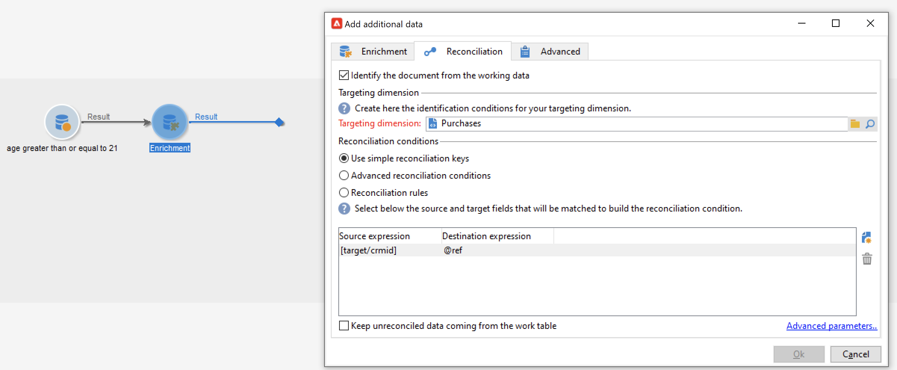

# Mecanismos de protección y limitaciones de los flujos de trabajo {#guardrails-limitations}

Al trabajar en la interfaz de usuario web de Campaign con flujos de trabajo creados o modificados en la consola del cliente de Campaign, se aplican los mecanismos de protección y limitaciones que se enumeran a continuación.

Tenga en cuenta que, aunque esta página identifica las consideraciones clave a la hora de trabajar con flujos de trabajo en la consola y la interfaz de usuario web, no abarca todas las posibles incompatibilidades entre las dos interfaces.

## Actividades de flujo de trabajo {#wkf-activities}

>[!CONTEXTUALHELP]
>id="acw_orchestration_query_enrichment_noneditable"
>title="Actividad no editable"
>abstract="Cuando una actividad de **Consulta** o **Enriquecimiento** se configura con datos adicionales en la consola, los datos de enriquecimiento se tienen en cuenta en la web de Campaign y pasan a la transición saliente, pero no se pueden editar."

Las actividades de flujo de trabajo que aún no se admiten en la interfaz de usuario web de Campaign son de solo lectura y se muestran como actividades incompatibles. Puede ejecutar de todos modos el flujo de trabajo, enviar mensajes, comprobar los registros, etc. Las actividades de flujo de trabajo disponibles tanto en la interfaz de usuario web de Campaign como en la consola del cliente de Campaign se pueden editar.

| Consola | Web |
| --- | --- |
| {zoomable="yes"}{width="800px" align="left" zoomable="yes"} | {zoomable="yes"}{width="800px" align="left" zoomable="yes"} |

Cuando una actividad de **Consulta** o **Enriquecimiento** se configura con datos adicionales en la consola, los datos de enriquecimiento se tienen en cuenta en la web de Campaign y pasan a la transición saliente, pero no se pueden editar.

| Consola | Web |
| --- | --- |
| {zoomable="yes"}{width="800px" align="left" zoomable="yes"} | {zoomable="yes"}{width="800px" align="left" zoomable="yes"} |

En la consola, en la actividad **Enriquecimiento**, se puede realizar tanto la reconciliación como el enriquecimiento. Si ha definido en la consola la configuración de reconciliación en la actividad de **Enriquecimiento**, se mostrará como una actividad de **Reconciliación** de solo lectura no compatible en la interfaz de usuario de Campaign Web.

| Consola | Web |
| --- | --- |
| {zoomable="yes"}{width="800px" align="left" zoomable="yes"} | {zoomable="yes"}{width="800px" align="left" zoomable="yes"} |

## Lienzo de flujo de trabajo {#wkf-canvas}

Al crear un nuevo flujo de trabajo en la interfaz de usuario web de Campaign, el lienzo solo admite un punto de entrada. Sin embargo, si ha creado un flujo de trabajo en la consola con varios puntos de entrada, puede abrirlo y editarlo en la interfaz de usuario web de Campaign.

| Consola | Web |
| --- | --- |
| {zoomable="yes"}{width="800px" align="left" zoomable="yes"} | {zoomable="yes"}{width="800px" align="left" zoomable="yes"} |

La posición de los nodos se actualiza cada vez que se añade o elimina una actividad. Si crea un flujo de trabajo en la consola, lo modifica mediante la interfaz de usuario web de Campaign y lo vuelve a abrir en la consola, es posible que observe algunas pequeñas imperfecciones de posición. Esto no afecta a los procesos y tareas del flujo de trabajo.

| Flujo de trabajo inicial | Cambio de posición |
| --- | --- |
| {zoomable="yes"}{width="800px" align="left" zoomable="yes"} | {zoomable="yes"}{width="800px" align="left" zoomable="yes"} |
