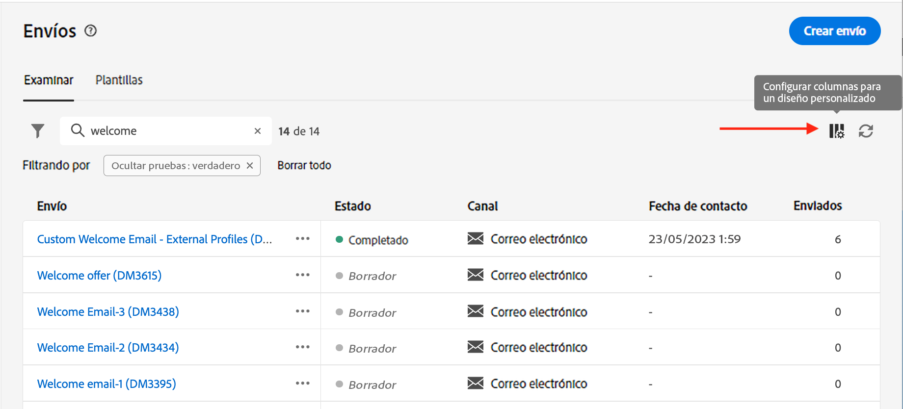
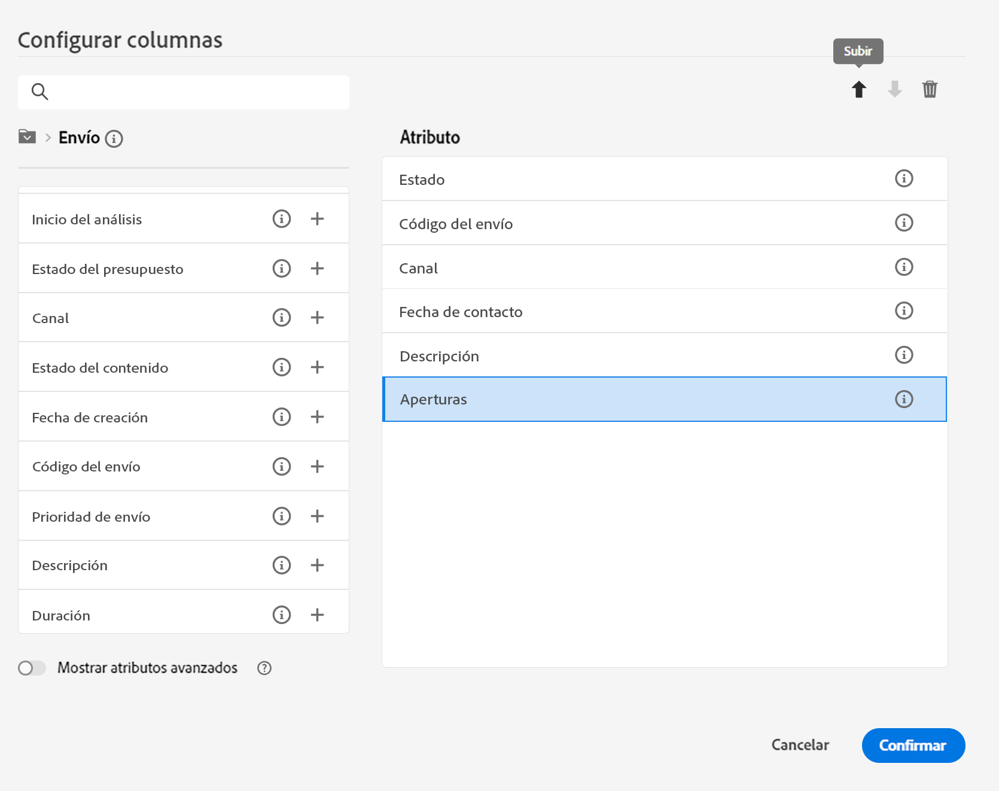
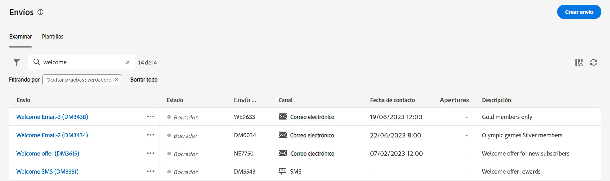
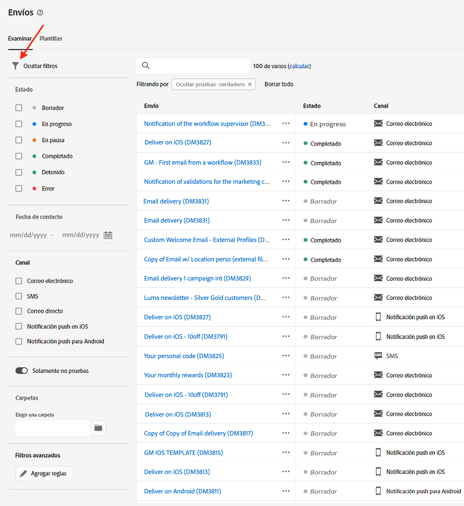
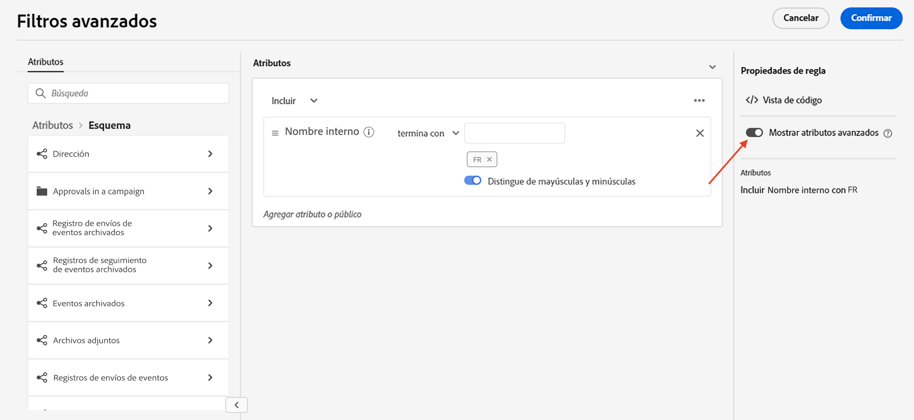

# Examen y filtrado de listas {#list-screens}

La mayoría de los vínculos del menú de navegación izquierdo muestran listas de objetos, como la lista de **Envíos** o **Campañas**. Algunas de estas pantallas de lista son de solo lectura. Puede personalizar la visualización de la lista y filtrar estas listas, como se detalla a continuación.

## Personalizar pantallas de lista {#custom-lists}

Las listas se muestran en columnas. Puede mostrar información adicional cambiando la configuración de la columna. Para ello, haga clic en el icono **Configurar la columna para un diseño personalizado** en la esquina superior derecha de la lista.

{width="70%" align="left" zoomable="yes"}

En la pantalla **Configuración de columnas**, agregue o quite columnas, y cambie el orden en el que se muestran.

Por ejemplo, para esta configuración:

{width="70%" align="left" zoomable="yes"}

La lista muestra las siguientes columnas:

{width="70%" align="left" zoomable="yes"}

## Ordenar datos {#sort-lists}

Para ordenar los elementos de la lista, haga clic en cualquier encabezado de columna. Se muestra una flecha (arriba o abajo) que indica que la lista está ordenada en esa columna.

Para las columnas numéricas o de fecha, la flecha **Arriba** indica que la lista se ordena en orden ascendente, mientras que la flecha **Abajo** indica un orden descendente. Para las columnas de cadena o alfanuméricas, los valores aparecen en orden alfabético.

## Filtros {#list-built-in-filters}

Para buscar elementos más rápidamente, puede utilizar la barra de búsqueda o filtros personalizados e incorporados para adaptar la lista según criterios contextuales.

{width="70%" align="left" zoomable="yes"}

Encontrará información detallada sobre cómo utilizar los filtros y crear sus propios filtros personalizados en [esta sección](../query/filter.md).

<!--
## Use advanced attributes {#adv-attributes}

>[!CONTEXTUALHELP]
>id="acw_attributepicker_advancedfields"
>title="Display advanced attributes"
>abstract="Only the most common attributes are displayed by default in the attribute list. Activate the **Display advanced attributes** toggle to see all available attributes for the current list in the left palette of the rule builder, such as nodes, groupings, 1-1 links, 1-N links."

>[!CONTEXTUALHELP]
>id="acw_rulebuilder_advancedfields"
>title="Rule builder advanced fields"
>abstract="Only the most common attributes are displayed by default in the attribute list. Activate the **Display advanced attributes** toggle to see all available attributes for the current list in the left palette of the rule builder, such as nodes, groupings, 1-1 links, 1-N links."

>[!CONTEXTUALHELP]
>id="acw_rulebuilder_properties_advanced"
>title="Rule builder advanced attributes"
>abstract="Only the most common attributes are displayed by default in the attribute list. Activate the **Display advanced attributes** toggle to see all available attributes for the current list in the left palette of the rule builder, such as nodes, groupings, 1-1 links, 1-N links."

Only most common attributes are displayed by default in the attribute list and filter configuration screens. Attributes which were set as `advanced` attributes in the data schema are hidden from the configuration screens. 

Activate the **Display advanced attributes** toggle to see all available attributes for the current list in the left palette of the rule builder, such as nodes, groupings, 1-1 links, 1-N links. The attribute list is updated instantly.

{width="70%" align="left" zoomable="yes"}
-->