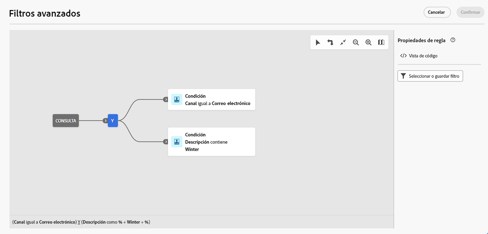

# Examen, búsqueda y filtrado de listas {#list-screens}

La mayoría de los vínculos del menú de navegación izquierdo muestran listas de objetos, como la lista de **Envíos** o **Campañas**. Algunas de estas pantallas de lista son de solo lectura. Puede personalizar la visualización de la lista y filtrar estas listas, como se detalla a continuación.

Para quitar un filtro, haga clic en el botón **Borrar todo**.

## Personalizar pantallas de lista {#custom-lists}

Las listas se muestran en columnas. Puede mostrar información adicional cambiando la configuración de la columna. Para ello, haga clic en el icono **Configurar la columna para un diseño personalizado** en la esquina superior derecha de la lista.

{width="70%" align="left" zoomable="yes"}

En la pantalla **Configuración de columnas**, agregue o quite columnas, y cambie el orden en el que se muestran.

Por ejemplo, para esta configuración:

{width="70%" align="left" zoomable="yes"}

La lista muestra las siguientes columnas:

{width="70%" align="left" zoomable="yes"}

Utilice la opción **Mostrar atributos avanzados** para ver todos los atributos de la lista actual. [Más información](#adv-attributes)

## Ordenar datos {#sort-lists}

Para ordenar los elementos de la lista, haga clic en cualquier encabezado de columna. Se muestra una flecha (arriba o abajo) que indica que la lista está ordenada en esa columna.

Para las columnas numéricas o de fecha, la flecha **Arriba** indica que la lista se ordena en orden ascendente, mientras que la flecha **Abajo** indica un orden descendente. Para las columnas de cadena o alfanuméricas, los valores aparecen en orden alfabético.

## Filtros integrados {#list-built-in-filters}

Para buscar elementos más rápidamente, puede utilizar la barra de búsqueda o filtrar la lista según criterios contextuales.

{width="70%" align="left" zoomable="yes"}

Por ejemplo, puede filtrar los envíos según su estado, canal, fecha de contacto o carpeta. También puede ocultar las pruebas.

## Filtros personalizados{#list-custom-filters}

Para crear filtros personalizados con los datos, vaya a la parte inferior de los filtros y haga clic en el botón **Agregar reglas**.

Arrastre y suelte los atributos para generar los criterios de filtro en la pantalla **Filtros avanzados**.

{width="70%" align="left" zoomable="yes"}

Utilice la opción **Mostrar atributos avanzados** para ver todos los atributos de la lista actual. [Más información](#adv-attributes)

## Uso de atributos avanzados {#adv-attributes}

>[!CONTEXTUALHELP]
>id="acw_attributepicker_advancedfields"
>title="Mostrar atributos avanzados"
>abstract="Solo los atributos más comunes se muestran de forma predeterminada en la lista de atributos. Utilice esta opción para crear un filtro con atributos avanzados."

>[!CONTEXTUALHELP]
>id="acw_rulebuilder_advancedfields"
>title="Campos avanzados del generador de reglas"
>abstract="Configure los filtros avanzados con campos avanzados."

>[!CONTEXTUALHELP]
>id="acw_rulebuilder_properties_advanced"
>title="Atributos avanzados del generador de reglas"
>abstract="Utilice atributos avanzados para definir la regla."

Solo los atributos más comunes se muestran de forma predeterminada en las pantallas de lista de atributos y configuración de filtros. Los atributos que se establecieron como atributos de `advanced` del esquema de datos se ocultan de las pantallas de configuración.

Active la opción **Mostrar atributos avanzados** para ver todos los atributos disponibles para la lista actual: la lista de atributos se actualiza instantáneamente

{width="70%" align="left" zoomable="yes"}
