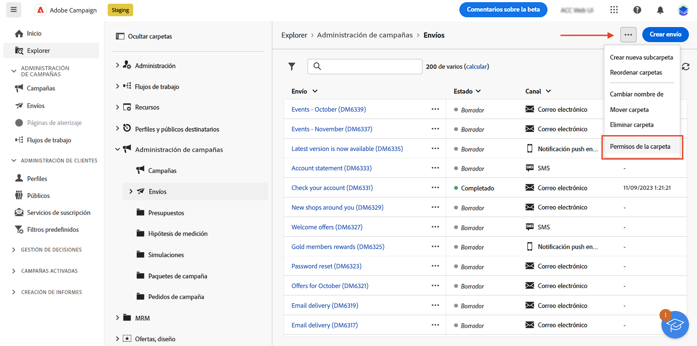
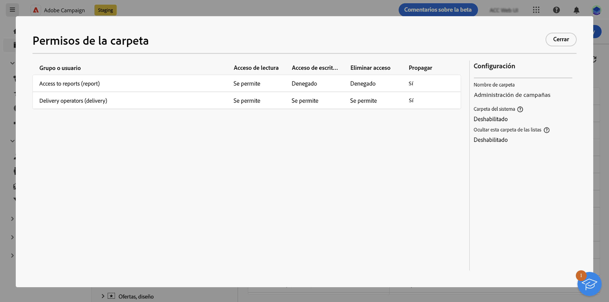
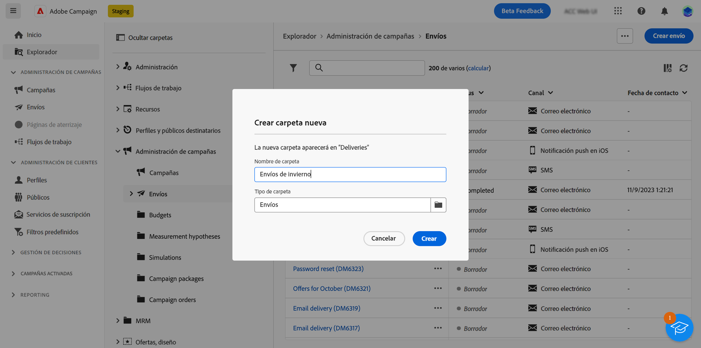
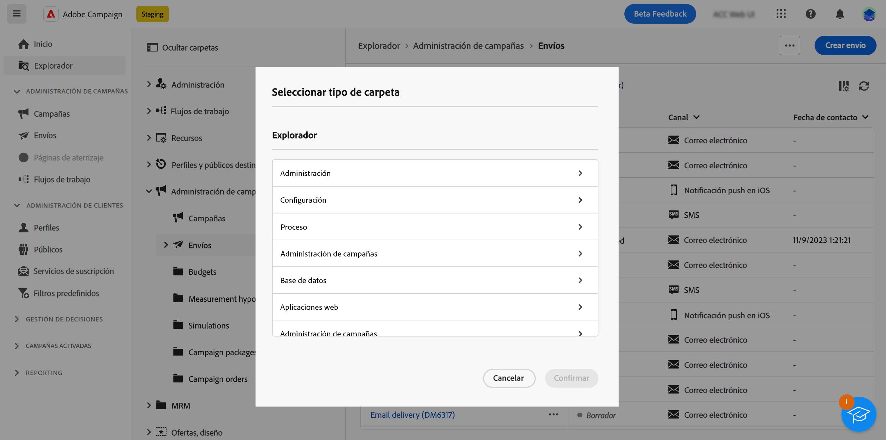
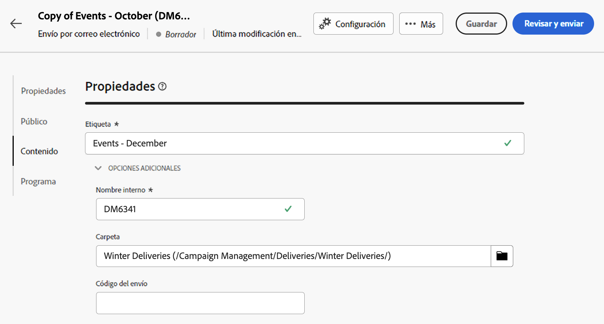

# Acceso y permisos {#access-and-permissions}

>[!CONTEXTUALHELP]
>id="acw_explorer_permissions_create"
>title="Permiso obligatorio"
>abstract="El administrador debe otorgarle permiso para poder crear este objeto."

>[!CONTEXTUALHELP]
>id="acw_audiences_read_only"
>title="Este público es de solo lectura"
>abstract="No tiene permisos para editar este público. Si es necesario, póngase en contacto con el administrador para que le conceda acceso."

>[!CONTEXTUALHELP]
>id="acw_subscription_services_read_only"
>title="Este servicio es de solo lectura"
>abstract="No tiene permisos para editar este servicio. Si es necesario, póngase en contacto con el administrador para que le conceda acceso."

>[!CONTEXTUALHELP]
>id="acw_recipients_readonlyprofile"
>title="Perfil de solo lectura de los destinatarios"
>abstract="No tiene permisos para editar este perfil. Si es necesario, póngase en contacto con el administrador para que le conceda acceso."

>[!CONTEXTUALHELP]
>id="acw_campaign_read_only"
>title="Esta campaña es de solo lectura"
>abstract="No tiene permisos para editar esta campaña. Si es necesario, póngase en contacto con el administrador para que le conceda acceso."

>[!CONTEXTUALHELP]
>id="acw_deliveries_read_only"
>title="Este envío es de solo lectura"
>abstract="No tiene permisos para editar este envío. Si es necesario, póngase en contacto con el administrador para que le conceda acceso."

>[!CONTEXTUALHELP]
>id="acw_wf_read_only"
>title="Este flujo de trabajo es de solo lectura"
>abstract="No tiene permisos para editar este flujo de trabajo. Si es necesario, póngase en contacto con el administrador para que le conceda acceso."

El control de acceso puede restringir el acceso a objetos y datos de listas principales, como envíos, destinatarios o flujos de trabajo. Estas restricciones también se aplican en el árbol de navegación de **Explorer.** Además, necesita permisos para crear, eliminar, duplicar y editar objetos desde la interfaz de usuario.

El control de acceso se administra en la consola del cliente de Campaign. Todos los permisos de la web de Campaign se sincronizan con los permisos de la consola del cliente de Campaign. Solo los administradores de Campaign pueden definir y modificar permisos de usuario. Obtenga más información sobre los permisos de usuario en [Documentación de Campaign v8 (consola de cliente)](https://experienceleague.adobe.com/docs/campaign/campaign-v8/admin/permissions/gs-permissions.html?lang=es){target="_blank"}.

A medida que navega por la interfaz de usuario web de Campaign, puede acceder a datos, objetos y funcionalidades en función de sus permisos. Por ejemplo, si no tiene permisos de acceso a una carpeta, no podrá verla. Los permisos también afectan a la administración de objetos y datos. Sin permisos de escritura para una carpeta específica, no se puede crear un envío en dicha carpeta, aunque se pueda ver en la interfaz de usuario.

## Ver permisos {#view-permissions}

En **Explorer**, puede examinar los permisos de cada carpeta. Estos permisos se establecen en la consola del cliente y se utilizan para organizar y controlar el acceso a los datos de Campaign.

Para ver los permisos de una carpeta, siga estos pasos:

1. Desde el menú de navegación de la izquierda de **Explorer**, seleccione una carpeta.
1. Haga clic en los tres puntos de la esquina superior derecha y seleccione **Permisos de la carpeta**.

   {zoomable="yes"}{width="70%" align="left" zoomable="yes"}

1. Compruebe los detalles en la pantalla, como se muestra a continuación:

   {zoomable="yes"}{width="70%" align="left" zoomable="yes"}

   Un grupo o un operador puede tener permisos de lectura, escritura o eliminación sobre los datos almacenados en la carpeta seleccionada.

   Si la opción **Propagar** está habilitada, todos los permisos definidos para una carpeta se aplican a todas sus subcarpetas. Estos permisos se pueden sobrecargar para cada subcarpeta.

   Si la opción **Carpeta del sistema** está habilitada, el acceso está permitido a todos los operadores, independientemente de sus permisos.

Obtenga más información sobre los permisos de usuario en la [Documentación de Campaign v8 (consola de cliente)](https://experienceleague.adobe.com/docs/campaign/campaign-v8/admin/permissions/folder-permissions.html?lang=es){target="_blank"}.

## Trabajar con carpetas {#folders}

>[!CONTEXTUALHELP]
>id="acw_folder_properties"
>title="Propiedades de carpetas"
>abstract="Propiedades de carpetas"

>[!CONTEXTUALHELP]
>id="acw_folder_security"
>title="Seguridad de carpetas"
>abstract="Seguridad de carpetas"

>[!CONTEXTUALHELP]
>id="acw_folder_restrictions"
>title="Restricciones de carpetas"
>abstract="Restricciones de carpetas"

>[!CONTEXTUALHELP]
>id="acw_folder_schedule"
>title="Programación de carpetas"
>abstract="Programación de carpetas"

Puede crear, cambiar el nombre, reordenar y mover carpetas para organizar los componentes y los datos. También puede eliminar carpetas desde el mismo menú.

>[!CAUTION]
>
>Al eliminar una carpeta, también se eliminan todos los datos almacenados en ella.

Para crear una carpeta, siga estos pasos:

1. Desde el menú de navegación de la izquierda de **Explorer**, seleccione una carpeta.
1. Haga clic en los tres puntos de la esquina superior derecha y seleccione **Crear nueva subcarpeta**.
1. Introduzca el nombre de la carpeta.

   {zoomable="yes"}{width="70%" align="left" zoomable="yes"}

1. Seleccione el tipo de carpeta. De forma predeterminada, el tipo de carpeta principal está seleccionado, “Deliveries” (envíos), en nuestro ejemplo. Para cambiar el tipo de carpeta, haga clic en el icono de carpeta y seleccione cualquier otro tipo.

   {zoomable="yes"}{width="70%" align="left" zoomable="yes"}

1. Haga clic en **Crear**.

   La carpeta se agrega como una subcarpeta de la carpeta actual. Navegue hasta esa nueva carpeta para crear componentes directamente en ella. También puede crear un componente desde cualquier carpeta y guardarlo en esa nueva carpeta, desde la sección **Opciones adicionales** de las propiedades, para un envío, tal como se muestra a continuación:

   {zoomable="yes"}{width="70%" align="left" zoomable="yes"}
