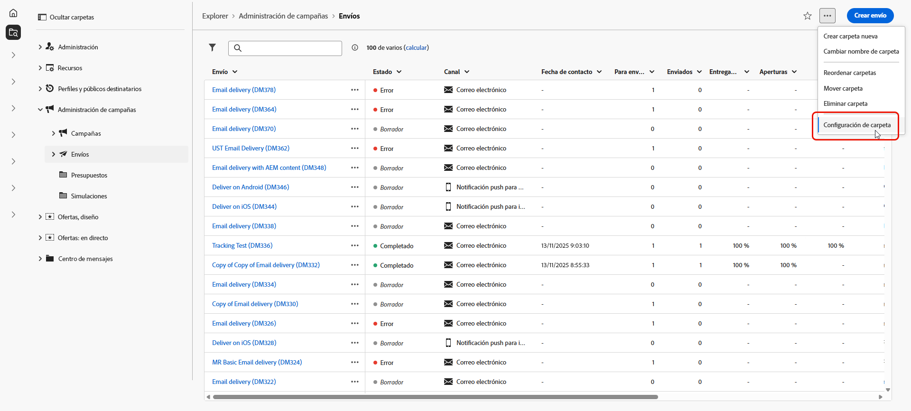
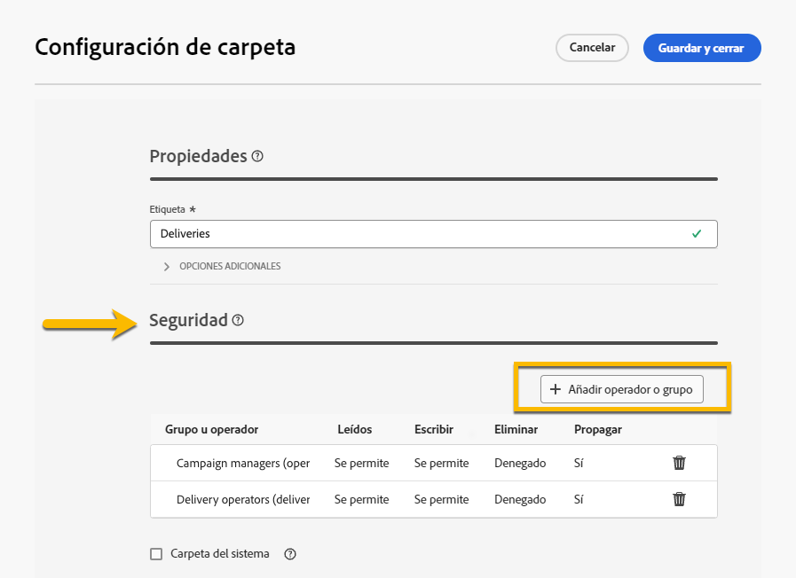
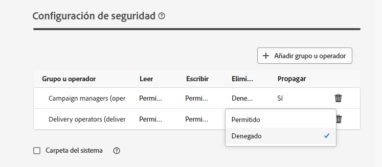

<?xml version="1.0" encoding="UTF-8"?>
<xliff xmlns="urn:oasis:names:tc:xliff:document:1.2" xmlns:okp="okapi-framework:xliff-extensions" xmlns:its="http://www.w3.org/2005/11/its" xmlns:itsxlf="http://www.w3.org/ns/its-xliff/" version="1.2" its:version="2.0">
<file original="help/v8/get-started/permissions.md.mdsc" source-language="en-US" target-language="en-XX" datatype="x-text/markdown">
<body>
<trans-unit id="tu10" xml:space="preserve">
<source xml:lang="en-US">https://experienceleague.adobe.com/en/docs/campaign/campaign-v8/admin/permissions/gs-permissions</source>
<target xml:lang="en-XX">https://experienceleague.adobe.com/es/docs/campaign/campaign-v8/admin/permissions/gs-permissions</target>
</trans-unit>
<trans-unit id="tu26" xml:space="preserve">
<source xml:lang="en-US">https://experienceleague.adobe.com/docs/campaign/campaign-v8/permissions/manage-permissions.html#use-named-rights</source>
<target xml:lang="en-XX">https://experienceleague.adobe.com/es/docs/campaign/campaign-v8/permissions/manage-permissions#use-named-rights</target>
</trans-unit>
<trans-unit id="tu1" restype="x-YAML_METADATA_HEADER_VALUE" xml:space="preserve">
<source xml:lang="en-US">Permission management in Campaign Web user interface</source>
<target xml:lang="en-XX">Administración de permisos en la interfaz de usuario web de Campaign</target>
</trans-unit>
<trans-unit id="tu2" restype="x-YAML_METADATA_HEADER_VALUE" xml:space="preserve">
<source xml:lang="en-US">Learn more about permissions in Campaign Web user interface</source>
<target xml:lang="en-XX">Más información sobre los permisos en la interfaz de usuario web de Campaign</target>
</trans-unit>
<trans-unit id="tu3" xml:space="preserve">
<source xml:lang="en-US">Permissions</source>
<target xml:lang="en-XX">Permisos</target>
</trans-unit>
<trans-unit id="tu4" xml:space="preserve">
<source xml:lang="en-US">Each user in Adobe Campaign has specific permissions and restrictions in the application. The user can belong to an operators group and inherit the group's permissions.</source>
<target xml:lang="en-XX">Cada usuario de Adobe Campaign tiene permisos y restricciones específicos en la aplicación. El usuario puede pertenecer a un grupo de operadores y heredar los permisos del grupo.</target>
</trans-unit>
<trans-unit id="tu5" xml:space="preserve">
<source xml:lang="en-US">Based on their permissions, an operator can:</source>
<target xml:lang="en-XX">Según sus permisos, un operador puede hacer lo siguiente:</target>
</trans-unit>
<trans-unit id="tu6" xml:space="preserve">
<source xml:lang="en-US">Access certain capabilities</source>
<target xml:lang="en-XX">Acceder a determinadas funciones</target>
</trans-unit>
<trans-unit id="tu7" xml:space="preserve">
<source xml:lang="en-US">Access certain data</source>
<target xml:lang="en-XX">Acceder a determinados datos</target>
</trans-unit>
<trans-unit id="tu8" xml:space="preserve">
<source xml:lang="en-US">Access certain actions (create, modify, delete)</source>
<target xml:lang="en-XX">Acceder a determinadas acciones (crear, modificar, eliminar)</target>
</trans-unit>
<trans-unit id="tu9" xml:space="preserve">
<source xml:lang="en-US">A detailed procedure for setting up permissions in Adobe Campaign is available in <ph id="1" ctype="x-LINK">&lbrack;</ph>Adobe Campaign v8 (console) documentation<ph id="2" ctype="x-LINK">[#$tu10]{target="_blank"}</ph>.</source>
<target xml:lang="en-XX">Los procedimientos detallados para configurar los permisos en Adobe Campaign están disponibles en la <ph id="1" ctype="x-LINK">&lbrack;</ph>documentación de la versión 8 Adobe Campaign (consola)<ph id="2" ctype="x-LINK">[#$tu10]{target="_blank"}</ph>.</target>
</trans-unit>
<trans-unit id="tu11" xml:space="preserve">
<source xml:lang="en-US">Permissions on folders</source>
<target xml:lang="en-XX">Permisos de las carpetas</target>
</trans-unit>
<trans-unit id="tu12" xml:space="preserve">
<source xml:lang="en-US">Based on your rights, you can view and manage permissions on folders in the <ph id="1" ctype="x-STRONG_EMPHASIS">**[!UICONTROL </ph>Folder settings<ph id="3" ctype="x-LINK_REF">]**</ph>.</source>
<target xml:lang="en-XX">En función de sus derechos, puede ver y administrar permisos en las carpetas en la <ph id="1" ctype="x-STRONG_EMPHASIS">**[!UICONTROL </ph>Configuración de carpetas<ph id="3" ctype="x-LINK_REF">]**</ph>.</target>
</trans-unit>
<trans-unit id="tu13" xml:space="preserve">
<source xml:lang="en-US">Below is an example of a delivery folder:</source>
<target xml:lang="en-XX">A continuación se muestra un ejemplo de una carpeta de envío:</target>
</trans-unit>
<trans-unit id="tu14" xml:space="preserve">
<source xml:lang="en-US"><ph id="1" ctype="x-IMAGE">{zoomable="yes"}</ph></source>
<target xml:lang="en-XX"><ph id="1" ctype="x-IMAGE">{zoomable="yes"}</ph></target>
</trans-unit>
<trans-unit id="tu15" xml:space="preserve">
<source xml:lang="en-US">In the <ph id="1" ctype="x-STRONG_EMPHASIS">**[!UICONTROL </ph>Security<ph id="3" ctype="x-LINK_REF">]**</ph> section of the <ph id="5" ctype="x-STRONG_EMPHASIS">**[!UICONTROL </ph>Folder settings<ph id="7" ctype="x-LINK_REF">]**</ph>, you can view and manage (add or delete) operators or groups who can access the folder.</source>
<target xml:lang="en-XX">En la sección <ph id="1" ctype="x-STRONG_EMPHASIS">**[!UICONTROL </ph>Seguridad<ph id="3" ctype="x-LINK_REF">]**</ph> de la <ph id="5" ctype="x-STRONG_EMPHASIS">**[!UICONTROL </ph>Configuración de carpetas<ph id="7" ctype="x-LINK_REF">]**</ph>, puede ver y administrar (añadir o eliminar) operadores o grupos que tengan acceso a la carpeta.</target>
</trans-unit>
<trans-unit id="tu16" xml:space="preserve">
<source xml:lang="en-US"><ph id="1" ctype="x-IMAGE">{zoomable="yes"}</ph></source>
<target xml:lang="en-XX"><ph id="1" ctype="x-IMAGE">{zoomable="yes"}</ph></target>
</trans-unit>
<trans-unit id="tu17" xml:space="preserve">
<source xml:lang="en-US">You can directly click on the permissions and change them to either <ph id="1" ctype="x-STRONG_EMPHASIS">**[!UICONTROL </ph>Allowed<ph id="3" ctype="x-LINK_REF">]**</ph> or <ph id="5" ctype="x-STRONG_EMPHASIS">**[!UICONTROL </ph>Denied<ph id="7" ctype="x-LINK_REF">]**</ph>.</source>
<target xml:lang="en-XX">Puede hacer clic directamente en los permisos y cambiarlos entre <ph id="1" ctype="x-STRONG_EMPHASIS">**[!UICONTROL </ph>Permitido<ph id="3" ctype="x-LINK_REF">]**</ph> o <ph id="5" ctype="x-STRONG_EMPHASIS">**[!UICONTROL </ph>Denegado<ph id="7" ctype="x-LINK_REF">]**</ph>.</target>
</trans-unit>
<trans-unit id="tu18" xml:space="preserve">
<source xml:lang="en-US"><ph id="1" ctype="x-IMAGE">{zoomable="yes"}</ph></source>
<target xml:lang="en-XX"><ph id="1" ctype="x-IMAGE">{zoomable="yes"}</ph></target>
</trans-unit>
<trans-unit id="tu19" xml:space="preserve">
<source xml:lang="en-US"><ph id="1" ctype="x-regxph" equiv-text="&lbrack;!NOTE">[!NOTE]</ph></source>
<target xml:lang="en-XX"><ph id="1" ctype="x-regxph" equiv-text="&lbrack;!NOTE">[!NOTE]</ph></target>
</trans-unit>
<trans-unit id="tu20" xml:space="preserve">
<source xml:lang="en-US">You should not be able to create an object for which you do not have at least one folder with writing rights.</source>
<target xml:lang="en-XX">No debería poder crear un objeto para el que no tenga al menos una carpeta con derechos de escritura.</target>
</trans-unit>
<trans-unit id="tu21" xml:space="preserve">
<source xml:lang="en-US">You do not need to be an admin to create fragments, but you must have writing rights on at least one "Content visual fragment" folder. Otherwise, you won't be able to create a visual fragment.</source>
<target xml:lang="en-XX">No necesita ser administrador para crear fragmentos, pero debe tener derechos de escritura en al menos una carpeta “Fragmento visual de contenido”. De lo contrario, no podrá crear un fragmento visual.</target>
</trans-unit>
<trans-unit id="tu22" xml:space="preserve">
<source xml:lang="en-US">If the <ph id="1" ctype="x-STRONG_EMPHASIS">**[!UICONTROL </ph>Propagate<ph id="3" ctype="x-LINK_REF">]**</ph> option is enabled, all permissions defined for a folder apply to all its sub-folders. These permissions can be overridden for each sub-folder.</source>
<target xml:lang="en-XX">Si la opción <ph id="1" ctype="x-STRONG_EMPHASIS">**[!UICONTROL </ph>Propagar<ph id="3" ctype="x-LINK_REF">]**</ph> está habilitada, todos los permisos definidos para una carpeta se aplican a todas sus subcarpetas. Estos permisos pueden anularse para cada subcarpeta.</target>
</trans-unit>
<trans-unit id="tu23" xml:space="preserve">
<source xml:lang="en-US">If the <ph id="1" ctype="x-STRONG_EMPHASIS">**[!UICONTROL </ph>System folder<ph id="3" ctype="x-LINK_REF">]**</ph> option is selected, access is allowed to all operators, regardless of their permissions.</source>
<target xml:lang="en-XX">Si la opción <ph id="1" ctype="x-STRONG_EMPHASIS">**[!UICONTROL </ph>Carpeta del sistema<ph id="3" ctype="x-LINK_REF">]**</ph> está habilitada, el acceso está permitido a todos los operadores, independientemente de sus permisos.</target>
</trans-unit>
<trans-unit id="tu24" xml:space="preserve">
<source xml:lang="en-US">See this <ph id="1" ctype="x-LINK">[</ph>section<ph id="2" ctype="x-LINK">](work-with-folders.md#folder-access-rights)</ph> to learn how these rights affect the actions available to you on a folder.</source>
<target xml:lang="en-XX">Consulte esta <ph id="1" ctype="x-LINK">[</ph>sección<ph id="2" ctype="x-LINK">](work-with-folders.md#folder-access-rights)</ph> para conocer cómo estos derechos afectan las acciones que tiene disponibles sobre una carpeta.</target>
</trans-unit>
<trans-unit id="tu25" xml:space="preserve">
<source xml:lang="en-US">Named rights also determine which folder actions are available to an operator. Refer to the <ph id="1" ctype="x-LINK">&lbrack;</ph>Campaign v8 documentation<ph id="2" ctype="x-LINK">[#$tu26]{target="_blank"}</ph>.</source>
<target xml:lang="en-XX">Los derechos asignados también determinan qué acciones de carpeta están disponibles para un operador. Consulte la <ph id="1" ctype="x-LINK">&lbrack;</ph>documentación de Campaign v8<ph id="2" ctype="x-LINK">[#$tu26]{target="_blank"}</ph>.</target>
</trans-unit>
<trans-unit id="tu27" xml:space="preserve">
<source xml:lang="en-US">All permissions in the Campaign Web user interface synchronize with Campaign Client Console permissions.</source>
<target xml:lang="en-XX">Todos los permisos de la interfaz de usuario web de Campaign se sincronizan con los permisos de la consola del cliente de Campaign.</target>
</trans-unit>
</body>
</file>
</xliff>