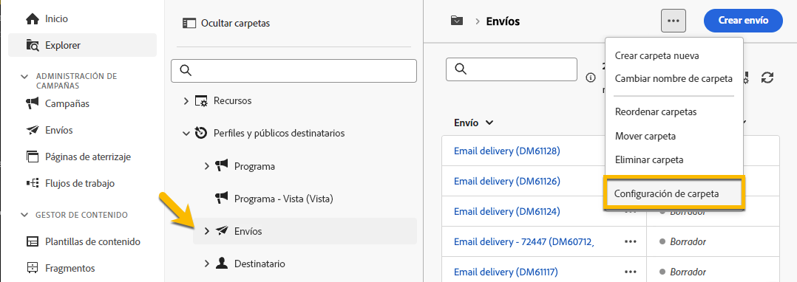

# Permisos {#permissions}

Cada usuario de Adobe Campaign tiene permisos y restricciones específicos en la aplicación. El usuario puede pertenecer a un grupo de operadores y heredar los permisos del grupo.

En función de sus permisos, un operador puede:

* Acceso a determinadas funciones
* Acceder a determinados datos
* Acceder a determinadas acciones (crear, modificar, eliminar)

Hay disponible un procedimiento detallado para configurar permisos en Adobe Campaign en [Documentación de Adobe Campaign v8 (consola)](https://experienceleague.adobe.com/es/docs/campaign/campaign-v8/admin/permissions/gs-permissions){target="_blank"}.

## Permisos de las carpetas {#folder-permissions}

En función de sus derechos, puede ver y administrar permisos en las carpetas en **[!UICONTROL Configuración de carpeta]**.

A continuación se muestra un ejemplo de carpeta de envíos:

{zoomable="yes"}

En la sección **[!UICONTROL Security]** de **[!UICONTROL Folder settings]**, puede ver y administrar (agregar o eliminar) los operadores o grupos que tienen acceso a la carpeta.

{zoomable="yes"}

Puede hacer clic directamente en los permisos y cambiarlos a **[!UICONTROL Permitido]** o **[!UICONTROL Denegado]**.

{zoomable="yes"}

Si la opción **[!UICONTROL Propagate]** está habilitada, todos los permisos definidos para una carpeta se aplicarán a todas sus subcarpetas. Estos permisos se pueden sobrescribir para cada subcarpeta.

Si se selecciona la opción **[!UICONTROL Carpeta del sistema]**, se permite el acceso a todos los operadores, independientemente de sus permisos.

También puede [administrar los permisos de las carpetas en la consola de Adobe Campaign](https://experienceleague.adobe.com/es/docs/campaign/campaign-v8/admin/permissions/folder-permissions){target="_blank"}.

Todos los permisos de la interfaz de usuario web de Campaign se sincronizan con los permisos de la consola del cliente de Campaign.