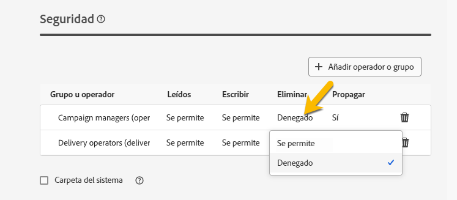

# Permisos {#permissions}

Cada usuario de Adobe Campaign tiene sus propios permisos y restricciones en la aplicación. El usuario puede formar parte del grupo de operadores y hereda los permisos del grupo.

Según sus permisos, un operador puede:

* Acceso a determinadas funciones
* Acceso a determinados datos
* Acceso a determinadas acciones (crear, modificar, eliminar)

Los procedimientos detallados para configurar permisos en Adobe Campaign están disponibles en [Documentación de Adobe Campaign v8 (consola)](https://experienceleague.adobe.com/en/docs/campaign/campaign-v8/admin/permissions/gs-permissions){target="_blank"}.

## Permisos en carpetas {#folder-permissions}

Según sus derechos, tiene la posibilidad de ver y administrar los permisos de las carpetas en **[!UICONTROL Configuración de carpeta]**.

A continuación se muestra un ejemplo de una carpeta de envíos:

{zoomable="yes"}

En la sección **[!UICONTROL Security]** de **[!UICONTROL Folder settings]**, puede ver y administrar (agregar o eliminar) operadores o grupos que tengan acceso a la carpeta.

{zoomable="yes"}

Puede hacer clic directamente en los permisos y cambiarlos **[!UICONTROL Permitido]** o **[!UICONTROL Denegado]**.

{zoomable="yes"}

Si la opción **[!UICONTROL Propagar]** está habilitada, todos los permisos definidos para una carpeta se aplican a todas sus subcarpetas. Estos permisos se pueden sobrecargar para cada subcarpeta.

Si se marca la opción **[!UICONTROL Carpeta del sistema]**, se permite el acceso a todos los operadores, independientemente de sus permisos.

También puede [administrar los permisos en las carpetas de la consola Adobe Campaign](https://experienceleague.adobe.com/en/docs/campaign/campaign-v8/admin/permissions/folder-permissions){target="_blank"}.

Todos los permisos de la interfaz de usuario web de Campaign se sincronizan con los permisos de la consola del cliente de Campaign.
