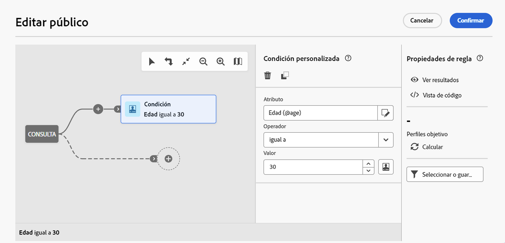

# Trabajar con filtros predefinidos {#predefined-filters}

>[!CONTEXTUALHELP]
>id="acw_homepage_learning_card4"
>title="Administración de filtros predefinidos"
>abstract="Campaign web ahora le ofrece una interfaz fácil de usar para administrar y personalizar filtros predefinidos para satisfacer sus necesidades específicas. Créelos una sola vez y guárdelos para usarlos en el futuro."

<!--TO REMOVE BELOW-->
>[!CONTEXTUALHELP]
>id="acw_homepage_card4"
>title="Administración de filtros predefinidos"
>abstract="Campaign web ahora le ofrece una interfaz fácil de usar para administrar y personalizar filtros predefinidos para satisfacer sus necesidades específicas. Créelos una sola vez y guárdelos para usarlos en el futuro."

<!--TO REMOVE ABOVE-->

>[!CONTEXTUALHELP]
>id="acw_predefined-filters-dashboard"
>title="Filtros predefinidos"
>abstract="Campaign web ahora le ofrece una interfaz fácil de usar para administrar y personalizar filtros predefinidos para satisfacer sus necesidades específicas. Créelos una sola vez y guárdelos para usarlos en el futuro."

Los filtros predefinidos son filtros personalizados que se crean y guardan para que estén disponibles para su uso futuro. Se pueden utilizar como accesos directos durante cualquier operación de filtrado con el modelador de consultas, por ejemplo, al filtrar una lista de datos o crear el público de un envío.

Puede utilizar filtros integrados existentes para acceder a un subconjunto específico de sus datos o crear sus propios filtros predefinidos y guardarlos.

>[!IMPORTANT]
>
>En esa versión del producto, al crear reglas, seleccionar el público de un envío o crear un público en un flujo de trabajo, algunos filtros predefinidos no están disponibles en la interfaz de usuario. Puede usarlos de todos modos. [Más información](guardrails.md#predefined-filters-filters-guardrails-limitations)

## Creación de un filtro predefinido {#create-predefined-filter}

>[!CONTEXTUALHELP]
>id="acw_predefined-filters-creation"
>title="Creación de un filtro predefinido"
>abstract="Introduzca una etiqueta para el filtro predefinido y seleccione la tabla a la que se aplica. Abra las opciones adicionales para agregar una descripción y establecer el filtro como favorito. A continuación, utilice el botón “Crear regla” para definir las condiciones de filtrado."

>[!CONTEXTUALHELP]
>id="acw_predefined-filters-rules"
>title="Creación de reglas de filtro predefinidas"
>abstract="Para definir las condiciones de filtrado del filtro personalizado, haga clic en el botón “Crear regla”."

### Cree un filtro a partir del modelador de consultas {#create-from-rule-builder}

Puede guardar un filtro personalizado desde el [modelador de consultas](../query/query-modeler-overview.md) para que esté disponible para usarlo en el futuro. Siga estos pasos:

1. Abra el modelador de consultas y defina las condiciones de filtrado. En el ejemplo siguiente, se filtran los destinatarios que viven en Madrid y están suscritos a una Newsletter.
1. Haga clic en el botón **Seleccionar o guardar filtro** y seleccione **Guardar como filtro**.

   

1. Seleccione **Crear nuevo filtro** y escriba un nombre y una descripción para él.

   

   Puede guardar el filtro como favorito si lo necesita. Obtenga más información en [esta sección](#fav-filter).

1. Haga clic en **Confirmar** para guardar los cambios.

El filtro personalizado ahora está disponible en la lista **Filtros predefinidos** y es accesible para todos los usuarios de Campaign.

### Creación de filtros a partir de la lista de filtros {#create-filter-from-list}

Puede crear un filtro desde la entrada **Filtros predefinidos** en el menú de la izquierda. Para realizar esto, siga los pasos a continuación:

1. Examine la entrada **Filtros predefinidos** en el menú de la izquierda.
1. Haga clic en el botón **Crear filtro**.
1. Introduzca el nombre del filtro y, en el campo **Tipo de documento**, seleccione el esquema al que se aplica. El esquema predeterminado es `Recipients(nms)`.

1. Defina la regla para el filtro. Por ejemplo, perfiles de personas de más de 30 años.

   

1. Guarde los cambios.

   

El filtro se añade a la lista de filtros predefinidos. Puede guardar el filtro como favorito si lo necesita. Obtenga más información en [esta sección](#fav-filter).

## Guarde el filtro como favorito {#fav-filter}

Al crear un filtro predefinido, puede activar la opción **Guardar como favorito** si desea ver ese filtro predefinido en sus favoritos.

Cuando un filtro se guarda como favorito, está disponible para todos los usuarios en la sección **Filtros favoritos** de la lista de creación de filtros, como se muestra a continuación:

{width="30%" align="left"}

## Uso de un filtro predefinido {#use-predefined-filter}

Los filtros predefinidos están disponibles al definir las propiedades de una regla. Para acceder a los filtros predefinidos, seleccione **Seleccionar filtro personalizado** en la lista desplegable del modelador de consultas.

Luego podrá acceder a la lista completa de filtros predefinidos disponibles para el contexto dado.

También puede utilizar los métodos abreviados de filtro disponibles en la sección **Filtros favoritos** de la lista desplegable. Puede obtener más información sobre los favoritos en [esta sección](#fav-filter).

Por ejemplo, para crear un público a partir de un filtro predefinido, siga estos pasos:

1. Examine la entrada **Públicos** en el menú de la izquierda.
1. Haga clic en el botón **Crear público**.
1. Introduzca el nombre del público y haga clic en el botón **Crear público**.
1. Seleccione la actividad **Consulta** y, en el panel derecho, haga clic en el botón **Crear público**.

   

1. Desde el **botón Seleccionar o guardar filtro**, elija la opción **Seleccionar filtro personalizado**.

   

1. Vaya al filtro predefinido que se utilizará para crear el público, selecciónelo y confirme.

   

1. Compruebe las propiedades de la regla para ese filtro y confirme.

   El filtro ahora se utiliza como consulta en la actividad **Consulta**.

   

1. Guarde los cambios y haga clic en el botón **Iniciar** para crear el público y que esté disponible en la lista de públicos.

## Administrar los filtros predefinidos {#manage-predefined-filter}

Los filtros predefinidos se agrupan en una entrada propia del menú de navegación de la izquierda.

A partir de esa lista, puede crear un nuevo filtro como se explica más arriba y:

* editar un filtro existente y cambiar sus reglas y propiedades
* duplicar un filtro predefinido
* eliminar un filtro predefinido

Puede añadir un filtro predefinido como favorito para acceder rápidamente a la hora de crear públicos. Obtenga más información en [esta sección](#fav-filter).

<!--
## Built-in predefined filters {#ootb-predefined-filter}

Campaign comes with a set of predefined filters, built from the client console. These filters can be used to define your audiences, and rules. They must not be modified.
-->
