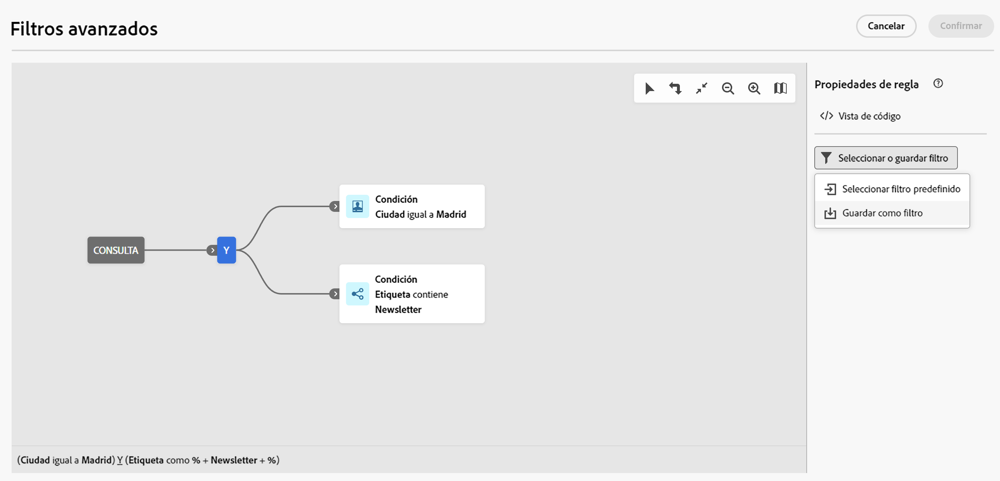
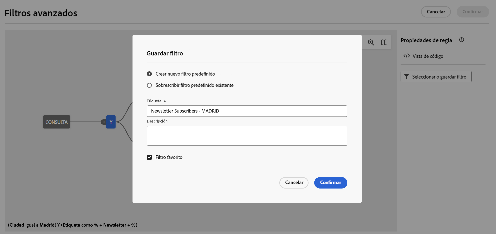
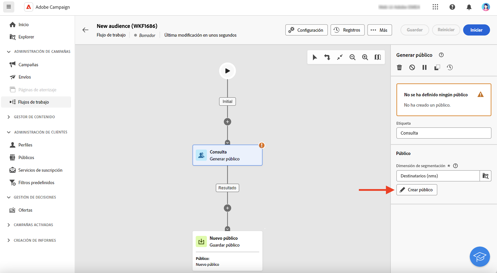
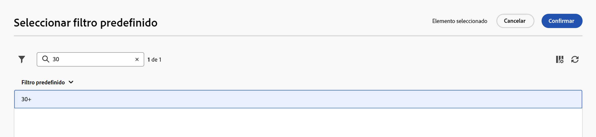

# Trabajo con filtros predefinidos {#predefined-filters}

>[!CONTEXTUALHELP]
>id="acw_homepage_learning_card4"
>title="Administración de filtros predefinidos"
>abstract="Campaign interfaz de usuario Web ofrece una interfaz usuario fácil de usar para administrar y personalizar sin esfuerzo filtros predefinidos para satisfacer sus necesidades específicas. Debe crearla una sola vez y guardarla para usarla en el futuro."

>[!CONTEXTUALHELP]
>id="acw_predefined-filters-dashboard"
>title="Filtros predefinidos"
>abstract="Campaign interfaz de usuario Web ofrece una interfaz usuario fácil de usar para administrar y personalizar sin esfuerzo filtros predefinidos para satisfacer sus necesidades específicas. Debe crearla una sola vez y guardarla para usarla en el futuro."

Los filtros predefinidos son filtros personalizados se crean y guardan para su uso futuro. Actúan como accesos directos durante las operaciones de filtrado con el consulta modelador. Por ejemplo, se pueden usar al filtrar una lista de datos o al crear la audiencia de una envío.

Puede utilizar filtros integrados existentes para acceder a un subconjunto específico de sus datos o crear sus propios filtros predefinidos y guardarlos.

{zoomable="yes"}

## Creación de un filtro predefinido {#create-predefined-filter}

>[!CONTEXTUALHELP]
>id="acw_predefined-filters-creation"
>title="Creación de un filtro predefinido"
>abstract="Introduzca una etiqueta para el filtro predefinido y seleccione la tabla a la que se aplica. Abra las opciones adicionales para agregar una descripción y establecer el filtro como favorito. A continuación, utilice el botón “Crear regla” para definir las condiciones de filtrado."

>[!CONTEXTUALHELP]
>id="acw_predefined-filters-rules"
>title="Creación de reglas de filtro predefinidas"
>abstract="Para definir las condiciones de filtrado del filtro personalizado, haga clic en el botón “Crear regla”."

### Cree un filtro a partir del modelador de consultas {#create-from-rule-builder}

Guardar un filtro personalizado del modelador](../query/query-modeler-overview.md) de [consulta para que esté disponible para su uso futuro. Siga estos pasos:

1. Abra el modelador de consultas y defina las condiciones de filtrado. En el siguiente ejemplo, se filtran los destinatarios que residen en Madrid y están suscritos a una newsletter.
1. Haga clic en el botón **Seleccionar o guardar filtro** y seleccione **Guardar como filtro**.

   {zoomable="yes"}

1. Seleccione **Crear nuevo filtro** y escriba un nombre y una descripción para él.

   {zoomable="yes"}

   Puede guardar el filtro como favorito si lo necesita. Obtenga más información en [esta sección](#fav-filter).

1. Haga clic en **Confirmar** para guardar los cambios.

El filtro personalizado ahora está disponible en la lista **Filtros predefinidos** y es accesible para todos los usuarios de Campaign.

### Creación de filtros a partir de la lista de filtros {#create-filter-from-list}

Crear un filtro de la **entrada filtros** predefinido del menú de la izquierda. Siga estos pasos:

1. Examinar a la **entrada filtros** predefinida del menú de la izquierda.
1. Haga clic en el botón **Crear filtro**.
1. Introduzca el nombre del filtro y, en el campo **Tipo de documento**, seleccione el esquema al que se aplica. El esquema predeterminado es `Recipients(nms)`.

1. Defina la regla para el filtro. Por ejemplo, perfiles de personas de más de 30 años.

   {zoomable="yes"}

1. Guarde los cambios.

   {zoomable="yes"}

El filtro se añade a la lista de filtros predefinidos. Puede guardar el filtro como favorito si lo necesita. Obtenga más información en [esta sección](#fav-filter).

## Guarde el filtro como favorito {#fav-filter}

Al crear un filtro predefinido, habilite el **Guardar como opción favorita** para ver este filtro predefinido en sus favoritos.

Cuando un filtro se guarda como favorito, está disponible para todos los usuarios en la sección **Filtros favoritos** de la lista de creación de filtros, como se muestra a continuación:

{zoomable="yes"}{width="30%" align="left"}

## Uso de un filtro predefinido {#use-predefined-filter}

Los filtros predefinidos están disponibles al definir las propiedades de una regla. Para acceder a filtros predefinidos, elija la opción Seleccionar **filtro** personalizado en el menú desplegable del modelador de consulta.

Acceda a la lista completa de filtros predefinidos disponibles para el contexto actual y utilice los accesos directos de la **sección filtros** favorita de la lista desplegable. Puede obtener más información sobre los favoritos en [esta sección](#fav-filter).

Por ejemplo, para crear un público a partir de un filtro predefinido, siga estos pasos:

1. Vaya a la entrada **Públicos** en el menú de la izquierda y haga clic en **Crear público** en la esquina superior izquierda de la lista de públicos.
1. Introduzca el nombre del público y haga clic en el botón **Crear público**.
1. Seleccione la actividad **Consulta** y, en el panel derecho, haga clic en el botón **Crear público**.

   {zoomable="yes"}

1. En el botón **Seleccionar o guardar filtro**, elija la opción **Seleccionar filtro personalizado**.

   {zoomable="yes"}

1. Vaya al filtro predefinido que se utilizará para crear el público, selecciónelo y confirme.

   {zoomable="yes"}

1. Compruebe las propiedades de la regla para ese filtro y confirme.

   El filtro ahora se utiliza como consulta en la actividad **Consulta**.

   {zoomable="yes"}

1. Guarde los cambios y haga clic en el botón **Iniciar** para crear el público y que esté disponible en la lista de públicos.

## Administrar los filtros predefinidos {#manage-predefined-filter}

Los filtros predefinidos se agrupan en una entrada propia del menú de navegación de la izquierda.

{zoomable="yes"}

Desde este lista, puede crear un nuevo filtro como se detalla anteriormente y realizar las acciones que se enumeran a continuación:

* Editar un filtro existente y cambiar sus reglas y propiedades.
* Duplique un filtro predefinido.
* Elimine un filtro predefinido.

También puede agregar un filtro predefinido como favorito para obtener acceso rápido al crear sus audiencias. Obtenga más información en [esta sección](#fav-filter).

<!--
## Built-in predefined filters {#ootb-predefined-filter}

Campaign comes with a set of predefined filters, built from the client console. These filters can be used to define your audiences, and rules. They must not be modified.
-->