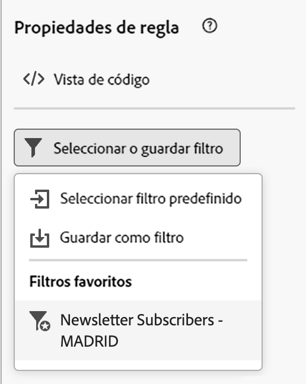
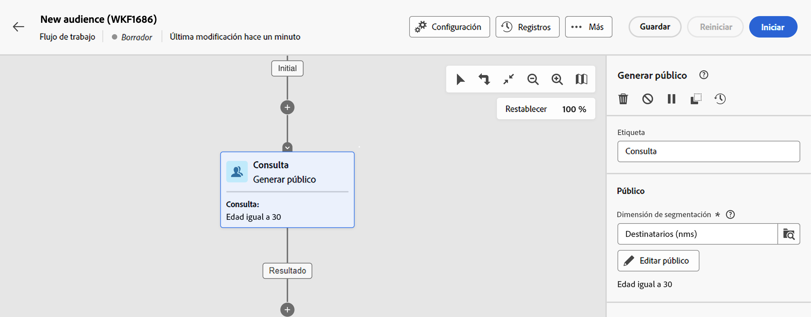

# Trabajo con filtros predefinidos {#predefined-filters}

>[!CONTEXTUALHELP]
>id="acw_homepage_card3"
>title="Administración de filtros predefinidos"
>abstract="La web de Campaign ahora le ofrece una interfaz fácil de usar para administrar y personalizar sin esfuerzo los filtros predefinidos para satisfacer sus necesidades específicas. Cree una vez y guárdela para usarla en el futuro."

>[!CONTEXTUALHELP]
>id="acw_predefined-filters-dashboard"
>title="Filtros predefinidos"
>abstract="La web de Campaign ahora le ofrece una interfaz fácil de usar para administrar y personalizar sin esfuerzo los filtros predefinidos para satisfacer sus necesidades específicas. Cree una vez y guárdela para usarla en el futuro."

Los filtros predefinidos son filtros personalizados que se crean y guardan para que estén disponibles para su uso futuro. Se pueden utilizar como accesos directos durante cualquier operación de filtrado con el generador de reglas, por ejemplo al filtrar una lista de datos o crear la audiencia de una entrega.

Puede utilizar filtros integrados existentes para acceder a un subconjunto específico de sus datos o crear sus propios filtros predefinidos y guardarlos.

>[!IMPORTANT]
>
>En esa versión del producto, al crear reglas, seleccionar la audiencia de una entrega o al crear una audiencia en un flujo de trabajo, algunos filtros predefinidos no están disponibles en la interfaz de usuario. Aún puede usarlos. [Más información](guardrails.md#predefined-filters-filters-guardrails-limitations)

## Creación de un filtro predefinido {#create-predefined-filter}

>[!CONTEXTUALHELP]
>id="acw_predefined-filters-creation"
>title="Creación de un filtro predefinido"
>abstract="Introduzca una etiqueta para el filtro predefinido y seleccione la tabla a la que se aplica. Abra las opciones adicionales para agregar una descripción y establecer este filtro como favorito. A continuación, utilice el botón &quot;Crear regla&quot; para definir las condiciones de filtrado."

>[!CONTEXTUALHELP]
>id="acw_predefined-filters-rules"
>title="Creación de reglas de filtro predefinidas"
>abstract="Para definir las condiciones de filtrado del filtro personalizado, haga clic en el botón Crear regla."

### Creación de un filtro desde el generador de reglas {#create-from-rule-builder}

Puede guardar un filtro personalizado del generador de reglas para que esté disponible para uso futuro. Siga estos pasos:

1. Abra el generador de reglas y defina las condiciones de filtrado. En el ejemplo siguiente, se filtran los destinatarios que viven en Madrid.
1. Haga clic en **Seleccionar o guardar filtro** y seleccione. **Guardar como filtro**.

   

1. Seleccionar **Creación de un nuevo filtro** y escriba un nombre y una descripción para ese filtro.

   {width="70%" align="left"}

   Puede guardar el filtro como favorito si lo necesita. Obtenga más información en [esta sección](#fav-filter).

1. Clic **Confirmar** para guardar los cambios.

El filtro personalizado ahora está disponible en la **Filtros predefinidos** y accesibles para todos los usuarios de Campaign.

### Creación de filtros a partir de la lista de filtros {#create-filter-from-list}

Puede crear un filtro desde el **Filtros predefinidos** en el menú de la izquierda. Para ello, siga los pasos a continuación:

1. Examine la **Filtros predefinidos** en el menú de la izquierda.
1. Haga clic en **Crear filtro** botón.
1. Introduzca el nombre del filtro y, en **Tipo de documento** , seleccione el esquema al que se aplica. El esquema predeterminado es `Recipients(nms)`.

   Puede guardar el filtro como favorito si lo necesita. Obtenga más información en [esta sección](#fav-filter).

1. Defina la regla para el filtro. Por ejemplo, perfiles mayores de 30.

   

1. Guarde los cambios. El filtro se agrega a la lista de filtros predefinidos.

## Guarde el filtro como favorito {#fav-filter}

Al crear un filtro predefinido, puede activar la variable **Guardar como favorito** si desea ver este filtro predefinido en sus favoritos.

Cuando un filtro se guarda como favorito, está disponible para todos los usuarios en la **Filtros favoritos** de la lista de creación de filtros, como se muestra a continuación:

{width="30%" align="left"}

## Uso de un filtro predefinido {#use-predefined-filter}

Los filtros predefinidos están disponibles al definir las propiedades de la regla. Para acceder a los filtros predefinidos, seleccione **Seleccionar filtro personalizado** en la lista desplegable del generador de reglas.

A continuación, puede acceder a la lista completa de filtros predefinidos disponibles para el contexto actual.

También puede utilizar los métodos abreviados de filtro disponibles en la variable **Filtros favoritos** de la lista desplegable. Más información sobre los favoritos en [esta sección](#fav-filter).

Por ejemplo, para crear una audiencia a partir de un filtro predefinido, siga estos pasos:

1. Examine la **Audiencias** en el menú de la izquierda.
1. Haga clic en **Crear audiencia** botón.
1. Introduzca el nombre de la audiencia y haga clic en **Crear audiencia** botón.
1. Seleccione el **Consulta** actividad y, en el panel derecho, haga clic en **Crear audiencia** botón.

   

1. Desde el **Botón Seleccionar o guardar filtro**, elija la **Seleccionar filtro personalizado** opción.

   

1. Vaya al filtro predefinido que se utilizará para crear la audiencia, selecciónelo y confirme la acción.

   

1. Compruebe las propiedades de la regla para este filtro y confirme.

   

   El filtro ahora se utiliza como consulta en la **Consulta** actividad.

   

1. Guarde los cambios y haga clic en **Inicio** para crear la audiencia y que esté disponible en la lista de audiencias.

## Administrar los filtros predefinidos {#manage-predefined-filter}

Los filtros predefinidos se agrupan en la entrada dedicada del menú de navegación de la izquierda.

A partir de esta lista, puede crear un nuevo filtro como se detalla más arriba, y:

* editar un filtro existente y cambiarlo por reglas y propiedades
* duplicar un filtro predefinido
* eliminación de un filtro predefinido

Puede añadir un filtro predefinido como favorito para acceder rápidamente a la hora de crear reglas. Obtenga más información en [esta sección](#fav-filter).

<!--
## Built-in predefined filters {#ootb-predefined-filter}

Campaign comes with a set of predefined filters, built from the client console. These filters can be used to define your audiences, and rules. They must not be modified.
-->
